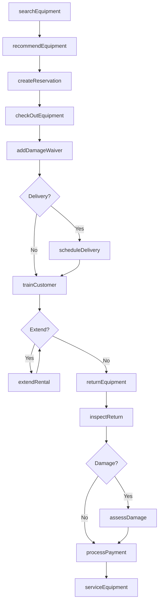
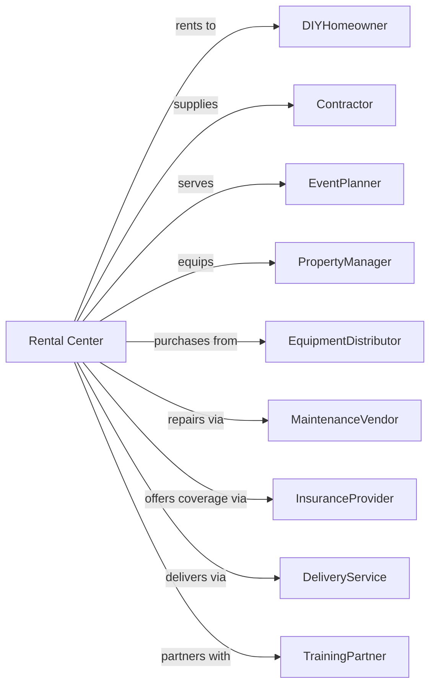

# General Rental Centers

> Business-as-Code definition for general rental center operations. Models the complete rental lifecycle from equipment selection through return.

## Overview

General rental centers provide a broad range of consumer and commercial equipment from a single location, including power tools, lawn equipment, party supplies, and contractor equipment. This definition exposes actions for multi-category inventory management, equipment checkout, maintenance scheduling, and customer account management, with events enabling automated workflow triggers throughout the rental lifecycle.

## Actors

| Actor | Description |
|-------|-------------|
| DIYHomeowner | Individual renting tools for home projects |
| Contractor | Builder or tradesperson renting equipment |
| EventPlanner | Professional renting party and event supplies |
| PropertyManager | Manager renting maintenance equipment |
| EquipmentDistributor | Supplies rental inventory |
| MaintenanceVendor | Services and repairs equipment |
| InsuranceProvider | Offers damage waiver coverage |
| DeliveryService | Transports large equipment |
| TrainingPartner | Provides equipment operation certification |

## Roles

| Role | Description |
|------|-------------|
| StoreManager | Oversees rental center operations |
| CounterAgent | Processes rentals and returns |
| EquipmentSpecialist | Advises on tool and equipment selection |
| ServiceTechnician | Maintains and repairs inventory |
| DeliveryCoordinator | Schedules equipment transport |

## Entities

| Entity | Description |
|--------|-------------|
| Equipment | Tool, machine, or rental item |
| Rental | Active equipment rental agreement |
| Category | Equipment classification type |
| Customer | Individual or business account |
| Reservation | Hold on equipment for future pickup |
| DamageWaiver | Optional damage protection coverage |
| Maintenance | Scheduled equipment service |
| Delivery | Equipment transport to job site |
| Rate | Hourly, daily, or weekly rental price |
| Accessory | Complementary item for equipment use |

## Actions

| Action | Description |
|--------|-------------|
| searchEquipment | Find available equipment by category |
| createReservation | Book equipment for future pickup |
| recommendEquipment | Suggest appropriate tools for project |
| checkOutEquipment | Process rental start |
| addDamageWaiver | Attach damage protection to rental |
| scheduleDelivery | Arrange equipment transport |
| extendRental | Add time to active rental |
| returnEquipment | Process rental completion |
| inspectReturn | Check equipment for damage |
| assessDamage | Price repair or replacement cost |
| processPayment | Charge rental and damage fees |
| serviceEquipment | Perform maintenance or repair |
| trainCustomer | Instruct on safe equipment operation |
| refuelEquipment | Add fuel and charge accordingly |

## Events

| Event | Description |
|-------|-------------|
| reservationCreated | Equipment booked for pickup |
| equipmentCheckedOut | Rental started |
| deliveryScheduled | Transport arranged |
| deliveryCompleted | Equipment delivered to site |
| rentalExtended | Additional time added |
| equipmentReturned | Rental completed |
| damageFound | Issue discovered during inspection |
| damageCharged | Customer billed for damage |
| equipmentServiced | Maintenance completed |
| trainingCompleted | Customer received equipment instruction |
| paymentProcessed | Rental charges collected |
| lowStockDetected | Rental inventory dropped below minimum threshold |

## Searches

| Search | Description |
|--------|-------------|
| findAvailableEquipment | Search by category and date |
| getReservations | List upcoming equipment holds |
| getRentalHistory | Retrieve past rentals for customer |
| getMaintenanceSchedule | View equipment due for service |
| getInventoryByCategory | Check stock levels by type |
| getDamageQueue | List equipment awaiting repair |
| getDeliverySchedule | View upcoming equipment transports |

## Workflow



## Actor Relationships



## Usage

### Calling Actions

```typescript
import { rentGeneralGoods } from '@headlessly/rent-general-goods'

const center = rentGeneralGoods()

// Search by category and date
const availableEquipment = await center.findAvailableEquipment({ category: 'power-tools', date: '2024-05-01' })

// List upcoming equipment holds
const reservations = await center.getReservations({ date: '2024-05-01' })

// Search for concrete equipment
const equipment = await center.searchEquipment({
  category: 'concrete',
  equipmentType: 'mixer',
  rentalDate: '2024-04-01',
  rentalDays: 3
})

// Get project recommendations
const recommendations = await center.recommendEquipment({
  projectType: 'concretePatio',
  squareFeet: 200,
  existingEquipment: []
})

// Check out equipment with delivery
const rental = await center.checkOutEquipment({
  customerId: 'contractor-456',
  items: [
    { equipmentId: 'mixer-towable-9cf', days: 3 },
    { equipmentId: 'vibrator-concrete', days: 3 },
    { equipmentId: 'trowel-power-36', days: 2 }
  ],
  damageWaiver: true
})

await center.scheduleDelivery({
  rentalId: rental.id,
  deliveryAddress: '456 Construction Site',
  deliveryDate: '2024-04-01T07:00:00',
  pickupDate: '2024-04-04T17:00:00'
})
```

### Event-Driven Automation

```typescript
// Auto-service equipment after return
center.equipmentReturned(async ({ equipmentId, totalHours }) => {
  const serviceThreshold = getServiceInterval(equipmentId)

  if (totalHours >= serviceThreshold) {
    await center.serviceEquipment({
      equipmentId,
      serviceType: 'preventiveMaintenance',
      priority: 'high'
    })
  }
})

// Auto-alert when category inventory low
center.lowStockDetected(async ({ category, currentCount, minimumCount }) => {
  await notifyPurchasing({
    category,
    shortage: minimumCount - currentCount,
    urgency: 'high'
  })

  // Check for equipment at other locations
  const transfers = await findTransferCandidates(category)
  if (transfers.length > 0) {
    await initiateTransfer(transfers[0])
  }
})
```
