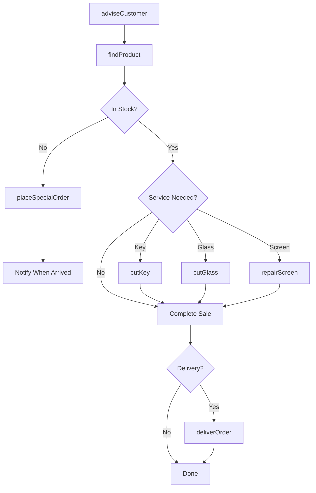
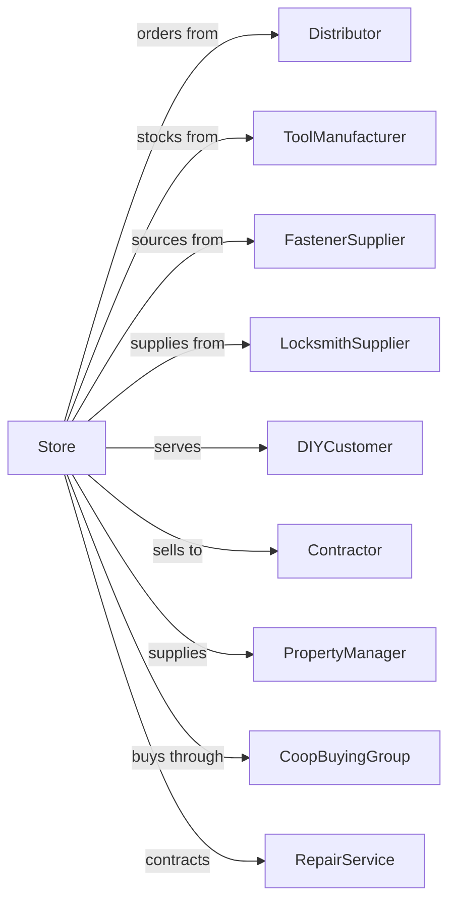

# Hardware Retailers

> Business-as-Code definition for hardware store retail operations. Models the sale of tools, fasteners, builders hardware, plumbing supplies, and electrical items with expert advice and special order capabilities.

## Overview

Hardware retailers specialize in tools, fasteners, builders hardware, and repair supplies for DIY and professional customers. This definition exposes actions for product advice, key cutting, glass cutting, screen repair, special orders, and localized service that builds community relationships.

## Actors

| Actor | Description |
|-------|-------------|
| Distributor | Hardware wholesaler providing inventory |
| ToolManufacturer | Suppliers of hand and power tools |
| FastenerSupplier | Provides screws, bolts, and hardware |
| LocksmithSupplier | Supplies keys, locks, and blanks |
| DIYCustomer | Homeowner doing repairs |
| Contractor | Professional needing supplies |
| PropertyManager | Manages maintenance for properties |
| CoopBuyingGroup | Collective purchasing organization |
| RepairService | Provides tool sharpening and repair |

## Roles

| Role | Description |
|------|-------------|
| StoreOwner | Owns and operates the hardware store |
| StoreManager | Manages daily operations |
| SalesAssociate | Assists customers with product selection |
| KeySpecialist | Cuts keys and services locks |
| ReceivingClerk | Manages inventory and receiving |
| ServiceTechnician | Performs repairs and cutting services |
| BookKeeper | Handles accounting and ordering |

## Entities

| Entity | Description |
|--------|-------------|
| Tool | Hand or power tool for repairs |
| Fastener | Screws, nails, bolts, and anchors |
| Hardware | Hinges, handles, brackets, and fixtures |
| Key | Blank or cut key for locks |
| GlassPane | Cut-to-size glass for windows |
| Screen | Window or door screen material |
| PlumbingPart | Pipes, fittings, and fixtures |
| ElectricalSupply | Wire, outlets, and switches |
| SpecialOrder | Non-stock item ordered for customer |

## Actions

| Action | Description |
|--------|-------------|
| adviseCustomer | Provide expert repair guidance |
| findProduct | Locate items in store |
| cutKey | Duplicate or cut keys |
| cutGlass | Cut glass to customer specifications |
| repairScreen | Replace or repair window screens |
| placeSpecialOrder | Order non-stock items |
| checkInventory | Verify product availability |
| assembleFastenerKit | Build custom fastener assortment |
| processReturn | Handle exchanges and returns |
| sharpenTool | Sharpen blades and tools |
| createAccount | Set up contractor charge account |
| deliverOrder | Deliver to local job site |

## Events

| Event | Description |
|-------|-------------|
| customerAdvised | Repair guidance provided |
| productFound | Item located for customer |
| keyCut | Key duplicated |
| glassCut | Glass cut to size |
| screenRepaired | Screen fixed or replaced |
| specialOrderPlaced | Non-stock item ordered |
| inventoryChecked | Availability confirmed |
| fastenerKitAssembled | Custom assortment built |
| returnProcessed | Exchange completed |
| toolSharpened | Blade or tool sharpened |
| accountCreated | Charge account opened |
| orderDelivered | Local delivery completed |

## Searches

| Search | Description |
|--------|-------------|
| findProducts | Search by category or keyword |
| checkStock | Query inventory availability |
| findFasteners | Search by size, type, material |
| getKeyBlanks | List available key types |
| findContractorAccounts | List professional accounts |
| getSpecialOrders | View pending special orders |
| getProjectGuides | Retrieve how-to information |
| getLocalDeliverySlots | View delivery availability |

## Workflow



## Actor Relationships



## Usage

### Calling Actions

```typescript
import { sellHardware } from '@headlessly/sell-hardware'

const store = sellHardware()

// Search by category or keyword
const products = await store.findProducts({ category: 'plumbing', keyword: 'copper-pipe' })

// Query inventory availability
const stock = await store.checkStock({ sku: 'COP-075-10', locationId: 'store-42' })

// Advise on door repair
const advice = await store.adviseCustomer({
  issue: 'squeaky-hinge',
  location: 'interior-door',
  symptoms: ['noise', 'sticking']
})

// Find recommended products
const products = await store.findProduct({
  category: 'door-hardware',
  items: advice.recommendedProducts
})

// Cut replacement key
const key = await store.cutKey({
  keyType: 'schlage-sc1',
  quantity: 2,
  source: 'existing-key'
})

// Assemble fastener kit for project
const kit = await store.assembleFastenerKit({
  project: 'deck-repair',
  materials: ['pressure-treated'],
  items: [
    { type: 'deck-screw', size: '3-inch', quantity: 100 },
    { type: 'lag-bolt', size: '5/16x4', quantity: 12 },
    { type: 'joist-hanger-nail', quantity: 50 }
  ]
})
```

### Event-Driven Automation

```typescript
// Notify on special order arrival
store.specialOrderPlaced(async ({ customerId, orderId, estimatedArrival }) => {
  await scheduleNotification({
    customerId,
    checkDate: estimatedArrival,
    message: 'Your special order has arrived!'
  })
})

// Follow up on large projects
store.customerAdvised(async ({ customerId, projectType, estimatedValue }) => {
  if (estimatedValue > 200) {
    await createFollowUp({
      customerId,
      projectType,
      delay: '7-days',
      message: 'How is your project going? Need any additional supplies?'
    })
  }
})
```
