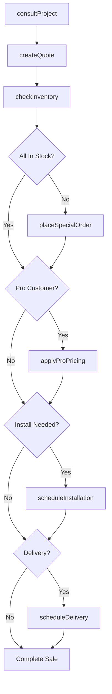
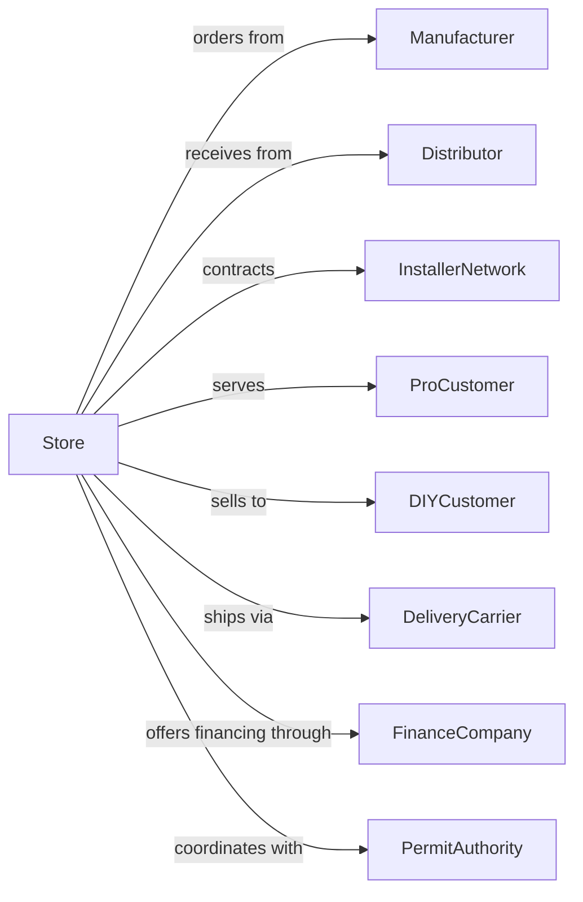

# Home Centers

> Business-as-Code definition for home center retail operations. Models the complete home improvement retail experience including lumber, building materials, plumbing, electrical, tools, and garden supplies with installation services.

## Overview

Home centers retail a general line of home repair and improvement materials including lumber, plumbing, electrical, tools, hardware, paint, and lawn and garden supplies. This definition exposes actions for project consultation, special orders, delivery scheduling, installation services, and contractor/pro account management.

## Actors

| Actor | Description |
|-------|-------------|
| Manufacturer | Suppliers of building materials and products |
| Distributor | Regional distribution centers for inventory |
| InstallerNetwork | Contractors providing installation services |
| ProCustomer | Contractors and builders with commercial accounts |
| DIYCustomer | Homeowner performing own repairs |
| DeliveryCarrier | Provides truck delivery to job sites |
| FinanceCompany | Offers project financing and store credit |
| PermitAuthority | Local building department for permits |
| DesignService | Kitchen, bath, and project design support |

## Roles

| Role | Description |
|------|-------------|
| StoreManager | Oversees all store operations |
| DepartmentManager | Manages specific product category |
| SalesAssociate | Assists customers on sales floor |
| ProDeskSpecialist | Serves contractor and commercial accounts |
| DesignConsultant | Provides kitchen, bath, and project design |
| ServiceDeskAssociate | Handles returns, orders, and customer service |
| ReceivingClerk | Manages inbound freight and inventory |
| DeliveryCoordinator | Schedules deliveries and installations |
| LotLoader | Loads lumber, concrete, and heavy materials into customer vehicles in the yard |

## Entities

| Entity | Description |
|--------|-------------|
| Product | Item in store inventory across categories |
| Project | Customer home improvement undertaking |
| SpecialOrder | Non-stock item ordered for customer |
| ProAccount | Commercial account with terms and pricing |
| InstallationOrder | Work order for professional installation |
| Delivery | Scheduled transport to customer location |
| Quote | Price estimate for project materials |
| ToolRental | Equipment rented to customer |
| Rebate | Manufacturer promotional refund |

## Actions

| Action | Description |
|--------|-------------|
| consultProject | Discuss customer project needs |
| createQuote | Build materials list with pricing |
| checkInventory | Verify product availability |
| placeSpecialOrder | Order non-stock items |
| scheduleDelivery | Arrange delivery to job site |
| scheduleInstallation | Book professional installation |
| processRental | Rent tools and equipment |
| applyProPricing | Apply contractor discount |
| processReturn | Handle product returns |
| submitRebate | Process manufacturer rebate |
| designKitchen | Create kitchen layout and plan |
| arrangeFinancing | Set up project payment plan |

## Events

| Event | Description |
|-------|-------------|
| projectConsulted | Customer project discussed |
| quoteCreated | Materials list and pricing provided |
| inventoryChecked | Product availability confirmed |
| specialOrderPlaced | Non-stock item ordered |
| deliveryScheduled | Delivery appointment set |
| installationScheduled | Installation date confirmed |
| rentalProcessed | Equipment rented |
| proPricingApplied | Commercial discount applied |
| returnProcessed | Product returned |
| rebateSubmitted | Rebate claim filed |
| kitchenDesigned | Layout plan completed |
| financingArranged | Payment plan established |

## Searches

| Search | Description |
|--------|-------------|
| findProducts | Search by category, brand, or keyword |
| checkStock | Query inventory across stores |
| findProAccounts | List contractor accounts |
| getProjectHistory | Retrieve customer purchase history |
| findInstallers | List available installation services |
| getRentalAvailability | Check tool rental inventory |
| getDeliverySlots | View available delivery times |
| getPromotions | View current deals and rebates |

## Workflow



## Actor Relationships



## Usage

### Calling Actions

```typescript
import { sellHomeImprovement } from '@headlessly/sell-home-improvement'

const store = sellHomeImprovement()

// Search by category, brand, or keyword
const findProductsResult = await store.findProducts({ category: 'featured', inStock: true })

// Query inventory across stores
const checkStockResult = await store.checkStock({ sku: 'featured-item', warehouse: 'main' })

// Consult on deck project
const project = await store.consultProject({
  customerId: 'cust-123',
  projectType: 'deck',
  dimensions: { length: 16, width: 12 },
  material: 'composite'
})

// Create materials quote
const quote = await store.createQuote({
  projectId: project.id,
  items: [
    { sku: 'DECK-BOARD-16', quantity: 48 },
    { sku: 'JOIST-2X8-16', quantity: 12 },
    { sku: 'POST-4X4-8', quantity: 6 },
    { sku: 'CONCRETE-60LB', quantity: 12 },
    { sku: 'DECK-SCREWS-5LB', quantity: 3 }
  ],
  includeHardware: true
})

// Schedule delivery
await store.scheduleDelivery({
  quoteId: quote.id,
  address: '123 Main St',
  deliveryType: 'flatbed',
  preferredDate: '2024-04-15',
  timeWindow: 'morning'
})
```

### Event-Driven Automation

```typescript
// Follow up on project quotes
store.quoteCreated(async ({ customerId, quoteId, total }) => {
  if (total > 1000) {
    await scheduleFollowUp({
      customerId,
      quoteId,
      delay: '3-days',
      channel: 'email'
    })
  }
})

// Notify installer on schedule
store.installationScheduled(async ({ installerId, orderId, date, scope }) => {
  await notifyInstaller({
    installerId,
    orderId,
    date,
    scope,
    customerContact: await getCustomerContact(orderId)
  })
})
```
