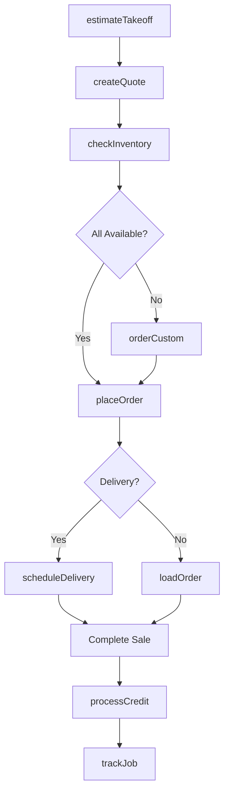
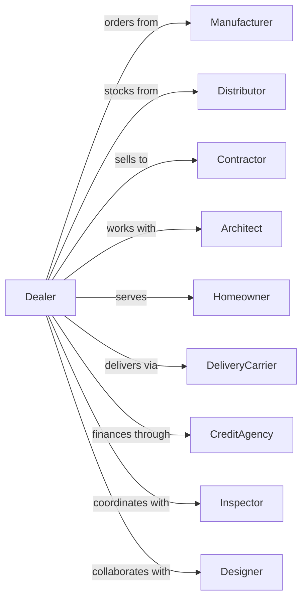

# Other Building Material Dealers

> Business-as-Code definition for specialized building material retail operations. Models lumber yards, electrical supply houses, plumbing suppliers, kitchen cabinet showrooms, and other specialty building material dealers.

## Overview

Other building material dealers specialize in specific product lines including lumber, electrical supplies, plumbing fixtures, kitchen cabinets, glass, fencing, and prefabricated structures. This definition exposes actions for contractor sales, takeoff estimation, job-site delivery, and project specification for residential and commercial construction.

## Actors

| Actor | Description |
|-------|-------------|
| Manufacturer | Suppliers of specialized building materials |
| Distributor | Regional warehouse for product inventory |
| Contractor | Builder or tradesperson purchasing materials |
| Architect | Specifies materials for construction projects |
| Homeowner | Consumer buying for renovation projects |
| DeliveryCarrier | Provides flatbed and boom truck delivery |
| CreditAgency | Provides trade credit and financing |
| Inspector | Building official reviewing installations |
| Designer | Kitchen, bath, or interior designer |

## Roles

| Role | Description |
|------|-------------|
| BranchManager | Oversees location operations |
| OutsideSalesRep | Calls on contractors and job sites |
| CounterSales | Serves walk-in customers |
| Estimator | Prepares material takeoffs and quotes |
| YardWorker | Loads and organizes inventory |
| DeliveryDriver | Delivers materials to job sites |
| DesignConsultant | Assists with kitchen and bath design |
| CreditManager | Manages contractor accounts receivable |

## Entities

| Entity | Description |
|--------|-------------|
| Lumber | Dimensional lumber, plywood, and boards |
| ElectricalSupply | Wire, panels, fixtures, and devices |
| PlumbingFixture | Sinks, faucets, toilets, and fittings |
| Cabinet | Kitchen and bath cabinetry |
| Countertop | Granite, quartz, and laminate surfaces |
| Glass | Windows, mirrors, and specialty glass |
| Fencing | Posts, rails, and panels |
| Takeoff | Material quantity estimate from plans |
| DeliveryTicket | Job-site delivery documentation |

## Actions

| Action | Description |
|--------|-------------|
| estimateTakeoff | Calculate materials from plans |
| createQuote | Build priced proposal for project |
| checkInventory | Verify product availability |
| placeOrder | Order materials for customer |
| scheduleDelivery | Arrange job-site delivery |
| loadOrder | Pull and load materials for pickup |
| processReturn | Handle returned materials |
| openAccount | Set up contractor credit account |
| designCabinets | Create kitchen or bath layout |
| orderCustom | Source custom or special items |
| processCredit | Apply payment to account |
| trackJob | Monitor ongoing project orders |

## Events

| Event | Description |
|-------|-------------|
| takeoffEstimated | Material quantities calculated |
| quoteCreated | Proposal delivered to customer |
| inventoryChecked | Availability confirmed |
| orderPlaced | Materials ordered |
| deliveryScheduled | Delivery appointment set |
| orderLoaded | Materials ready for pickup |
| returnProcessed | Credit issued for returns |
| accountOpened | Contractor account activated |
| cabinetsDesigned | Layout completed |
| customOrdered | Special item sourced |
| creditProcessed | Payment applied |
| jobTracked | Project status updated |

## Searches

| Search | Description |
|--------|-------------|
| findProducts | Search by category or specification |
| checkStock | Query inventory across locations |
| findContractors | List active contractor accounts |
| getQuotes | Retrieve pending proposals |
| getDeliverySchedule | View scheduled deliveries |
| getJobHistory | Retrieve orders by project |
| findCustomItems | Search available custom products |
| getAccountBalance | Check contractor account status |

## Workflow



## Actor Relationships



## Usage

### Calling Actions

```typescript
import { sellBuildingMaterial } from '@headlessly/sell-building-material'

const dealer = sellBuildingMaterial()

// Search by category or specification
const findProductsResult = await dealer.findProducts({ category: 'featured', inStock: true })

// Query inventory across locations
const checkStockResult = await dealer.checkStock({ sku: 'featured-item', warehouse: 'main' })

// Estimate materials from plans
const takeoff = await dealer.estimateTakeoff({
  projectType: 'residential-addition',
  plans: 'https://example.com/plans.pdf',
  categories: ['lumber', 'windows', 'roofing']
})

// Create quote for contractor
const quote = await dealer.createQuote({
  contractorId: 'cont-123',
  takeoffId: takeoff.id,
  markup: 'standard',
  validDays: 30
})

// Schedule phased delivery
await dealer.scheduleDelivery({
  orderId: quote.orderId,
  jobSite: '456 Oak Ave',
  phases: [
    { date: '2024-04-01', items: ['framing-lumber', 'sheathing'] },
    { date: '2024-04-15', items: ['windows', 'doors'] },
    { date: '2024-04-22', items: ['roofing', 'siding'] }
  ],
  equipment: 'boom-truck'
})
```

### Event-Driven Automation

```typescript
// Follow up on quotes
dealer.quoteCreated(async ({ contractorId, quoteId, total, validUntil }) => {
  const daysUntilExpiry = daysBetween(new Date(), validUntil)

  await scheduleReminder({
    to: contractorId,
    at: addDays(validUntil, -7),
    message: `Quote ${quoteId} expires in 7 days`
  })
})

// Track delivery completion
dealer.deliveryScheduled(async ({ orderId, jobSite, phases }) => {
  for (const phase of phases) {
    await scheduleTask({
      at: phase.date,
      action: async () => {
        await confirmDelivery({
          orderId,
          phase: phase.items,
          requireSignature: true
        })
      }
    })
  }
})
```
