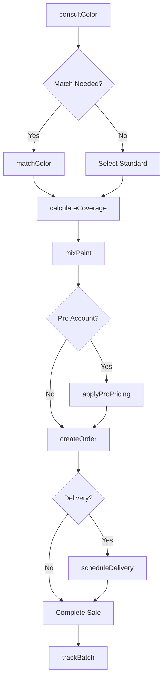
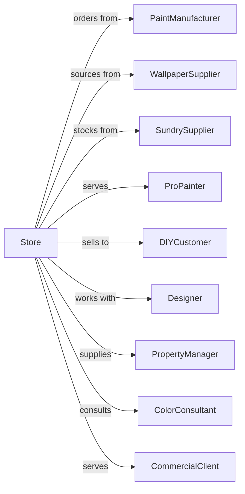

# Paint and Wallpaper Retailers

> Business-as-Code definition for paint and wallpaper retail operations. Models color consultation, custom color matching, paint mixing, wallpaper ordering, and professional painter account management.

## Overview

Paint and wallpaper retailers specialize in coatings, stains, wallcoverings, and related supplies. This definition exposes actions for color matching, custom tinting, coverage calculations, professional contractor programs, and design consultation for residential and commercial projects.

## Actors

| Actor | Description |
|-------|-------------|
| PaintManufacturer | Supplies paint, stains, and coatings (Sherwin-Williams, Benjamin Moore) |
| WallpaperSupplier | Provides wallcoverings and murals |
| SundrySupplier | Supplies brushes, rollers, and prep materials |
| ProPainter | Professional painting contractor |
| DIYCustomer | Homeowner doing own painting |
| Designer | Interior designer specifying colors |
| PropertyManager | Manages multiple rental properties |
| ColorConsultant | Provides professional color advice |
| CommercialClient | Business needing facility painting |

## Roles

| Role | Description |
|------|-------------|
| StoreManager | Oversees store operations and staff |
| ColorSpecialist | Provides expert color consultation |
| SalesAssociate | Assists customers with product selection |
| ProRepresentative | Manages contractor accounts |
| Mixer | Operates tinting equipment and matches colors |
| DesignConsultant | Assists with wallpaper and decor selection |
| InventoryManager | Manages paint and supply inventory |

## Entities

| Entity | Description |
|--------|-------------|
| Paint | Coating product with base, sheen, and color |
| ColorFormula | Tinting recipe for custom colors |
| Wallpaper | Wall covering with pattern and material |
| Sundry | Brushes, rollers, tape, and prep supplies |
| ProAccount | Contractor account with pricing tier |
| Project | Customer painting or wallpaper job |
| ColorSample | Small quantity for testing |
| Coverage | Square footage a product will cover |
| Batch | Mixed paint lot for color consistency |

## Actions

| Action | Description |
|--------|-------------|
| consultColor | Discuss color options with customer |
| matchColor | Create formula from sample or photo |
| mixPaint | Tint base paint to formula |
| calculateCoverage | Determine quantity needed for area |
| createOrder | Build order with paints and supplies |
| orderWallpaper | Source wallpaper from supplier |
| provideSample | Dispense color sample for testing |
| applyProPricing | Apply contractor discount |
| trackBatch | Record batch for future matching |
| scheduleDelivery | Arrange delivery to job site |
| processClaim | Handle quality or color issues |
| designConsult | Full color and material consultation |

## Events

| Event | Description |
|-------|-------------|
| colorConsulted | Color discussion completed |
| colorMatched | Formula created from sample |
| paintMixed | Custom color tinted |
| coverageCalculated | Quantity determined |
| orderCreated | Paint order completed |
| wallpaperOrdered | Wallcovering sourced |
| sampleProvided | Test color dispensed |
| proPricingApplied | Contractor discount applied |
| batchTracked | Mix recorded for reference |
| deliveryScheduled | Delivery arranged |
| claimProcessed | Issue resolved |
| consultCompleted | Design consultation finished |

## Searches

| Search | Description |
|--------|-------------|
| findColors | Search colors by name, number, or family |
| getColorFormula | Retrieve tinting formula |
| findWallpapers | Search patterns and materials |
| checkStock | Query inventory availability |
| findProAccounts | List contractor accounts |
| getProjectHistory | Retrieve past color purchases |
| getBatchHistory | Find previous color matches |
| getPromotions | View current deals and rebates |

## Workflow



## Actor Relationships



## Usage

### Calling Actions

```typescript
import { sellPaint } from '@headlessly/sell-paint'

const store = sellPaint()

// Search colors by name, number, or family
const colors = await store.findColors({ brand: 'Benjamin Moore', family: 'blue' })

// Retrieve tinting formula
const colorFormula = await store.getColorFormula({ colorCode: 'HC-154' })

// Match color from photo
const formula = await store.matchColor({
  source: 'photo',
  imageUrl: 'https://example.com/room-photo.jpg',
  area: 'accent-wall',
  targetSheen: 'eggshell'
})

// Calculate coverage for room
const coverage = await store.calculateCoverage({
  rooms: [
    { name: 'living-room', sqft: 450, coats: 2 },
    { name: 'bedroom', sqft: 280, coats: 2 }
  ],
  productType: 'interior-latex'
})

// Mix custom color
const paint = await store.mixPaint({
  formulaId: formula.id,
  base: 'ultra-deep',
  sheen: 'eggshell',
  size: 'gallon',
  quantity: coverage.gallonsNeeded
})

// Track batch for future reference
await store.trackBatch({
  customerId: 'cust-456',
  formulaId: formula.id,
  batchNumber: paint.batchNumber,
  projectName: 'Living Room Refresh'
})
```

### Event-Driven Automation

```typescript
// Follow up on color samples
store.sampleProvided(async ({ customerId, colorId, sampleType }) => {
  await scheduleFollowUp({
    customerId,
    delay: '5-days',
    message: `Ready to order ${colorId}? We saved your color!`
  })
})

// Notify pro on batch ready
store.paintMixed(async ({ orderId, proAccountId, batchNumber }) => {
  if (proAccountId) {
    await notifyContractor({
      proAccountId,
      message: `Order ${orderId} ready for pickup`,
      batchNumber
    })
  }
})
```
