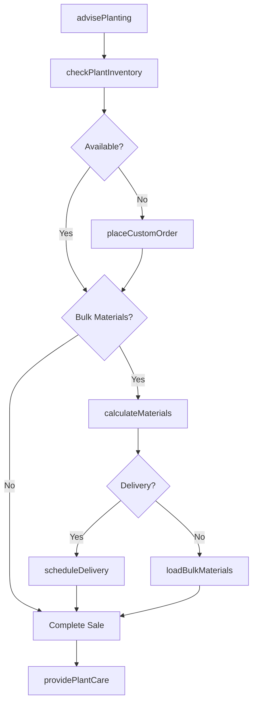
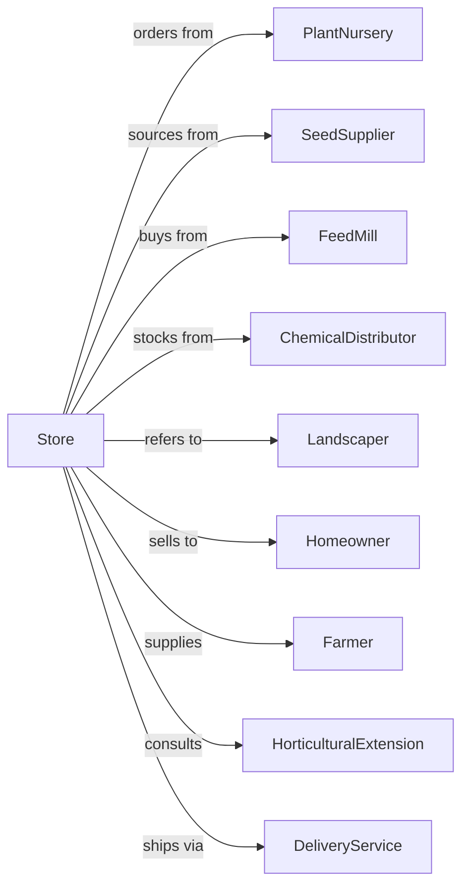

# Nursery, Garden Center, and Farm Supply Retailers

> Business-as-Code definition for nursery, garden center, and farm supply retail operations. Models plant sales, seasonal inventory, landscaping supplies, animal feed, and agricultural chemicals with expert horticultural advice.

## Overview

Nursery, garden center, and farm supply retailers sell trees, shrubs, plants, seeds, bulbs, sod, and farm supplies including animal feed, fertilizers, and agricultural chemicals. This definition exposes actions for seasonal inventory management, plant care advice, landscape design, custom orders, and delivery services for both residential gardeners and farming operations.

## Actors

| Actor | Description |
|-------|-------------|
| PlantNursery | Wholesale grower providing trees, shrubs, and plants |
| SeedSupplier | Provides seeds, bulbs, and starter plants |
| FeedMill | Supplies animal feed and supplements |
| ChemicalDistributor | Provides fertilizers, pesticides, and herbicides |
| Landscaper | Professional installing plants and hardscape |
| Homeowner | Consumer purchasing for home gardens |
| Farmer | Agricultural producer buying supplies |
| HorticulturalExtension | Provides expert growing advice |
| DeliveryService | Transports bulk materials and plants |

## Roles

| Role | Description |
|------|-------------|
| StoreOwner | Owns and operates the garden center |
| StoreManager | Manages daily operations and staff |
| Horticulturist | Provides expert plant advice |
| SalesAssociate | Assists customers with purchases |
| NurseryWorker | Cares for plant inventory |
| FeedSpecialist | Advises on animal nutrition |
| YardWorker | Loads bulk materials |
| DeliveryDriver | Delivers plants and materials |

## Entities

| Entity | Description |
|--------|-------------|
| Plant | Tree, shrub, or perennial for sale |
| Seed | Packaged seeds or bulbs |
| Sod | Grass rolls for instant lawn |
| AnimalFeed | Nutrition products for livestock |
| Fertilizer | Soil amendments and nutrients |
| Pesticide | Pest control products |
| SoilAmendment | Mulch, compost, and topsoil |
| HardGoods | Pots, tools, and garden decor |
| CustomOrder | Special plant or quantity order |

## Actions

| Action | Description |
|--------|-------------|
| advisePlanting | Recommend plants for conditions |
| checkPlantInventory | Verify plant availability |
| placeCustomOrder | Order specialty plants |
| calculateMaterials | Estimate bulk material quantities |
| createLandscapePlan | Design planting layout |
| mixFeed | Blend custom animal feed |
| scheduleDelivery | Arrange delivery of materials |
| careForPlants | Water, fertilize, and maintain stock |
| processReturn | Handle plant guarantees |
| providePlantCare | Give growing instructions |
| loadBulkMaterials | Fill customer vehicles |
| processSeasonalMarkdown | Adjust prices for season end |

## Events

| Event | Description |
|-------|-------------|
| plantAdvised | Growing recommendations provided |
| inventoryChecked | Plant availability confirmed |
| customOrderPlaced | Specialty order submitted |
| materialsCalculated | Bulk quantities estimated |
| landscapePlanned | Design completed |
| feedMixed | Custom blend prepared |
| deliveryScheduled | Delivery arranged |
| plantsCareCompleted | Inventory maintained |
| returnProcessed | Guarantee honored |
| plantCareProvided | Instructions given |
| materialsLoaded | Bulk order filled |
| seasonalMarkdownApplied | Prices adjusted |

## Searches

| Search | Description |
|--------|-------------|
| findPlants | Search by type, size, sun requirement |
| checkAvailability | Query plant and material stock |
| findFeed | Search animal feed by species |
| getPlantingGuide | Retrieve care instructions |
| findLandscapers | List professional installers |
| getSeasonalPlants | View currently available plants |
| findBulkMaterials | Search mulch, soil, and stone |
| getZoneInfo | Retrieve hardiness zone data |

## Workflow



## Actor Relationships



## Usage

### Calling Actions

```typescript
import { sellPlants } from '@headlessly/sell-plants'

const store = sellPlants()

// Search by type, size, sun requirement
const findPlantsResult = await store.findPlants({ status: 'active' })

// Query plant and material stock
const checkAvailabilityResult = await store.checkAvailability({ status: 'active' })

// Advise on shade garden plants
const recommendations = await store.advisePlanting({
  conditions: {
    sunlight: 'part-shade',
    soil: 'clay',
    moisture: 'average',
    zone: '6b'
  },
  style: 'native-garden',
  budget: 500
})

// Calculate mulch for beds
const materials = await store.calculateMaterials({
  material: 'hardwood-mulch',
  coverage: { sqft: 800, depth: 3 },
  unit: 'cubic-yards'
})

// Place custom order for specimen tree
const customOrder = await store.placeCustomOrder({
  customerId: 'cust-123',
  plant: {
    type: 'japanese-maple',
    variety: 'bloodgood',
    size: '2-inch-caliper',
    quantity: 1
  },
  deliveryRequired: true
})
```

### Event-Driven Automation

```typescript
// Send seasonal reminders
store.plantAdvised(async ({ customerId, plants, plantingDate }) => {
  // Schedule fertilization reminder
  await scheduleReminder({
    customerId,
    delay: '6-weeks',
    message: 'Time to fertilize your new plantings!'
  })

  // Schedule winterization for tender plants
  const tenderPlants = plants.filter(p => p.zone > 6)
  if (tenderPlants.length > 0) {
    await scheduleReminder({
      customerId,
      timing: 'october',
      message: 'Protect tender plants before frost'
    })
  }
})

// Auto-markdown aging inventory
store.plantsCareCompleted(async ({ plants }) => {
  for (const plant of plants) {
    if (plant.daysInInventory > 90) {
      await store.processSeasonalMarkdown({
        plantId: plant.id,
        discount: 0.25,
        reason: 'inventory-age'
      })
    }
  }
})
```
