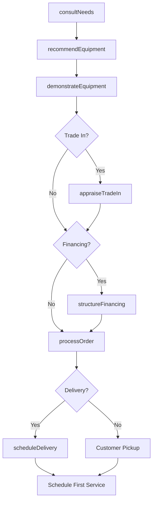
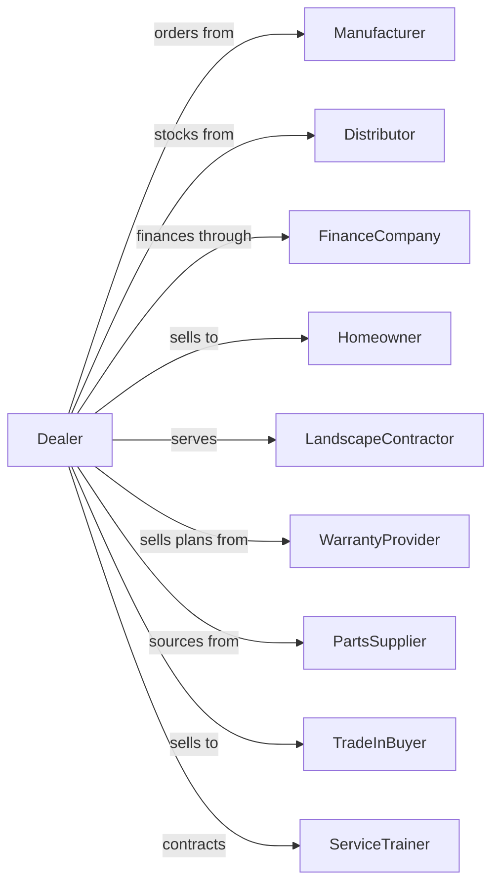

# Outdoor Power Equipment Retailers

> Business-as-Code definition for outdoor power equipment retail operations. Models sales, service, and parts for lawn mowers, tractors, chainsaws, snow blowers, and other outdoor power equipment.

## Overview

Outdoor power equipment retailers sell and service lawn mowers, garden tractors, chainsaws, string trimmers, leaf blowers, and snow removal equipment. This definition exposes actions for equipment selection, trade-in valuation, financing, warranty service, seasonal maintenance, and parts inventory management.

## Actors

| Actor | Description |
|-------|-------------|
| Manufacturer | OEM providing equipment and warranty support |
| Distributor | Regional warehouse for parts and units |
| FinanceCompany | Provides equipment financing |
| Homeowner | Consumer purchasing equipment for personal use |
| LandscapeContractor | Commercial buyer for business use |
| WarrantyProvider | Administers extended service plans |
| PartsSupplier | Sources OEM and aftermarket parts |
| TradeInBuyer | Purchases used equipment for resale |
| ServiceTrainer | Provides technician certification |

## Roles

| Role | Description |
|------|-------------|
| DealerOwner | Owns dealership and franchise relationships |
| SalesManager | Manages equipment sales team |
| SalesConsultant | Assists customers with equipment selection |
| ServiceManager | Runs repair and maintenance operations |
| ServiceTechnician | Performs equipment repairs |
| PartsManager | Manages parts inventory and ordering |
| FinanceCoordinator | Structures payment plans |
| DeliveryDriver | Delivers equipment to customers |
| SmallEngineMechanic | Diagnoses and repairs carburetors, ignitions, and drive systems on power equipment |

## Entities

| Entity | Description |
|--------|-------------|
| Equipment | Outdoor power unit (mower, tractor, chainsaw) |
| Part | Replacement component with part number |
| ServiceOrder | Work ticket for repairs or maintenance |
| TradeIn | Customer's used equipment for allowance |
| Warranty | Manufacturer or extended coverage |
| FinanceContract | Payment plan for equipment purchase |
| MaintenanceKit | Seasonal service package |
| Attachment | Add-on implements (bagger, plow, deck) |
| Fuel | Mixed fuel and lubricants for equipment |

## Actions

| Action | Description |
|--------|-------------|
| consultNeeds | Assess customer lawn and usage needs |
| recommendEquipment | Suggest appropriate models |
| demonstrateEquipment | Show features and operation |
| appraiseTradeIn | Value customer's existing equipment |
| structureFinancing | Arrange payment plan |
| processOrder | Complete equipment sale |
| scheduleDelivery | Arrange delivery and setup |
| performService | Complete repair or maintenance |
| orderParts | Source parts for repairs |
| winterize | Prepare equipment for off-season |
| springService | Pre-season maintenance and tune-up |
| processWarranty | Handle warranty claims |

## Events

| Event | Description |
|-------|-------------|
| needsConsulted | Customer requirements assessed |
| equipmentRecommended | Appropriate models suggested |
| demonstrationCompleted | Customer saw equipment operation |
| tradeInAppraised | Trade value determined |
| financingApproved | Payment plan established |
| orderProcessed | Sale completed |
| deliveryScheduled | Delivery arranged |
| serviceCompleted | Repair or maintenance finished |
| partsOrdered | Components sourced |
| winterized | Equipment stored for off-season |
| springServiced | Pre-season maintenance done |
| warrantyProcessed | Claim completed |

## Searches

| Search | Description |
|--------|-------------|
| findEquipment | Search by type, brand, features |
| checkInventory | Query available units |
| findParts | Search by equipment or part number |
| getTradeValue | Look up used equipment values |
| getFinancePrograms | View available payment options |
| getServiceHistory | Retrieve equipment service records |
| findAppointments | View scheduled service |
| getWarrantyStatus | Check coverage by serial number |

## Workflow



## Actor Relationships



## Usage

### Calling Actions

```typescript
import { sellOutdoorPowerEquipment } from '@headlessly/sell-outdoor-power-equipment'

const dealer = sellOutdoorPowerEquipment()

// Search by type, brand, features
const findEquipmentResult = await dealer.findEquipment({ status: 'active' })

// Query available units
const checkInventoryResult = await dealer.checkInventory({ status: 'active' })

// Consult on customer needs
const assessment = await dealer.consultNeeds({
  customerId: 'cust-123',
  lawnSize: 0.75, // acres
  terrain: 'rolling',
  features: ['mulching', 'bagging'],
  budget: 4000
})

// Get recommendations
const recommendations = await dealer.recommendEquipment({
  assessmentId: assessment.id,
  category: 'riding-mower',
  brands: ['john-deere', 'husqvarna', 'cub-cadet']
})

// Appraise trade-in
const tradeValue = await dealer.appraiseTradeIn({
  make: 'craftsman',
  model: 'T110',
  year: 2019,
  hours: 120,
  condition: 'good'
})

// Complete sale with financing
await dealer.structureFinancing({
  customerId: 'cust-123',
  equipmentId: recommendations[0].id,
  tradeAllowance: tradeValue.value,
  downPayment: 500,
  term: 48,
  rate: 0.0
})
```

### Event-Driven Automation

```typescript
// Schedule seasonal service reminders
dealer.orderProcessed(async ({ customerId, equipmentId, equipmentType }) => {
  // Schedule spring tune-up
  await scheduleReminder({
    customerId,
    equipmentId,
    service: 'spring-service',
    timing: 'march',
    message: 'Time for pre-season tune-up!'
  })

  // Schedule winterization if applicable
  if (['riding-mower', 'lawn-tractor'].includes(equipmentType)) {
    await scheduleReminder({
      customerId,
      equipmentId,
      service: 'winterization',
      timing: 'november',
      message: 'Protect your investment with winterization service'
    })
  }
})

// Follow up on service completion
dealer.serviceCompleted(async ({ customerId, equipmentId, findings }) => {
  if (findings.recommendedServices.length > 0) {
    await sendFollowUp({
      customerId,
      message: 'Additional recommended services from your visit',
      recommendations: findings.recommendedServices
    })
  }
})
```
