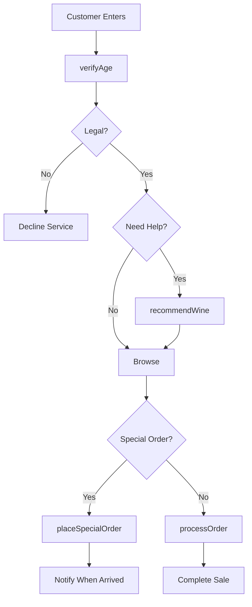
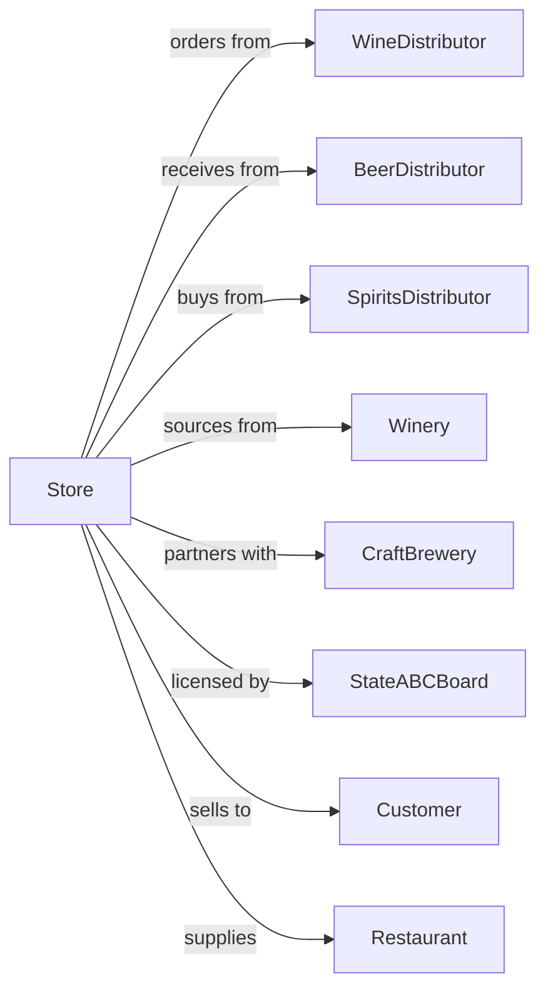

# Beer, Wine, and Liquor Retailers

> Business-as-Code definition for beer, wine, and liquor retail operations. Models age verification, inventory management, wine curation, tasting events, and specialty product sourcing for package stores and specialty wine shops.

## Overview

Beer, wine, and liquor retailers sell packaged alcoholic beverages including craft beer, fine wines, and spirits. This definition exposes actions for age verification, wine selection consultation, tasting events, special orders, temperature-controlled storage, and compliance with state liquor regulations.

## Actors

| Actor | Description |
|-------|-------------|
| WineDistributor | Provides wines from various regions |
| BeerDistributor | Supplies domestic and craft beers |
| SpiritsDistributor | Delivers liquor and spirits |
| Winery | Direct source for allocated wines |
| CraftBrewery | Local brewery for specialty beers |
| StateABCBoard | Regulates liquor sales and licensing |
| Customer | Individual purchasing beverages |
| EventPlanner | Orders for parties and occasions |
| Restaurant | Commercial buyer for beverage program |

## Roles

| Role | Description |
|------|-------------|
| StoreOwner | Owns and operates liquor store |
| StoreManager | Oversees operations and compliance |
| WineSpecialist | Provides expert wine recommendations |
| BeerBuyer | Curates craft and specialty beers |
| Cashier | Processes sales and verifies age |
| InventoryManager | Manages stock and ordering |
| TastingCoordinator | Organizes sampling events |
| Sommelier | Provides expert wine pairing and selection advice to customers |

## Entities

| Entity | Description |
|--------|-------------|
| Wine | Wines by region, variety, and vintage |
| Beer | Craft, domestic, and imported beers |
| Spirit | Liquor including whiskey, vodka, rum |
| Vintage | Specific harvest year for wines |
| Allocation | Limited release wine availability |
| TastingEvent | Wine or spirits sampling occasion |
| AgeVerification | ID check for legal purchase |
| SpecialOrder | Customer request for specific item |
| CellarStorage | Temperature-controlled inventory |

## Actions

| Action | Description |
|--------|-------------|
| verifyAge | Check ID for legal purchase |
| recommendWine | Suggest wines for occasion or pairing |
| processOrder | Complete customer sale |
| placeSpecialOrder | Order specific wines or spirits |
| hostTasting | Conduct sampling event |
| manageAllocations | Handle limited release wines |
| receiveInventory | Accept distributor deliveries |
| maintainCellar | Monitor storage conditions |
| checkCompliance | Verify regulatory adherence |
| createGiftSet | Assemble beverage gift packages |
| fulfillPartyOrder | Prepare large event orders |
| trackInventory | Monitor stock levels |

## Events

| Event | Description |
|-------|-------------|
| ageVerified | ID confirmed legal |
| wineRecommended | Suggestion provided |
| orderProcessed | Sale completed |
| specialOrderPlaced | Request submitted |
| tastingHosted | Sampling event held |
| allocationManaged | Limited wine allocated |
| inventoryReceived | Delivery accepted |
| cellarMaintained | Storage verified |
| complianceChecked | Regulations confirmed |
| giftSetCreated | Package assembled |
| partyOrderFulfilled | Event order prepared |
| inventoryTracked | Stock updated |

## Searches

| Search | Description |
|--------|-------------|
| findWines | Search by region, variety, price |
| findBeers | Search by style, brewery, origin |
| findSpirits | Search by type, brand, age |
| checkInventory | Query current stock |
| getAllocations | View limited release availability |
| getTastingSchedule | View upcoming events |
| findPairings | Get food pairing suggestions |
| getSpecialOrders | View pending requests |

## Workflow



## Actor Relationships



## Usage

### Calling Actions

```typescript
import { sellWineSpirits } from '@headlessly/sell-wine-spirits'

const store = sellWineSpirits()

// Verify customer age
const verification = await store.verifyAge({
  idType: 'drivers-license',
  dateOfBirth: '1990-03-15',
  state: 'CA',
  idNumber: 'D12345678'
})

// Recommend wine for dinner
const recommendations = await store.recommendWine({
  occasion: 'dinner-party',
  pairing: 'grilled-salmon',
  preferences: {
    type: 'white',
    region: 'flexible',
    priceRange: { min: 20, max: 40 }
  },
  quantity: 3
})

// Place special order for allocated wine
const specialOrder = await store.placeSpecialOrder({
  customerId: 'cust-123',
  wine: {
    producer: 'Opus One',
    vintage: 2021,
    quantity: 2
  },
  notifyWhenAvailable: true
})

// Host wine tasting event
await store.hostTasting({
  theme: 'Napa-Cabernets',
  date: '2024-05-15',
  time: '19:00',
  capacity: 24,
  wines: [
    { producer: 'Caymus', vintage: 2020 },
    { producer: 'Silver Oak', vintage: 2019 },
    { producer: 'Stags Leap', vintage: 2020 }
  ],
  ticketPrice: 45
})
```

### Event-Driven Automation

```typescript
// Notify on special order arrival
store.inventoryReceived(async ({ items }) => {
  const specialOrders = await store.getSpecialOrders({ status: 'pending' })

  for (const order of specialOrders) {
    const arrived = items.find(i =>
      i.producer === order.wine.producer &&
      i.vintage === order.wine.vintage
    )

    if (arrived) {
      await notifyCustomer({
        customerId: order.customerId,
        message: `Your ${order.wine.producer} ${order.wine.vintage} has arrived!`,
        holdUntil: addDays(new Date(), 14)
      })
    }
  }
})

// Alert on allocation releases
store.allocationManaged(async ({ wine, quantity, releaseDate }) => {
  const interestedCustomers = await getWaitlist(wine.producer)

  for (const customer of interestedCustomers) {
    await notifyCustomer({
      customerId: customer.id,
      message: `${wine.producer} ${wine.vintage} allocation available`,
      priority: customer.tier === 'vip' ? 'early-access' : 'standard'
    })
  }
})
```
