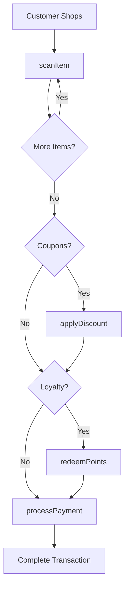
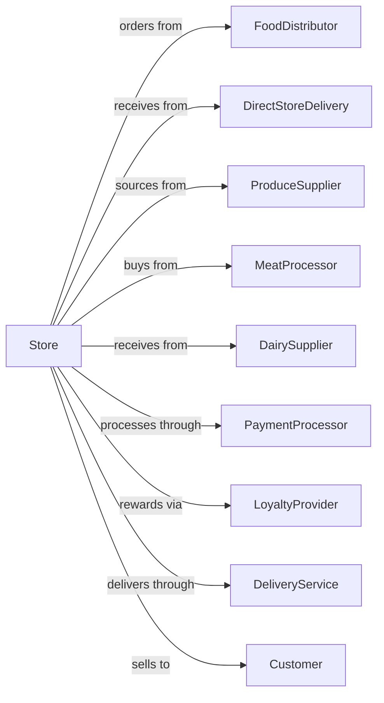

# Supermarkets and Other Grocery Retailers (except Convenience Retailers)

> Business-as-Code definition for supermarket and grocery retail operations. Models the complete grocery retail experience including inventory management, perishable handling, checkout operations, loyalty programs, and online ordering with delivery.

## Overview

Supermarkets retail a general line of food products including produce, meat, dairy, bakery, and packaged goods along with household items. This definition exposes actions for category management, perishable inventory, promotional pricing, loyalty programs, online fulfillment, and fresh department operations.

## Actors

| Actor | Description |
|-------|-------------|
| FoodDistributor | Provides grocery products via warehouse |
| DirectStoreDelivery | Vendors delivering bread, chips, beverages |
| ProduceSupplier | Sources fresh fruits and vegetables |
| MeatProcessor | Provides fresh and processed meats |
| DairySupplier | Delivers milk, cheese, and dairy products |
| PaymentProcessor | Handles credit, debit, and EBT transactions |
| LoyaltyProvider | Manages customer rewards program |
| DeliveryService | Provides home delivery fulfillment |
| Customer | Shopper purchasing groceries |

## Roles

| Role | Description |
|------|-------------|
| StoreManager | Oversees all store operations |
| DepartmentManager | Manages specific category (produce, meat, etc.) |
| Cashier | Processes customer transactions |
| Stocker | Replenishes shelf inventory |
| ProduceClerk | Maintains fresh produce displays |
| MeatCutter | Prepares and packages fresh meats |
| Deli Clerk | Operates deli and prepared foods |
| OnlinePickupAssociate | Fulfills online orders |
| Bakery Chef | Prepares fresh breads, pastries, and cakes in the in-store bakery |

## Entities

| Entity | Description |
|--------|-------------|
| Product | SKU with price, UPC, and category |
| Shelf | Display location with planogram |
| Order | Customer purchase transaction |
| Coupon | Manufacturer or store discount |
| LoyaltyAccount | Customer rewards membership |
| Promotion | Sale pricing for products |
| OnlineOrder | Digital order for pickup or delivery |
| Perishable | Time-sensitive product with expiration |
| Basket | Customer's shopping cart contents |

## Actions

| Action | Description |
|--------|-------------|
| scanItem | Read product barcode at checkout |
| processPayment | Complete transaction payment |
| applyDiscount | Apply coupon or promotional price |
| checkInventory | Verify product availability |
| replenishShelf | Stock products on shelf |
| markdownPerishable | Reduce price on expiring items |
| fulfillOnlineOrder | Pick and pack digital order |
| scheduleDelivery | Arrange home delivery |
| processReturn | Handle customer returns |
| enrollLoyalty | Sign up customer for rewards |
| redeemPoints | Apply loyalty rewards |
| receiveDelivery | Accept vendor shipment |

## Events

| Event | Description |
|-------|-------------|
| itemScanned | Product added to transaction |
| paymentProcessed | Transaction completed |
| discountApplied | Savings calculated |
| inventoryChecked | Stock level confirmed |
| shelfReplenished | Product stocked |
| perishableMarkedDown | Price reduced for expiration |
| onlineOrderFulfilled | Digital order ready |
| deliveryScheduled | Home delivery arranged |
| returnProcessed | Refund completed |
| loyaltyEnrolled | Customer joined program |
| pointsRedeemed | Rewards applied |
| deliveryReceived | Vendor shipment accepted |

## Searches

| Search | Description |
|--------|-------------|
| findProducts | Search by name, UPC, or category |
| checkStock | Query inventory levels |
| findPromotions | View active sales and deals |
| getCustomerHistory | Retrieve purchase history |
| findLoyaltyAccount | Look up customer rewards |
| getOnlineOrders | View pending digital orders |
| getExpiringProducts | List items nearing expiration |
| getDeliverySchedule | View incoming vendor deliveries |

## Workflow



## Actor Relationships



## Usage

### Calling Actions

```typescript
import { retailGroceries } from '@headlessly/retail-groceries'

const store = retailGroceries()

// Process checkout transaction
const transaction = await store.processTransaction({
  items: [
    { upc: '012345678901', quantity: 2 },
    { upc: '098765432109', quantity: 1, weight: 1.5 }
  ],
  loyaltyId: 'LOYALTY-12345'
})

// Apply available discounts
const discounts = await store.applyDiscount({
  transactionId: transaction.id,
  coupons: ['MFR-SAVE-100', 'STORE-5OFF25'],
  loyaltyOffers: true
})

// Complete payment
await store.processPayment({
  transactionId: transaction.id,
  method: 'credit',
  amount: transaction.total - discounts.savings
})
```

### Event-Driven Automation

```typescript
// Auto-markdown expiring perishables
store.inventoryChecked(async ({ products }) => {
  for (const product of products) {
    if (product.daysUntilExpiry <= 2 && !product.markedDown) {
      await store.markdownPerishable({
        productId: product.id,
        discount: product.daysUntilExpiry === 1 ? 0.50 : 0.30,
        reason: 'expiration'
      })
    }
  }
})

// Notify online order ready
store.onlineOrderFulfilled(async ({ orderId, customerId, pickupTime }) => {
  await notifyCustomer({
    customerId,
    channel: 'sms',
    message: `Your order is ready for pickup! Order #${orderId}`,
    pickupLocation: 'Online Pickup Parking'
  })
})
```
