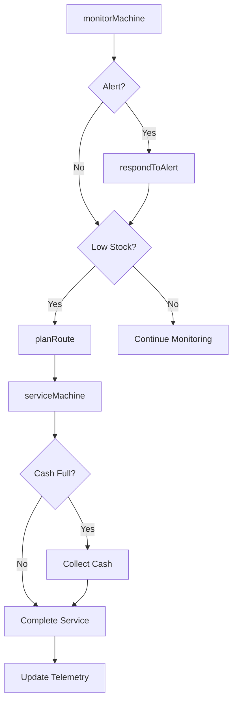
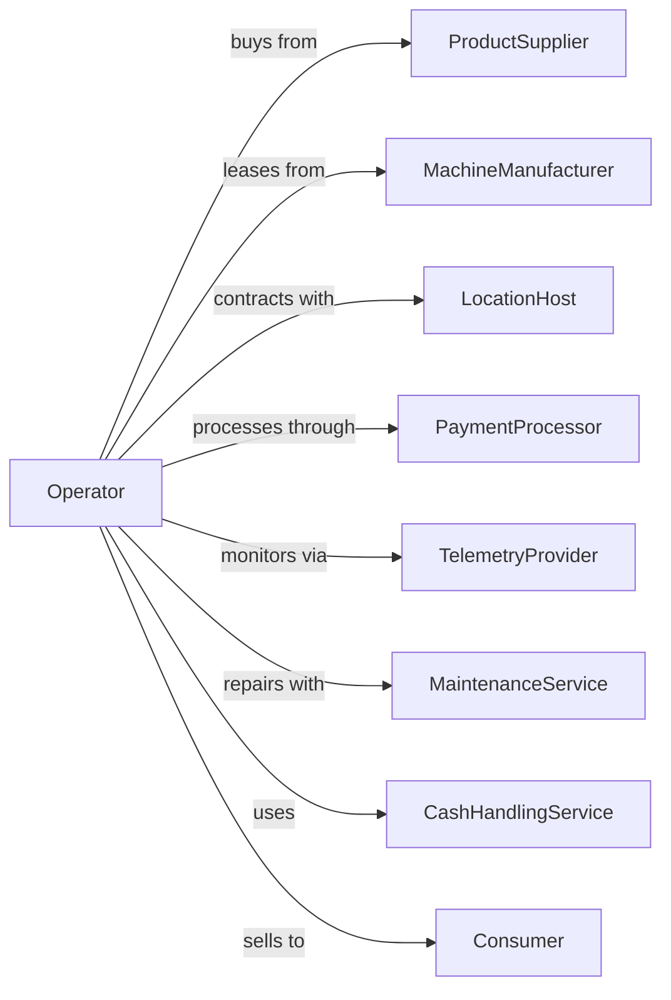

# Vending Machine Operators

> Business-as-Code definition for vending machine service operations. Models machine placement, route servicing, inventory management, cashless payments, and remote monitoring for automated retail.

## Overview

Vending machine operators place and service automated retail machines selling snacks, beverages, and other merchandise. This definition exposes actions for route optimization, machine monitoring, inventory replenishment, payment processing, and location management across distributed vending networks.

## Actors

| Actor | Description |
|-------|-------------|
| ProductSupplier | Provides snacks, beverages, and merchandise |
| MachineManufacturer | Supplies vending equipment |
| LocationHost | Property owner hosting machines |
| PaymentProcessor | Handles cashless and mobile payments |
| TelemetryProvider | Provides remote monitoring technology |
| MaintenanceService | Repairs machines and equipment |
| CashHandlingService | Provides armored pickup and counting |
| RouteOptimizer | Software for efficient servicing |
| Consumer | End user making purchases |

## Roles

| Role | Description |
|------|-------------|
| RouteOwner | Owns vending route and locations |
| RouteDriver | Services machines on assigned route |
| Warehouse Manager | Manages product inventory |
| TechnicalSupport | Handles machine repairs |
| AccountManager | Manages location relationships |
| DataAnalyst | Analyzes sales and route data |
| CoinMechanic | Services bill validators, coin mechanisms, and cashless payment readers on machines |

## Entities

| Entity | Description |
|--------|-------------|
| Machine | Vending equipment at location |
| Location | Site where machine is placed |
| Route | Collection of machines serviced together |
| Product | SKU stocked in machines |
| Commission | Payment to location host |
| Transaction | Individual vend or purchase |
| Planogram | Product layout in machine |
| Alert | Machine status notification |
| ServiceVisit | Route driver service record |

## Actions

| Action | Description |
|--------|-------------|
| placeLocation | Install machine at new site |
| planRoute | Optimize service route |
| serviceMachine | Replenish, collect cash, and clean |
| monitorMachine | Check remote telemetry |
| respondToAlert | Address machine issues |
| adjustPricing | Update product prices |
| updatePlanogram | Change product selection |
| calculateCommission | Compute location host payment |
| processRefund | Handle customer complaints |
| relocateMachine | Move machine to new location |
| retireMachine | Remove underperforming machine |
| analyzePerformance | Review sales and metrics |

## Events

| Event | Description |
|-------|-------------|
| locationPlaced | Machine installed at site |
| routePlanned | Service schedule optimized |
| machineServiced | Replenishment completed |
| machineMonitored | Telemetry data received |
| alertResponded | Issue addressed |
| pricingAdjusted | Prices updated |
| planogramUpdated | Products changed |
| commissionCalculated | Host payment determined |
| refundProcessed | Customer issue resolved |
| machineRelocated | Equipment moved |
| machineRetired | Equipment removed |
| performanceAnalyzed | Metrics reviewed |

## Searches

| Search | Description |
|--------|-------------|
| findMachines | Search by location or status |
| getRoutes | List service routes |
| getMachineStatus | Query telemetry data |
| getAlerts | View active machine alerts |
| getSalesData | Retrieve transaction history |
| findLocations | Search potential placement sites |
| getInventoryLevels | Check product stock in machines |
| getCommissionReports | View host payments |

## Workflow



## Actor Relationships



## Usage

### Calling Actions

```typescript
import { operateVendingMachines } from '@headlessly/operate-vending-machines'

const operator = operateVendingMachines()

// Monitor machine fleet
const status = await operator.monitorMachine({
  machineIds: ['VND-001', 'VND-002', 'VND-003'],
  metrics: ['inventory', 'sales', 'errors', 'temperature']
})

// Plan service route
const route = await operator.planRoute({
  driverId: 'driver-123',
  date: '2024-04-15',
  criteria: {
    lowInventory: true,
    cashFull: true,
    alerts: true,
    scheduledService: true
  },
  optimize: 'distance'
})

// Service machine
await operator.serviceMachine({
  machineId: 'VND-001',
  actions: {
    replenish: [
      { slot: 'A1', sku: 'COKE-20OZ', quantity: 8 },
      { slot: 'B3', sku: 'DORITOS', quantity: 12 }
    ],
    collectCash: true,
    cleanExterior: true
  },
  driverId: 'driver-123'
})
```

### Event-Driven Automation

```typescript
// Auto-respond to alerts
operator.alertResponded(async ({ machineId, alertType, severity }) => {
  if (severity === 'critical') {
    await dispatchTechnician({
      machineId,
      issue: alertType,
      priority: 'immediate'
    })
  } else {
    await addToRoute({
      machineId,
      reason: alertType,
      priority: 'next-scheduled'
    })
  }
})

// Optimize underperformers
operator.performanceAnalyzed(async ({ machineId, metrics }) => {
  if (metrics.vendsPerDay < 5 && metrics.daysAtLocation > 90) {
    await operator.flagForReview({
      machineId,
      reason: 'low-performance',
      options: ['relocate', 'updatePlanogram', 'retire']
    })
  }
})
```
