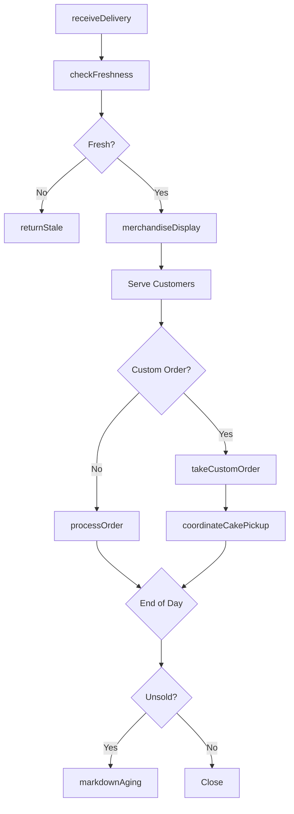
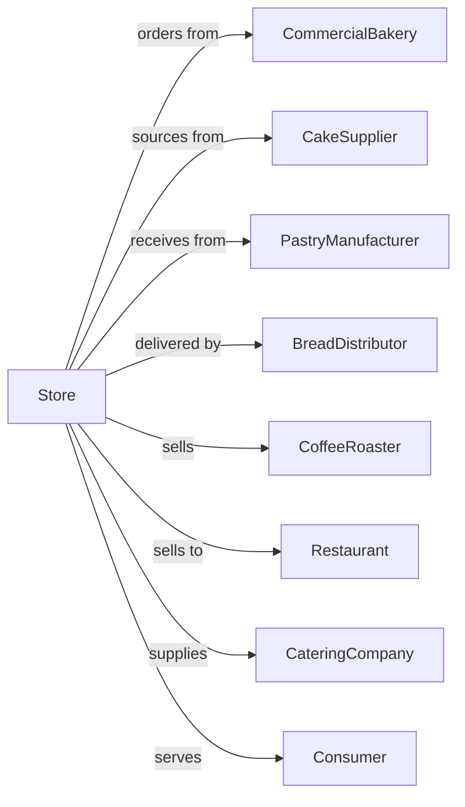

# Baked Goods Retailers

> Business-as-Code definition for bakery retail operations. Models sourcing from commercial bakeries, product freshness management, custom cake ordering, and specialty bread merchandising for retail customers.

## Overview

Baked goods retailers specialize in bread, pastries, cakes, and other bakery products not made on premises. This definition exposes actions for freshness management, daily delivery coordination, custom cake ordering, seasonal merchandising, and wholesale accounts for restaurants and cafes.

## Actors

| Actor | Description |
|-------|-------------|
| CommercialBakery | Provides bread, rolls, and pastries |
| CakeSupplier | Sources specialty and custom cakes |
| PastryManufacturer | Supplies croissants, danishes, and pastries |
| BreadDistributor | Delivers daily bread products |
| CoffeeRoaster | Provides coffee to complement sales |
| Restaurant | Commercial buyer for foodservice |
| CateringCompany | Orders for events and functions |
| Consumer | Individual purchasing baked goods |
| DeliveryService | Provides home delivery |

## Roles

| Role | Description |
|------|-------------|
| StoreOwner | Owns and operates bakery retail |
| StoreManager | Oversees daily operations |
| SalesAssociate | Serves customers and processes sales |
| CakeSpecialist | Handles custom cake orders |
| DisplayMerchandiser | Arranges attractive product displays |
| DeliveryDriver | Delivers to wholesale accounts |
| ReceivingClerk | Accepts daily bakery deliveries |

## Entities

| Entity | Description |
|--------|-------------|
| Bread | Loaves, rolls, and specialty breads |
| Pastry | Croissants, danishes, and sweet rolls |
| Cake | Decorated cakes for occasions |
| Cookie | Packaged and fresh-baked cookies |
| Pie | Fruit, cream, and specialty pies |
| CustomOrder | Special cake or pastry request |
| FreshnessDate | Sell-by date for products |
| DailyDelivery | Scheduled bakery arrival |
| Display | Merchandised product arrangement |

## Actions

| Action | Description |
|--------|-------------|
| receiveDelivery | Accept daily bakery shipment |
| checkFreshness | Verify sell-by dates |
| merchandiseDisplay | Arrange products attractively |
| takeCustomOrder | Accept special cake request |
| processOrder | Complete customer sale |
| markdownAging | Reduce price on day-old items |
| coordinateCakePickup | Schedule custom cake pickup |
| fulfillWholesale | Prepare restaurant orders |
| returnStale | Send back unsold products |
| manageSeasonal | Stock holiday and seasonal items |
| suggestPairing | Recommend complementary items |
| packageGift | Prepare gift boxes and baskets |

## Events

| Event | Description |
|-------|-------------|
| deliveryReceived | Daily shipment accepted |
| freshnessChecked | Sell-by dates verified |
| displayMerchandised | Products arranged |
| customOrderTaken | Special request recorded |
| orderProcessed | Sale completed |
| agingMarkedDown | Day-old priced reduced |
| cakePickupScheduled | Custom cake ready date set |
| wholesaleFulfilled | Restaurant order shipped |
| staleReturned | Unsold products credited |
| seasonalManaged | Holiday items stocked |
| pairingSuggested | Complement recommended |
| giftPackaged | Gift box prepared |

## Searches

| Search | Description |
|--------|-------------|
| findProducts | Search by type or occasion |
| checkAvailability | Query current inventory |
| getCustomOrders | View pending cake orders |
| getFreshnessStatus | Check sell-by dates |
| findSeasonalItems | View holiday products |
| getWholesaleAccounts | List restaurant customers |
| getDailySpecials | View today's featured items |
| getDeliverySchedule | View expected shipments |

## Workflow



## Actor Relationships



## Usage

### Calling Actions

```typescript
import { sellBakedGoods } from '@headlessly/sell-baked-goods'

const store = sellBakedGoods()

// Search by type or occasion
const findProductsResult = await store.findProducts({ category: 'featured', inStock: true })

// Query current inventory
const checkAvailabilityResult = await store.checkAvailability({ status: 'active' })

// Receive daily delivery
await store.receiveDelivery({
  supplier: 'artisan-bakers',
  items: [
    { product: 'sourdough-loaf', quantity: 24 },
    { product: 'croissant', quantity: 48 },
    { product: 'danish-assorted', quantity: 36 },
    { product: 'baguette', quantity: 18 }
  ],
  deliveryTime: '05:30',
  freshnessDate: '2024-04-16'
})

// Take custom cake order
const cakeOrder = await store.takeCustomOrder({
  customerId: 'cust-123',
  type: 'birthday-cake',
  specifications: {
    size: '10-inch',
    flavor: 'chocolate',
    frosting: 'buttercream',
    decoration: 'Happy Birthday Sarah',
    colorScheme: ['pink', 'white']
  },
  pickupDate: '2024-04-20',
  pickupTime: '14:00'
})

// Markdown end-of-day items
await store.markdownAging({
  products: [
    { sku: 'croissant', quantity: 12, discount: 0.50 },
    { sku: 'danish-assorted', quantity: 8, discount: 0.50 }
  ],
  reason: 'day-old',
  validUntil: 'close-of-business'
})
```

### Event-Driven Automation

```typescript
// Alert on custom cake pickup
store.customOrderTaken(async ({ orderId, customerId, pickupDate }) => {
  // Remind customer day before
  await scheduleReminder({
    customerId,
    at: subtractDays(pickupDate, 1),
    message: `Your custom cake order is ready for pickup tomorrow!`,
    orderId
  })
})

// Auto-markdown aging products
store.freshnessChecked(async ({ products }) => {
  const endOfShelfLife = products.filter(p => p.daysUntilExpiry <= 1)
  if (endOfShelfLife.length > 0) {
    await store.markdownAging({
      products: endOfShelfLife.map(p => ({
        sku: p.sku,
        quantity: p.quantity,
        discount: 0.40
      })),
      reason: 'end-of-shelf-life'
    })
  }
})
```
