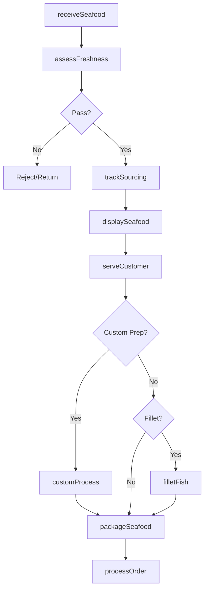

# Fish and Seafood Retailers

> Business-as-Code definition for fish and seafood retail operations. Models sourcing from boats and distributors, freshness management, custom processing, and specialty seafood preparation for retail and foodservice customers.

## Overview

Fish and seafood retailers specialize in fresh, frozen, and cured seafood including fin fish, shellfish, and specialty items. This definition exposes actions for freshness assessment, custom filleting, smoking, and portion control while managing cold chain compliance and sustainability sourcing.

## Actors

| Actor | Description |
|-------|-------------|
| FishingBoat | Direct source for fresh-caught seafood |
| SeafoodDistributor | Provides wholesale fish and shellfish |
| AquacultureFarm | Sources farm-raised fish and shellfish |
| ImporterExporter | Provides specialty and international seafood |
| Restaurant | Commercial buyer for foodservice |
| SushiChef | Specialty buyer for raw fish preparations |
| Consumer | Individual purchasing seafood |
| FDAInspector | Oversees food safety compliance |
| IceMachine Vendor | Supplies ice for display and storage |

## Roles

| Role | Description |
|------|-------------|
| ShopOwner | Owns and operates fish market |
| Fishmonger | Expert in fish selection and preparation |
| FilletingSpecialist | Cuts and portions fish |
| CounterPerson | Serves customers and processes sales |
| SmokeHouseOperator | Cures and smokes fish products |
| QualityInspector | Checks freshness and safety |
| DeliveryDriver | Delivers to restaurants and customers |

## Entities

| Entity | Description |
|--------|-------------|
| Fish | Fin fish species with origin and catch method |
| Shellfish | Shrimp, crab, lobster, and mollusks |
| Fillet | Boneless portion of fish |
| Whole Fish | Unprocessed fish by weight |
| SmokedFish | Cured and smoked products |
| FreshDisplay | Iced case for fresh seafood |
| CatchDate | Date fish was harvested |
| Sustainability | Sourcing certification and practices |
| CustomOrder | Special preparation request |

## Actions

| Action | Description |
|--------|-------------|
| receiveSeafood | Accept delivery and inspect quality |
| assessFreshness | Evaluate quality indicators |
| filletFish | Cut whole fish into portions |
| scaleAndGut | Prepare whole fish for customer |
| smokeSeafood | Cure and smoke fish products |
| displaySeafood | Arrange on ice in case |
| serveCustomer | Take orders and process requests |
| customProcess | Prepare to customer specifications |
| packageSeafood | Wrap and ice for transport |
| trackSourcing | Record origin and sustainability |
| processOrder | Complete sale transaction |
| deliverOrder | Transport to customer location |

## Events

| Event | Description |
|-------|-------------|
| seafoodReceived | Delivery accepted |
| freshnessAssessed | Quality confirmed |
| fishFilleted | Portions cut |
| fishPrepared | Whole fish scaled and gutted |
| seafoodSmoked | Smoking completed |
| seafoodDisplayed | Case stocked |
| customerServed | Order taken |
| customProcessed | Special request completed |
| seafoodPackaged | Ready for transport |
| sourcingTracked | Origin recorded |
| orderProcessed | Sale completed |
| orderDelivered | Customer received delivery |

## Searches

| Search | Description |
|--------|-------------|
| findSeafood | Search by species, origin, or preparation |
| checkFreshness | Query catch dates and quality |
| findSustainable | Search certified sustainable products |
| getWholesaleAccounts | List restaurant customers |
| findLocalCatch | View locally sourced seafood |
| getSeasonalItems | Check seasonal availability |
| getPriceList | View current market prices |
| getSourcingInfo | Retrieve origin and catch method |

## Workflow



## Actor Relationships

```mermaid
graph LR
    S[Shop]

    S -->|buys from| FishingBoat
    S -->|orders from| SeafoodDistributor
    S -->|sources from| AquacultureFarm
    S -->|imports via| ImporterExporter
    S -->|sells to| Restaurant
    S -->|supplies| SushiChef
    S -->|serves| Consumer
    S -->|inspected by| FDAInspector
    S -->|buys from| IceMachine Vendor
```

## Usage

### Calling Actions

```typescript
import { sellSeafood } from '@headlessly/sell-seafood'

const market = sellSeafood()

// Search by species, origin, or preparation
const seafood = await market.findSeafood({ species: 'salmon', origin: 'alaska' })

// Query catch dates and quality
const freshness = await market.checkFreshness({ species: 'salmon', supplier: 'atlantic-fleet' })

// Receive fresh catch
await market.receiveSeafood({
  supplier: 'atlantic-fleet',
  items: [
    { species: 'salmon', origin: 'alaska', weight: 50, unit: 'lbs', catchDate: '2024-04-14' },
    { species: 'swordfish', origin: 'atlantic', weight: 30, unit: 'lbs', catchDate: '2024-04-13' },
    { species: 'shrimp', origin: 'gulf', size: '16-20', weight: 25, unit: 'lbs' }
  ],
  temperature: 34,
  sustainable: true
})

// Custom fillet for customer
const order = await market.customProcess({
  customerId: 'cust-123',
  species: 'salmon',
  preparation: 'fillet',
  options: {
    skinOn: false,
    pinBonesRemoved: true,
    portionSize: 6,
    quantity: 4
  }
})

// Track sustainability sourcing
await market.trackSourcing({
  species: 'salmon',
  certification: 'MSC',
  catchMethod: 'wild-caught',
  origin: 'alaska',
  vessel: 'North Star'
})
```

### Event-Driven Automation

```typescript
// Alert on freshness threshold
market.freshnessAssessed(async ({ species, catchDate, daysOld }) => {
  if (daysOld >= 3) {
    await alertStaff({
      message: `${species} approaching freshness limit`,
      action: 'markdown-or-smoke',
      priority: 'high'
    })
  }
})

// Notify wholesale customers of catch
market.seafoodReceived(async ({ items }) => {
  const premiumItems = items.filter(i => i.grade === 'sushi-grade')
  if (premiumItems.length > 0) {
    await notifyWholesaleAccounts({
      message: 'Fresh sushi-grade seafood available',
      items: premiumItems,
      expiresIn: '24-hours'
    })
  }
})
```
