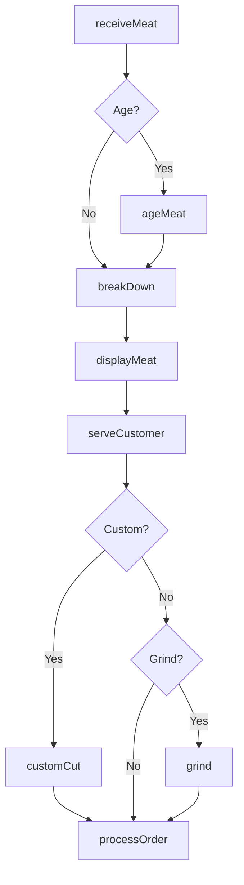
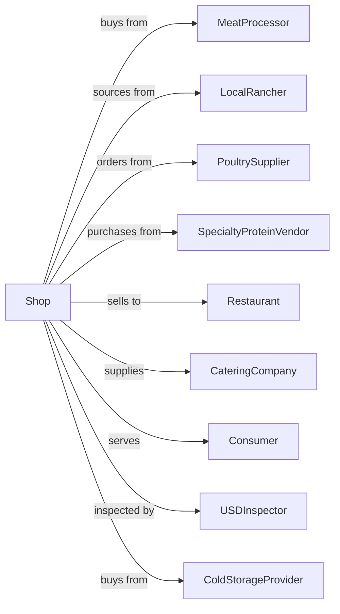

# Meat Retailers

> Business-as-Code definition for butcher shop and meat retail operations. Models sourcing from processors, custom cutting, aging, grinding, and specialty meat preparation for retail and foodservice customers.

## Overview

Meat retailers specialize in fresh, frozen, and cured meats including beef, pork, poultry, and specialty proteins. This definition exposes actions for custom cutting, meat aging, grinding, sausage making, smoking, and portion control for retail customers and restaurant accounts.

## Actors

| Actor | Description |
|-------|-------------|
| MeatProcessor | Provides primal and subprimal cuts |
| LocalRancher | Sources animals for custom processing |
| PoultrySupplier | Provides chicken, turkey, and game birds |
| SpecialtyProteinVendor | Sources lamb, veal, game, and exotic meats |
| Restaurant | Commercial buyer for foodservice |
| CateringCompany | Orders for events and functions |
| Consumer | Individual purchasing meat |
| USDInspector | Oversees food safety compliance |
| ColdStorageProvider | Provides refrigerated storage |

## Roles

| Role | Description |
|------|-------------|
| ShopOwner | Owns and operates butcher shop |
| HeadButcher | Leads cutting and fabrication |
| Butcher | Cuts and prepares meat products |
| SausageMaker | Produces ground products and sausages |
| CounterPerson | Serves customers and processes sales |
| MeatCutter | Portions and packages retail cuts |
| SmokeHouseOperator | Operates smoking and curing |

## Entities

| Entity | Description |
|--------|-------------|
| Cut | Specific portion of meat |
| Primal | Large wholesale cut for fabrication |
| Subprimal | Intermediate cut for retail breakdown |
| Grind | Ground meat product |
| Sausage | Seasoned meat in casing |
| AgedMeat | Dry or wet aged beef |
| MarinatedProduct | Seasoned and prepared meat |
| CustomOrder | Special cut or preparation request |
| ColdCase | Refrigerated display for products |

## Actions

| Action | Description |
|--------|-------------|
| receiveMeat | Accept delivery from processor |
| ageMeat | Dry or wet age beef |
| breakDown | Fabricate primal into retail cuts |
| customCut | Cut to customer specifications |
| grind | Process into ground meat |
| makeSausage | Produce sausage and links |
| smokeMeat | Cure and smoke products |
| marinate | Prepare seasoned products |
| displayMeat | Merchandise in cold case |
| serveCustomer | Take orders and cut to order |
| processOrder | Complete sale transaction |
| fulfillWholesale | Prepare restaurant orders |

## Events

| Event | Description |
|-------|-------------|
| meatReceived | Delivery accepted |
| meatAged | Aging period completed |
| primalBrokenDown | Cuts fabricated |
| customCutCompleted | Special order ready |
| meatGround | Ground product prepared |
| sausageMade | Sausage production completed |
| meatSmoked | Smoking process finished |
| meatMarinated | Seasoning applied |
| meatDisplayed | Case merchandised |
| customerServed | Order taken and cut |
| orderProcessed | Sale completed |
| wholesaleFulfilled | Restaurant order shipped |

## Searches

| Search | Description |
|--------|-------------|
| findCuts | Search by animal, cut, grade |
| checkInventory | Query available products |
| getAgingStatus | View meat in aging process |
| findSpecialtyMeats | Search exotic and specialty proteins |
| getCustomOrders | View pending special orders |
| getWholesaleAccounts | List restaurant customers |
| getPriceList | View current retail prices |
| getUsdaGrades | Reference grading standards |

## Workflow



## Actor Relationships



## Usage

### Calling Actions

```typescript
import { sellMeat } from '@headlessly/sell-meat'

const shop = sellMeat()

// Search by animal, cut, grade
const findCutsResult = await shop.findCuts({ status: 'active' })

// Query available products
const checkInventoryResult = await shop.checkInventory({ status: 'active' })

// Receive wholesale delivery
await shop.receiveMeat({
  supplier: 'certified-angus',
  items: [
    { product: 'ribeye-primal', grade: 'choice', weight: 45, unit: 'lbs' },
    { product: 'tenderloin', grade: 'prime', weight: 8, unit: 'lbs' },
    { product: 'ground-chuck', fat: '80-20', weight: 30, unit: 'lbs' }
  ],
  temperature: 34,
  lotNumber: 'LOT-2024-0415'
})

// Custom cut for customer
const order = await shop.customCut({
  customerId: 'cust-123',
  requests: [
    { primal: 'ribeye', cut: 'steak', thickness: 1.25, quantity: 4 },
    { primal: 'tenderloin', cut: 'filet-mignon', weight: 8, unit: 'oz', quantity: 2 }
  ],
  preparation: 'trimmed'
})

// Make custom sausage
await shop.makeSausage({
  recipe: 'italian-hot',
  meat: { type: 'pork-shoulder', weight: 20 },
  casings: 'natural-hog',
  output: 'links'
})
```

### Event-Driven Automation

```typescript
// Notify when aged meat ready
shop.meatAged(async ({ cutId, agingDays, customerId }) => {
  if (customerId) {
    await notifyCustomer({
      customerId,
      message: `Your ${agingDays}-day aged beef is ready for pickup!`,
      cutId
    })
  }
})

// Auto-reorder low inventory
shop.primalBrokenDown(async ({ product, remainingWeight }) => {
  const parLevel = getParLevel(product)
  if (remainingWeight < parLevel * 0.3) {
    await createPurchaseOrder({
      product,
      quantity: parLevel,
      priority: 'standard'
    })
  }
})
```
