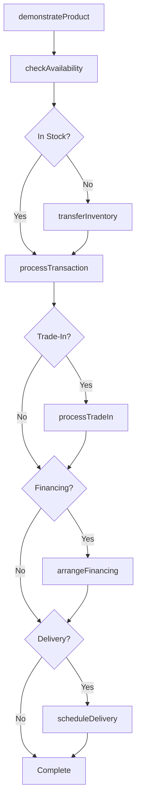
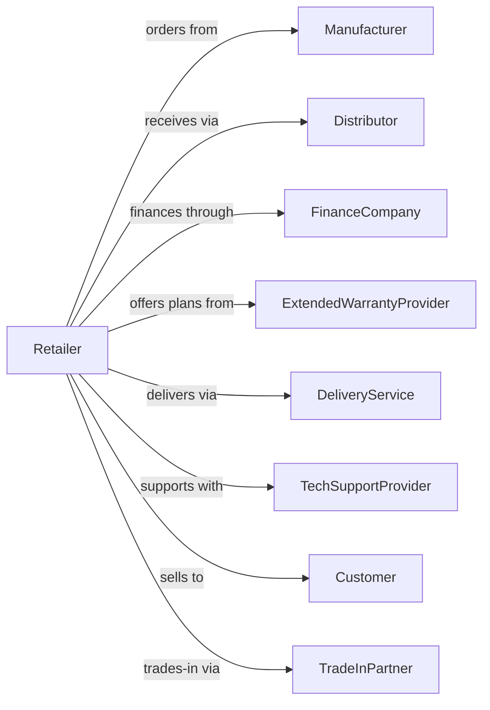

# Electronics and Appliance Retailers

> Business-as-Code definition for electronics and appliance retail operations. Models the technology retail lifecycle from product sourcing through sales consultation, financing, installation, and technical support services.

## Overview

Electronics and appliance retailers sell televisions, computers, tablets, phones, cameras, and household appliances with associated services. This definition exposes actions for product demonstration, financing arrangements, delivery scheduling, installation services, and technical support that drive modern electronics retail.

## Actors

| Actor | Description |
|-------|-------------|
| Manufacturer | Produces electronics and appliances with warranty support |
| Distributor | Warehouses and delivers products to retail locations |
| FinanceCompany | Provides consumer financing and credit programs |
| ExtendedWarrantyProvider | Administers protection plans beyond manufacturer warranty |
| DeliveryService | Handles last-mile delivery and white-glove installation |
| TechSupportProvider | Offers setup, repair, and support services |
| Customer | Individual purchasing electronics or appliances |
| TradeInPartner | Processes device trade-ins and recycling |

## Roles

| Role | Description |
|------|-------------|
| StoreManager | Oversees store operations and sales targets |
| SalesConsultant | Demonstrates products and advises customers |
| ApplianceSpecialist | Expert in major appliance features and installation |
| TechExpert | Provides technical support and device setup |
| DeliveryCoordinator | Schedules deliveries and installation appointments |
| InventoryManager | Manages stock levels and product allocation |
| GeekSquadAgent | Performs repairs and technical services |

## Entities

| Entity | Description |
|--------|-------------|
| Product | Electronics or appliance SKU with specifications |
| Warranty | Manufacturer coverage terms and duration |
| ProtectionPlan | Extended warranty and service coverage |
| Transaction | Customer purchase with items and services |
| Delivery | Scheduled delivery and installation appointment |
| TradeIn | Customer device accepted toward purchase credit |
| FinancingAgreement | Payment plan for customer purchase |
| ServiceTicket | Technical support or repair request |
| Demonstration | Product showcase and feature presentation |
| Inventory | Stock quantity by location and status |
| Return | Merchandise returned within return window |
| PriceMatch | Competitor price adjustment request |

## Actions

| Action | Description |
|--------|-------------|
| demonstrateProduct | Showcase features and capabilities to customer |
| processTransaction | Complete sale with payment and services |
| attachProtectionPlan | Add extended warranty to purchase |
| arrangeFinancing | Set up payment plan for customer |
| scheduleDelivery | Book delivery and installation appointment |
| processTradeIn | Evaluate and accept device trade-in |
| processReturn | Handle merchandise returns within policy |
| createServiceTicket | Open technical support or repair request |
| matchPrice | Adjust pricing to match competitor offer |
| checkAvailability | Verify stock and delivery options |
| transferInventory | Move stock between store locations |
| processPickup | Fulfill buy online pickup in-store order |

## Events

| Event | Description |
|-------|-------------|
| productDemonstrated | Customer received product showcase |
| transactionCompleted | Sale finalized with payment |
| protectionPlanAttached | Extended warranty added to sale |
| financingApproved | Payment plan approved for customer |
| deliveryScheduled | Installation appointment booked |
| tradeInProcessed | Device trade-in credit applied |
| returnProcessed | Refund or exchange completed |
| serviceTicketCreated | Support request opened |
| priceMatched | Competitor price adjustment applied |
| inventoryTransferred | Stock moved between locations |
| pickupPrepared | Online order prepared for customer pickup |
| deliveryCompleted | Product delivered and installed |

## Searches

| Search | Description |
|--------|-------------|
| findProducts | Search electronics by category, brand, or features |
| checkInventory | Query stock levels and store availability |
| getTransactions | Retrieve sales by date or customer |
| findDeliveries | Search scheduled deliveries by date or status |
| getTradeInValue | Check device trade-in quote |
| getServiceTickets | Retrieve open support requests |
| findProtectionPlans | List available coverage options |
| getFinancingOffers | Current promotional financing rates |

## Workflow



## Actor Relationships



## Usage

### Calling Actions

```typescript
import { retailElectronics } from '@headlessly/retail-electronics'

const store = retailElectronics()

// Search electronics by category, brand, or features
const findProductsResult = await store.findProducts({ category: 'featured', inStock: true })

// Query stock levels and store availability
const checkInventoryResult = await store.checkInventory({ status: 'active' })

// Process electronics purchase with services
const transaction = await store.processTransaction({
  items: [
    { sku: 'TV-OLED-65', quantity: 1, price: 1799.99 }
  ],
  services: [
    { type: 'protectionPlan', term: 4, price: 249.99 },
    { type: 'delivery', option: 'whiteGlove', price: 99.99 }
  ],
  payment: { method: 'financing', term: 24 }
})

// Process device trade-in
const tradeIn = await store.processTradeIn({
  deviceType: 'smartphone',
  brand: 'Apple',
  model: 'iPhone 13 Pro',
  condition: 'good',
  storage: '256GB'
})

// Schedule delivery with installation
await store.scheduleDelivery({
  transactionId: transaction.id,
  address: '123 Tech Lane, Seattle, WA 98101',
  preferredDate: '2024-03-20',
  timeWindow: 'afternoon',
  installation: { mountType: 'wall', heightInches: 48 }
})
```

### Event-Driven Automation

```typescript
// Follow up after delivery completion
store.deliveryCompleted(async ({ transactionId, customerId }) => {
  await sendSetupGuide({ customerId, transactionId })
  await scheduleFollowUp({
    customerId,
    delay: '7-days',
    purpose: 'satisfaction-survey'
  })
})

// Notify customer of trade-in offer expiration
store.tradeInProcessed(async ({ customerId, quoteId, quoteValue, expiresAt }) => {
  const daysUntilExpiry = daysBetween(new Date(), expiresAt)
  if (daysUntilExpiry === 3) {
    await notifyCustomer({
      customerId,
      message: `Your $${quoteValue} trade-in offer expires in 3 days!`
    })
  }
})
```
