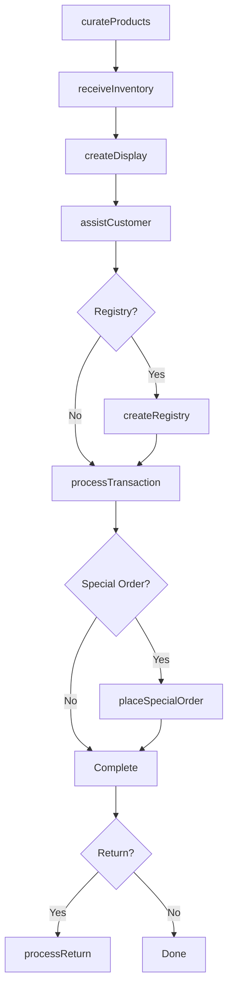
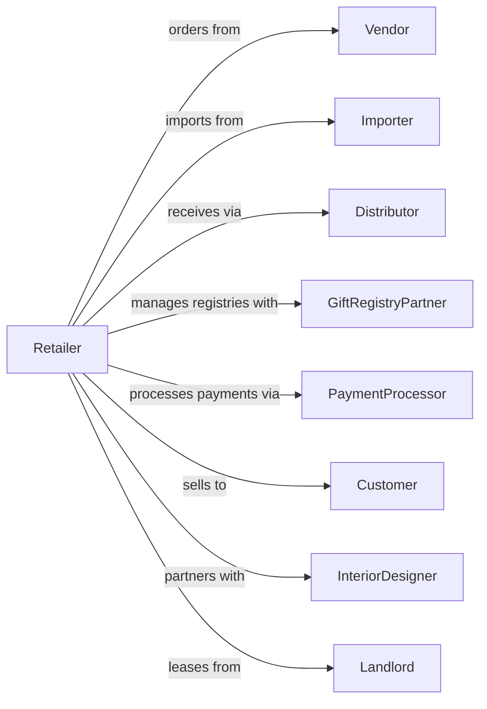

# All Other Home Furnishings Retailers

> Business-as-Code definition for home furnishings retail operations. Models the specialty home goods sales lifecycle from product sourcing through showroom merchandising, customer consultation, and gift registry services.

## Overview

Home furnishings retailers sell kitchenware, linens, bath accessories, picture frames, lamps, glassware, and decorative items for home decoration and function. This definition exposes actions for product curation, visual merchandising, gift registry management, and customer service that define specialty home goods retail.

## Actors

| Actor | Description |
|-------|-------------|
| Vendor | Supplies kitchenware, linens, and decorative products |
| Importer | Sources unique home goods from international artisans |
| Distributor | Warehouses and delivers home furnishing products |
| GiftRegistryPartner | Manages registry platform and fulfillment |
| Landlord | Leases retail showroom space |
| PaymentProcessor | Handles card and electronic payment transactions |
| Customer | Individual purchasing home furnishing items |
| InteriorDesigner | Specifies products for design projects |

## Roles

| Role | Description |
|------|-------------|
| StoreManager | Oversees store operations and sales performance |
| BuyingManager | Selects products and negotiates vendor terms |
| SalesAssociate | Assists customers with product selection |
| VisualMerchandiser | Creates displays and maintains store presentation |
| RegistryConsultant | Helps couples build and manage gift registries |
| StockAssociate | Receives inventory and maintains stock levels |

## Entities

| Entity | Description |
|--------|-------------|
| Product | Home furnishing item with SKU, price, and attributes |
| Category | Product grouping like kitchen, bath, or bedding |
| GiftRegistry | Customer registry with selected items and recipients |
| PurchaseOrder | Vendor order for merchandise replenishment |
| Transaction | Customer purchase with items and payment |
| GiftCard | Stored value card for purchases |
| Display | Visual merchandising arrangement in showroom |
| Inventory | Stock quantity by item and location |
| Return | Merchandise returned for refund or exchange |
| WishList | Customer saved items for future purchase |
| SpecialOrder | Custom or backordered item request |
| Promotion | Seasonal sale or discount offer |

## Actions

| Action | Description |
|--------|-------------|
| curateProducts | Select merchandise assortment for store |
| receiveInventory | Check in and process incoming shipments |
| createDisplay | Design and set up visual merchandising |
| assistCustomer | Help with product selection and recommendations |
| processTransaction | Complete sale with payment and receipt |
| createRegistry | Set up gift registry for customer |
| fulfillRegistryPurchase | Process gift purchase from registry |
| processReturn | Handle merchandise returns and exchanges |
| placeSpecialOrder | Order custom or backordered items |
| applyPromotion | Activate seasonal or sale pricing |
| issueGiftCard | Sell or activate gift card |
| conductInventory | Perform physical stock count |

## Events

| Event | Description |
|-------|-------------|
| productsCurated | New assortment selected for store |
| inventoryReceived | Shipment processed and stocked |
| displayCreated | Visual merchandising completed |
| customerAssisted | Product consultation provided |
| transactionCompleted | Sale finalized with payment |
| registryCreated | New gift registry established |
| registryPurchaseFulfilled | Gift item purchased and sent |
| returnProcessed | Refund or exchange completed |
| specialOrderPlaced | Custom item ordered from vendor |
| promotionApplied | Sale pricing activated |
| giftCardIssued | Gift card sold or activated |
| inventoryCounted | Physical count completed |

## Searches

| Search | Description |
|--------|-------------|
| findProducts | Search merchandise by category or style |
| checkInventory | Query stock levels and availability |
| getRegistry | Retrieve gift registry by name or code |
| findTransactions | Search sales by date or customer |
| getSpecialOrders | Track custom order status |
| findPromotions | List active sales and discounts |
| getTopSellers | Retrieve best-selling items |
| getGiftCards | Check gift card balance and history |

## Workflow



## Actor Relationships



## Usage

### Calling Actions

```typescript
import { retailHomeFurnishings } from '@headlessly/retail-home-furnishings'

const store = retailHomeFurnishings()

// Search merchandise by category or style
const findProductsResult = await store.findProducts({ category: 'featured', inStock: true })

// Query stock levels and availability
const checkInventoryResult = await store.checkInventory({ status: 'active' })

// Create gift registry for customer
const registry = await store.createRegistry({
  customerIds: ['cust-123', 'cust-456'],
  eventType: 'wedding',
  eventDate: '2024-06-15',
  shippingAddress: '789 Maple Dr, Austin, TX 78701'
})

// Process in-store transaction
const transaction = await store.processTransaction({
  items: [
    { sku: 'COOKWARE-SET-12PC', quantity: 1, price: 299.99 },
    { sku: 'LINEN-TOWEL-SET', quantity: 2, price: 49.99 }
  ],
  giftCardApplied: 'GC-123456',
  payment: { method: 'credit', amount: 349.97 }
})

// Place special order for backordered item
await store.placeSpecialOrder({
  customerId: 'cust-789',
  sku: 'CHANDELIER-CRYSTAL',
  quantity: 1,
  estimatedArrival: '2024-04-01'
})
```

### Event-Driven Automation

```typescript
// Notify registry creator when gift purchased
store.registryPurchaseFulfilled(async ({ registryId, itemSku, purchaserId }) => {
  const registry = await store.getRegistry({ registryId })
  await notifyRegistrant({
    email: registry.primaryEmail,
    message: `A gift has been purchased from your registry!`
  })
  await sendThankYouReminder({
    registryId,
    purchaserId,
    delay: '3-days'
  })
})

// Auto-reorder popular items
store.transactionCompleted(async ({ items }) => {
  for (const item of items) {
    const stock = await store.checkInventory({ sku: item.sku })
    if (stock.quantity < stock.reorderPoint) {
      await store.curateProducts({
        sku: item.sku,
        reorderQuantity: stock.reorderQuantity
      })
    }
  }
})
```
