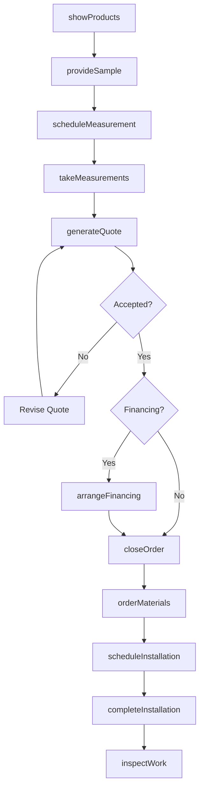
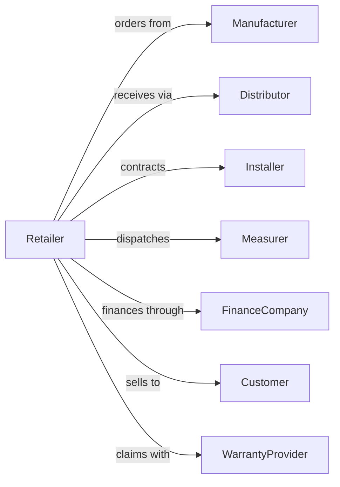

# Floor Covering Retailers

> Business-as-Code definition for floor covering retail operations. Models the complete flooring sales lifecycle from showroom presentation through measurement, sale, installation scheduling, and warranty service.

## Overview

Floor covering retailers sell carpets, rugs, vinyl, laminate, and tile flooring products along with installation services. This definition exposes actions for showroom operations, in-home measurements, product selection, installation coordination, and post-sale warranty service that define specialty flooring retail.

## Actors

| Actor | Description |
|-------|-------------|
| Manufacturer | Produces carpet, vinyl, laminate, and tile products |
| Distributor | Warehouses and delivers flooring materials |
| Installer | Licensed contractor performing flooring installation |
| Measurer | Technician conducting in-home measurements |
| Landlord | Leases retail showroom space |
| FinanceCompany | Provides customer financing for purchases |
| Customer | Homeowner or business purchasing flooring |
| WarrantyProvider | Administers product and installation warranties |

## Roles

| Role | Description |
|------|-------------|
| StoreManager | Oversees showroom operations and sales targets |
| FlooringSalesRep | Consults with customers on product selection |
| DesignConsultant | Assists with pattern, color, and material choices |
| InstallationCoordinator | Schedules and manages installer crews |
| WarehouseClerk | Manages inventory and order fulfillment |
| Estimator | Calculates material quantities and project costs |
| SeamingTechnician | Heat-seams carpet rolls and finishes edges for wall-to-wall installation |

## Entities

| Entity | Description |
|--------|-------------|
| FlooringProduct | Carpet, vinyl, laminate, or tile SKU with specifications |
| Sample | Physical product swatch for customer selection |
| Measurement | Room dimensions and square footage calculations |
| Quote | Itemized estimate for materials and installation |
| SalesOrder | Customer purchase with products and services |
| InstallationJob | Scheduled flooring installation project |
| Warranty | Coverage terms for product and workmanship |
| Subfloor | Existing floor condition affecting installation |
| Transition | Edge pieces connecting different floor surfaces |
| Padding | Underlayment material for carpet installations |
| RoomPlan | Layout diagram showing flooring placement |
| FinancingAgreement | Payment plan for customer purchase |

## Actions

| Action | Description |
|--------|-------------|
| showProducts | Present flooring options in showroom |
| provideSample | Give customer samples for home comparison |
| scheduleMeasurement | Book in-home measurement appointment |
| takeMeasurements | Record room dimensions and conditions |
| generateQuote | Calculate material and labor costs |
| closeOrder | Finalize customer purchase and payment |
| orderMaterials | Submit product order to supplier |
| scheduleInstallation | Book installer crew for project |
| completeInstallation | Execute flooring installation |
| inspectWork | Verify installation quality and completion |
| processWarrantyClaim | Handle product or workmanship issues |
| arrangeFinancing | Set up payment plan for customer |

## Events

| Event | Description |
|-------|-------------|
| productsShown | Customer viewed showroom options |
| sampleProvided | Customer took samples for review |
| measurementScheduled | In-home appointment booked |
| measurementsTaken | Room dimensions recorded |
| quoteGenerated | Estimate provided to customer |
| orderClosed | Purchase finalized with payment |
| materialsOrdered | Products ordered from supplier |
| installationScheduled | Crew assigned to project date |
| installationCompleted | Flooring successfully installed |
| workInspected | Quality verification completed |
| warrantyClaimFiled | Customer reported issue |
| financingApproved | Payment plan approved |

## Searches

| Search | Description |
|--------|-------------|
| findProducts | Search flooring by type, brand, or style |
| checkInventory | Query stock levels and availability |
| getQuotes | Retrieve customer quotes by status |
| findOrders | Search sales orders by customer or date |
| getInstallationSchedule | View upcoming installation jobs |
| findInstallers | List available installer crews |
| getWarrantyClaims | Retrieve warranty issues by status |
| getMeasurements | Access customer measurement records |

## Workflow



## Actor Relationships



## Usage

### Calling Actions

```typescript
import { retailFloorCovering } from '@headlessly/retail-floor-covering'

const store = retailFloorCovering()

// Search flooring by type, brand, or style
const findProductsResult = await store.findProducts({ category: 'featured', inStock: true })

// Query stock levels and availability
const checkInventoryResult = await store.checkInventory({ status: 'active' })

// Schedule in-home measurement
const appointment = await store.scheduleMeasurement({
  customerId: 'cust-456',
  address: '123 Main St, Springfield, IL 62701',
  preferredDate: '2024-03-18',
  rooms: ['living room', 'master bedroom', 'hallway']
})

// Generate quote after measurements
const quote = await store.generateQuote({
  measurementId: appointment.measurementId,
  products: [
    { sku: 'CARPET-PLUSH-BEIGE', sqft: 450, pricePerSqft: 4.99 },
    { sku: 'PADDING-PREMIUM', sqft: 450, pricePerSqft: 0.89 }
  ],
  laborRate: 2.50,
  transitions: 3,
  removalRequired: true
})

// Close order with financing
await store.closeOrder({
  quoteId: quote.id,
  financing: {
    provider: 'synchrony',
    term: 24,
    monthlyPayment: 125.00
  },
  deposit: 500.00
})
```

### Event-Driven Automation

```typescript
// Auto-schedule installation when materials arrive
store.materialsOrdered(async ({ orderId, expectedDelivery }) => {
  const order = await store.findOrders({ orderId })
  await store.scheduleInstallation({
    orderId,
    preferredDate: addDays(expectedDelivery, 2),
    estimatedDuration: calculateDuration(order.totalSqft)
  })
})

// Follow up after installation completion
store.installationCompleted(async ({ orderId, customerId }) => {
  await store.inspectWork({ orderId })
  await scheduleFollowUp({
    customerId,
    delay: '7-days',
    purpose: 'satisfaction-survey'
  })
  await sendWarrantyDocuments({ customerId, orderId })
})
```
