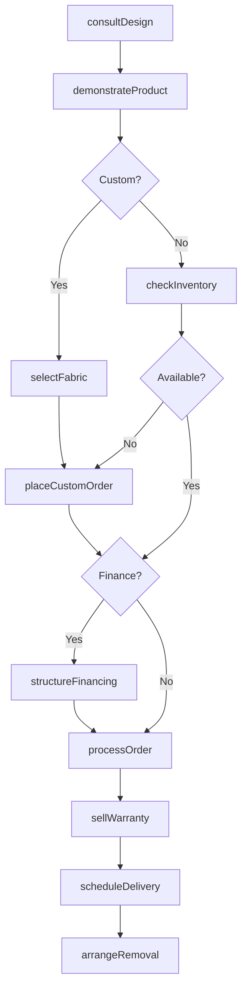
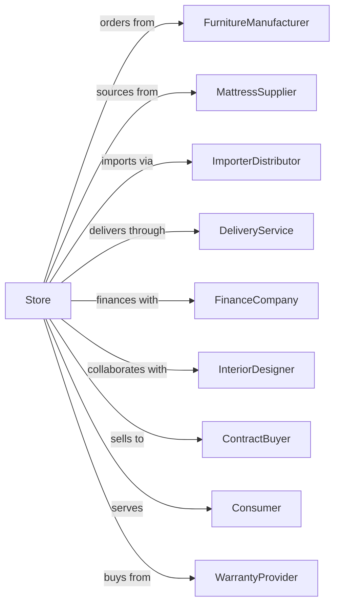

# Furniture Retailers

> Business-as-Code definition for furniture retail operations. Models showroom sales, custom orders, delivery coordination, financing, and design consultation for household and office furniture.

## Overview

Furniture retailers sell household furniture including living room, bedroom, dining, and outdoor pieces along with mattresses and office furniture. This definition exposes actions for showroom sales, special orders, white-glove delivery, financing arrangements, and design consultation services.

## Actors

| Actor | Description |
|-------|-------------|
| FurnitureManufacturer | Produces case goods and upholstery |
| MattressSupplier | Provides mattresses and sleep systems |
| ImporterDistributor | Sources international furniture |
| DeliveryService | Provides white-glove delivery |
| FinanceCompany | Offers retail financing and leasing |
| InteriorDesigner | Collaborates on room designs |
| ContractBuyer | Purchases for offices and facilities |
| Consumer | Individual purchasing furniture |
| WarrantyProvider | Administers protection plans |

## Roles

| Role | Description |
|------|-------------|
| StoreOwner | Owns and operates furniture store |
| SalesManager | Manages sales team and floor |
| DesignConsultant | Provides interior design advice |
| SalesAssociate | Assists customers with selection |
| FinanceSpecialist | Arranges customer payment plans |
| DeliveryCoordinator | Schedules deliveries |
| WarehouseManager | Manages inventory and receiving |
| CustomerService | Handles inquiries and issues |

## Entities

| Entity | Description |
|--------|-------------|
| Furniture | Case goods, upholstery, and tables |
| Mattress | Beds, box springs, and foundations |
| CustomOrder | Made-to-order furniture specifications |
| Fabric | Upholstery material options |
| FinanceContract | Payment plan agreement |
| DeliveryTicket | Scheduled delivery details |
| Warranty | Protection plan coverage |
| RoomDesign | Furniture layout and plan |
| Showroom | Display floor arrangement |

## Actions

| Action | Description |
|--------|-------------|
| consultDesign | Discuss room layout and needs |
| demonstrateProduct | Show furniture features |
| selectFabric | Choose upholstery material |
| placeCustomOrder | Order made-to-order pieces |
| structureFinancing | Arrange payment plan |
| scheduleDelivery | Book white-glove delivery |
| processOrder | Complete sale transaction |
| sellWarranty | Add protection plan |
| arrangeRemoval | Coordinate old furniture pickup |
| checkInventory | Verify product availability |
| followUpLead | Contact interested customer |
| resolveIssue | Handle delivery or product problems |

## Events

| Event | Description |
|-------|-------------|
| designConsulted | Room plan discussed |
| productDemonstrated | Features shown |
| fabricSelected | Upholstery chosen |
| customOrderPlaced | Special order submitted |
| financingApproved | Payment plan established |
| deliveryScheduled | Delivery date set |
| orderProcessed | Sale completed |
| warrantySold | Protection added |
| removalArranged | Old furniture pickup set |
| inventoryChecked | Availability confirmed |
| leadFollowedUp | Customer contacted |
| issueResolved | Problem addressed |

## Searches

| Search | Description |
|--------|-------------|
| findFurniture | Search by type, style, or brand |
| checkInventory | Query available pieces |
| findFabrics | Browse upholstery options |
| getDeliverySchedule | View available delivery windows |
| findFinanceOptions | View payment plan choices |
| getCustomOrders | Track pending special orders |
| findByRoom | Browse by room category |
| getDesignHistory | Retrieve customer design plans |

## Workflow



## Actor Relationships



## Usage

### Calling Actions

```typescript
import { retailFurniture } from '@headlessly/retail-furniture'

const store = retailFurniture()

// Search by type, style, or brand
const findFurnitureResult = await store.findFurniture({ status: 'active' })

// Query available pieces
const checkInventoryResult = await store.checkInventory({ status: 'active' })

// Design consultation for living room
const design = await store.consultDesign({
  customerId: 'cust-123',
  room: 'living-room',
  dimensions: { length: 18, width: 14 },
  style: 'mid-century-modern',
  budget: 8000
})

// Place custom order with fabric selection
const customOrder = await store.placeCustomOrder({
  customerId: 'cust-123',
  item: {
    type: 'sectional-sofa',
    style: 'mid-century',
    configuration: 'L-shape-right'
  },
  fabricId: 'FAB-VELVET-NAVY',
  options: ['down-cushions', 'chrome-legs']
})

// Structure financing
const financing = await store.structureFinancing({
  customerId: 'cust-123',
  total: 4500,
  plan: {
    type: 'promotional',
    term: 24,
    rate: 0.0,
    minPayment: 188
  }
})

// Schedule white-glove delivery
await store.scheduleDelivery({
  orderId: customOrder.id,
  address: '456 Oak Ave',
  preferredDate: '2024-05-15',
  timeWindow: 'afternoon',
  services: ['assembly', 'placement', 'packaging-removal']
})
```

### Event-Driven Automation

```typescript
// Notify on custom order arrival
store.customOrderPlaced(async ({ orderId, customerId, estimatedArrival }) => {
  await scheduleReminder({
    customerId,
    at: subtractDays(estimatedArrival, 7),
    message: 'Your custom furniture arrives next week!'
  })
})

// Follow up after delivery
store.deliveryScheduled(async ({ orderId, customerId, deliveryDate }) => {
  await scheduleTask({
    at: addDays(deliveryDate, 3),
    action: async () => {
      await sendSurvey({
        customerId,
        orderId,
        type: 'delivery-satisfaction'
      })
    }
  })
})
```
