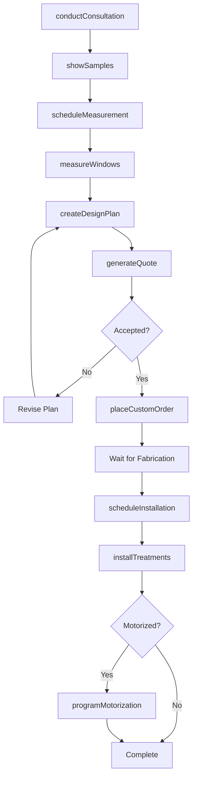
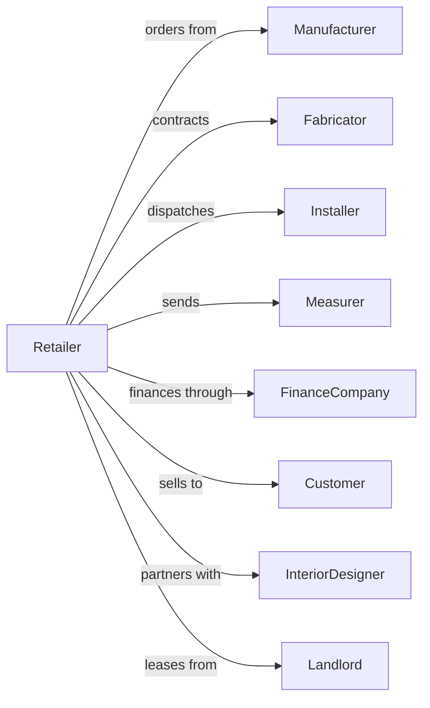

# Window Treatment Retailers

> Business-as-Code definition for window treatment retail operations. Models the custom window covering sales lifecycle from consultation through measurement, fabrication, installation, and service.

## Overview

Window treatment retailers sell curtains, drapes, blinds, shades, and shutters with custom measurement and installation services. This definition exposes actions for design consultation, precise measurements, custom fabrication orders, professional installation, and ongoing maintenance that define specialty window covering retail.

## Actors

| Actor | Description |
|-------|-------------|
| Manufacturer | Produces blinds, shades, and shutter products |
| Fabricator | Creates custom drapes and curtains to specification |
| Installer | Mounts and adjusts window treatments |
| Measurer | Takes precise window dimensions on-site |
| FinanceCompany | Provides customer financing options |
| Customer | Homeowner or business purchasing window treatments |
| InteriorDesigner | Specifies treatments for design projects |
| Landlord | Leases retail showroom space |

## Roles

| Role | Description |
|------|-------------|
| StoreManager | Oversees showroom and sales operations |
| DesignConsultant | Advises on style, fabric, and function choices |
| SalesAssociate | Assists customers and processes orders |
| MeasurementTech | Conducts precise on-site measurements |
| InstallationManager | Coordinates installation crews and schedules |
| OrderSpecialist | Manages custom fabrication orders |

## Entities

| Entity | Description |
|--------|-------------|
| WindowTreatment | Blind, shade, drape, curtain, or shutter product |
| Fabric | Material for custom drapes and soft treatments |
| Measurement | Window dimensions including width, height, and depth |
| CustomOrder | Specification for made-to-order treatments |
| Quote | Itemized estimate for products and installation |
| SalesOrder | Finalized customer purchase |
| InstallationJob | Scheduled mounting and adjustment work |
| Hardware | Rods, brackets, and mounting components |
| Motorization | Automated lift system for blinds and shades |
| Warranty | Coverage for product defects and operation |
| Sample | Fabric swatch or product demonstration piece |
| RoomDesign | Treatment plan showing all windows |

## Actions

| Action | Description |
|--------|-------------|
| conductConsultation | Discuss needs and present options |
| showSamples | Display fabrics and product demonstrations |
| scheduleMeasurement | Book on-site measurement appointment |
| measureWindows | Record precise window dimensions |
| createDesignPlan | Develop treatment recommendations per room |
| generateQuote | Calculate costs for products and installation |
| placeCustomOrder | Submit specifications to manufacturer or fabricator |
| scheduleInstallation | Book installation crew for delivery |
| installTreatments | Mount and adjust window coverings |
| programMotorization | Configure automated lift controls |
| processWarranty | Handle product issues and repairs |
| provideMaintenanceTips | Educate customer on care and cleaning |

## Events

| Event | Description |
|-------|-------------|
| consultationCompleted | Initial meeting with customer finished |
| samplesProvided | Customer received fabric or product samples |
| measurementScheduled | On-site appointment booked |
| windowsMeasured | Precise dimensions recorded |
| designPlanCreated | Room treatment plan finalized |
| quoteGenerated | Estimate provided to customer |
| orderPlaced | Custom order submitted for fabrication |
| installationScheduled | Crew assigned to install date |
| treatmentsInstalled | Window coverings mounted and adjusted |
| motorizationProgrammed | Automated controls configured |
| warrantyProcessed | Repair or replacement completed |
| orderShipped | Custom products shipped from manufacturer |

## Searches

| Search | Description |
|--------|-------------|
| findProducts | Search treatments by type, brand, or style |
| getSamples | List available fabric and product samples |
| getMeasurements | Retrieve customer measurement records |
| getQuotes | Find quotes by customer or status |
| findOrders | Search orders by customer or date |
| getInstallationSchedule | View upcoming installation jobs |
| checkOrderStatus | Track custom fabrication progress |
| getWarrantyClaims | Retrieve warranty service requests |

## Workflow



## Actor Relationships



## Usage

### Calling Actions

```typescript
import { retailWindowTreatment } from '@headlessly/retail-window-treatment'

const store = retailWindowTreatment()

// Search treatments by type, brand, or style
const findProductsResult = await store.findProducts({ category: 'featured', inStock: true })

// List available fabric and product samples
const getSamplesResult = await store.getSamples({ status: 'active' })

// Schedule measurement appointment
const appointment = await store.scheduleMeasurement({
  customerId: 'cust-789',
  address: '456 Oak Ave, Portland, OR 97201',
  preferredDate: '2024-03-20',
  windowCount: 8,
  notes: 'Large bay window in living room'
})

// Generate quote after measurements
const quote = await store.generateQuote({
  measurementId: appointment.measurementId,
  items: [
    { type: 'cellular-shade', windowId: 'W1', width: 72, height: 84, motorized: true },
    { type: 'custom-drape', windowId: 'W2', fabric: 'LINEN-NAVY', style: 'pinch-pleat' }
  ],
  installationType: 'inside-mount'
})

// Place custom order
await store.placeCustomOrder({
  quoteId: quote.id,
  rushProduction: false,
  specialInstructions: 'Match existing trim color'
})
```

### Event-Driven Automation

```typescript
// Notify customer when order ships
store.orderShipped(async ({ orderId, customerId, trackingNumber }) => {
  await notifyCustomer({
    customerId,
    message: `Your window treatments have shipped! Tracking: ${trackingNumber}`
  })
  await store.scheduleInstallation({
    orderId,
    targetDate: addDays(new Date(), 5)
  })
})

// Follow up after installation
store.treatmentsInstalled(async ({ orderId, customerId, motorized }) => {
  if (motorized) {
    await sendMotorizationGuide({ customerId })
  }
  await store.provideMaintenanceTips({ customerId, orderId })
  await scheduleFollowUp({
    customerId,
    delay: '14-days',
    purpose: 'satisfaction-check'
  })
})
```
