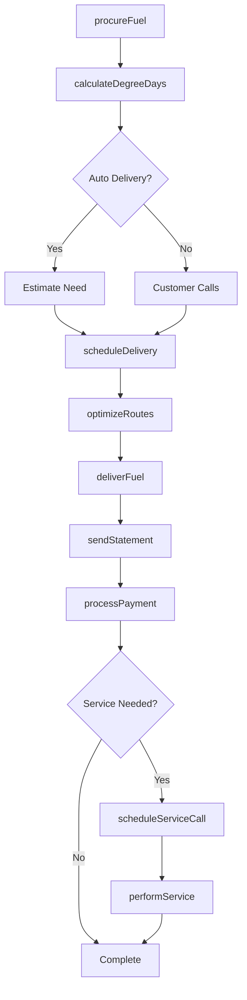
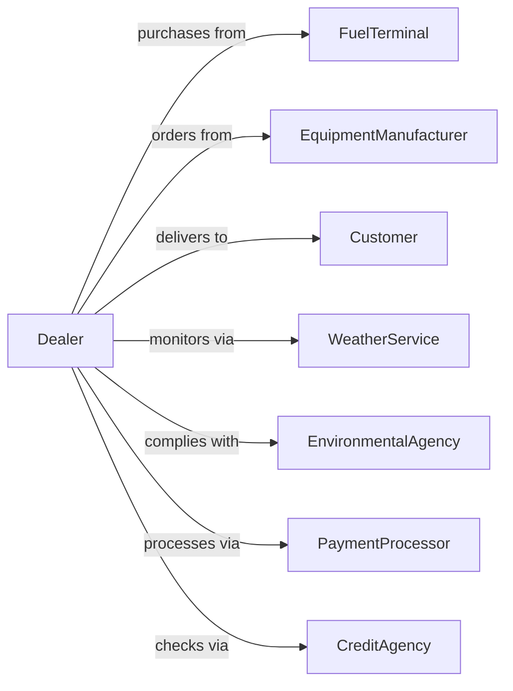

# Fuel Dealers

> Business-as-Code definition for heating fuel delivery operations. Models the home heating fuel lifecycle from procurement through route delivery, automatic refill programs, and equipment service.

## Overview

Fuel dealers retail heating oil, propane, and LP gas through direct delivery to residential and commercial customers. This definition exposes actions for customer management, delivery scheduling, automatic delivery programs, equipment service, and seasonal demand planning that drive home fuel distribution.

## Actors

| Actor | Description |
|-------|-------------|
| FuelTerminal | Supplies bulk heating oil and propane |
| EquipmentManufacturer | Produces tanks, burners, and heating equipment |
| Customer | Residential or commercial fuel user |
| WeatherService | Provides temperature data for degree-day calculations |
| EnvironmentalAgency | Regulates fuel storage and emissions |
| PaymentProcessor | Handles customer billing and payments |
| CreditAgency | Provides customer credit information |
| EmergencyService | First responders for fuel emergencies |

## Roles

| Role | Description |
|------|-------------|
| OwnerOperator | Owns business and sets strategy |
| DispatchManager | Schedules deliveries and routes drivers |
| DeliveryDriver | Operates fuel truck and makes deliveries |
| ServiceTechnician | Installs and repairs heating equipment |
| CustomerServiceRep | Handles orders and customer inquiries |
| CreditManager | Manages accounts receivable and collections |

## Entities

| Entity | Description |
|--------|-------------|
| FuelProduct | Heating oil, propane, or kerosene |
| CustomerAccount | Residential or commercial account |
| DeliveryTicket | Record of fuel delivery with gallons and price |
| Tank | Customer fuel storage tank with capacity |
| AutoDelivery | Automatic refill program based on degree-days |
| Route | Planned delivery path with customer stops |
| ServiceCall | Equipment repair or maintenance visit |
| PriceProtection | Locked price contract for heating season |
| DegreeDays | Temperature-based fuel consumption estimate |
| BudgetPlan | Equal monthly payment program |
| Invoice | Customer billing statement |
| Equipment | Burner, furnace, or boiler serviced |

## Actions

| Action | Description |
|--------|-------------|
| scheduleDelivery | Book customer fuel delivery |
| deliverFuel | Transport and pump fuel to customer tank |
| enrollAutoDelivery | Set up automatic refill program |
| calculateDegreeDays | Estimate fuel consumption from weather |
| scheduleServiceCall | Book equipment maintenance or repair |
| performService | Execute heating equipment repair |
| createPriceProtection | Lock in price for heating season |
| enrollBudgetPlan | Set up equal payment program |
| processPayment | Apply customer payment to account |
| procureFuel | Purchase bulk fuel from terminal |
| optimizeRoutes | Plan efficient delivery paths |
| sendStatement | Generate and deliver customer invoice |

## Events

| Event | Description |
|-------|-------------|
| deliveryScheduled | Customer delivery booked |
| fuelDelivered | Fuel pumped to customer tank |
| autoDeliveryEnrolled | Automatic program activated |
| degreeDaysCalculated | Consumption estimate updated |
| serviceCallScheduled | Equipment visit booked |
| serviceCompleted | Repair or maintenance finished |
| priceProtectionCreated | Season price locked |
| budgetPlanEnrolled | Equal payment started |
| paymentReceived | Customer payment applied |
| fuelProcured | Bulk purchase from terminal |
| routesOptimized | Delivery paths planned |
| statementSent | Invoice delivered to customer |

## Searches

| Search | Description |
|--------|-------------|
| getCustomerAccounts | List accounts by status or type |
| getDeliverySchedule | Upcoming deliveries by date or route |
| getAutoDeliveryDue | Accounts estimated to need fuel |
| getServiceCalls | Scheduled and completed equipment visits |
| getAccountBalance | Customer outstanding amounts |
| getFuelInventory | Bulk tank levels |
| getWeatherForecast | Temperature outlook for planning |
| getPriceProtections | Active season contracts |

## Workflow



## Actor Relationships



## Usage

### Calling Actions

```typescript
import { deliverHeatingFuel } from '@headlessly/deliver-heating-fuel'

const dealer = deliverHeatingFuel()

// List accounts by status or type
const getCustomerAccountsResult = await dealer.getCustomerAccounts({ type: 'residential', status: 'active' })

// Upcoming deliveries by date or route
const getDeliveryScheduleResult = await dealer.getDeliverySchedule({ status: 'active' })

// Enroll customer in automatic delivery
await dealer.enrollAutoDelivery({
  accountId: 'acct-456',
  tankCapacity: 275,
  kFactor: 4.5,
  targetFillPercent: 80,
  preferredDeliveryDay: 'tuesday'
})

// Schedule and execute delivery
const ticket = await dealer.deliverFuel({
  accountId: 'acct-456',
  productType: 'heating-oil',
  gallonsDelivered: 187.5,
  pricePerGallon: 3.899,
  tankReadingBefore: 45,
  tankReadingAfter: 230,
  driverNotes: 'Tank whistle working properly'
})

// Create price protection contract
await dealer.createPriceProtection({
  accountId: 'acct-456',
  season: '2024-2025',
  lockedPrice: 3.799,
  estimatedGallons: 800,
  depositRequired: 200.00
})
```

### Event-Driven Automation

```typescript
// Auto-schedule delivery based on degree-days
dealer.degreeDaysCalculated(async ({ accountId, estimatedTankLevel }) => {
  if (estimatedTankLevel < 30) {
    await dealer.scheduleDelivery({
      accountId,
      priority: estimatedTankLevel < 15 ? 'urgent' : 'standard',
      estimatedGallons: calculateFillAmount(accountId)
    })
  }
})

// Send payment reminder when statement due
dealer.statementSent(async ({ accountId, invoiceId, dueDate }) => {
  await scheduleReminder({
    accountId,
    triggerDate: subtractDays(dueDate, 7),
    message: 'Your fuel payment is due soon'
  })
})
```
