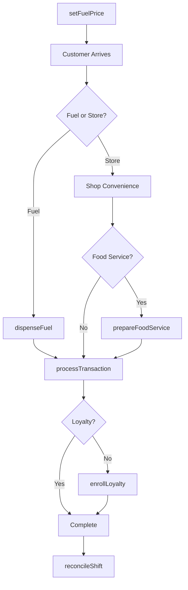
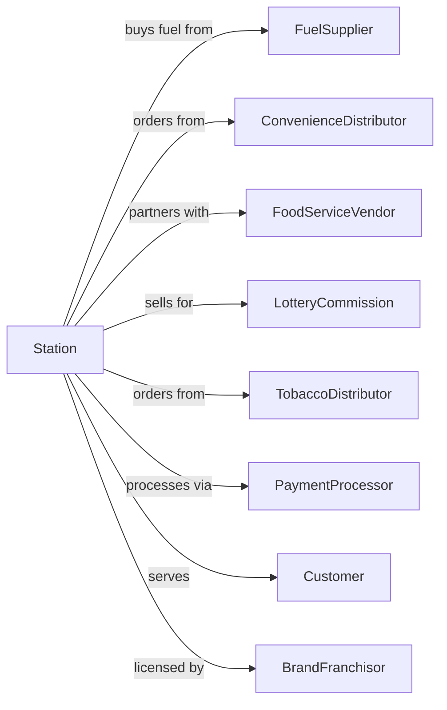

# Gasoline Stations with Convenience Stores

> Business-as-Code definition for gas station and convenience store operations. Models the fuel retail and convenience sales lifecycle from fuel procurement through pump operations, in-store sales, and loyalty programs.

## Overview

Gasoline stations with convenience stores sell automotive fuels alongside groceries, beverages, tobacco, and quick-service food items. This definition exposes actions for fuel pricing, pump management, inventory control, food service operations, and loyalty programs that drive combined fuel and convenience retail.

## Actors

| Actor | Description |
|-------|-------------|
| FuelSupplier | Delivers gasoline, diesel, and alternative fuels |
| ConvenienceDistributor | Supplies packaged goods and beverages |
| FoodServiceVendor | Provides prepared food and beverage programs |
| LotteryCommission | Administers lottery ticket sales |
| TobaccoDistributor | Supplies cigarettes and tobacco products |
| PaymentProcessor | Handles card transactions at pump and register |
| Customer | Individual purchasing fuel and merchandise |
| BrandFranchisor | Licenses fuel brand and quality standards |

## Roles

| Role | Description |
|------|-------------|
| StationManager | Oversees all station operations |
| ShiftSupervisor | Manages staff during operating shifts |
| Cashier | Processes in-store transactions |
| FoodServiceAttendant | Prepares food and maintains food service area |
| FuelAttendant | Assists customers at pumps and maintains forecourt |
| InventoryClerk | Manages stock levels and orders |
| PumpTechnician | Maintains and calibrates fuel dispensers, nozzles, and payment terminals |

## Entities

| Entity | Description |
|--------|-------------|
| FuelProduct | Gasoline, diesel, or alternative fuel grade |
| FuelTank | Underground storage tank with capacity and level |
| Dispenser | Fuel pump with multiple product nozzles |
| ConvenienceItem | Packaged snack, beverage, or merchandise |
| FoodServiceItem | Prepared food or fountain drink |
| Transaction | Customer purchase at pump or register |
| LotteryTicket | State lottery product |
| TobaccoProduct | Cigarettes, cigars, or vaping products |
| LoyaltyAccount | Customer rewards membership |
| PriceSign | Displayed fuel pricing |
| Shift | Staff working period with sales reconciliation |
| Delivery | Scheduled fuel or merchandise delivery |

## Actions

| Action | Description |
|--------|-------------|
| setFuelPrice | Update pricing displayed on signs and pumps |
| dispenseFuel | Pump fuel to customer vehicle |
| processTransaction | Complete pump or in-store purchase |
| receiveFuelDelivery | Accept and verify fuel delivery |
| restockShelves | Replenish convenience merchandise |
| prepareFoodService | Make ready-to-eat items and maintain stations |
| sellLottery | Process lottery ticket sales and redemptions |
| sellTobacco | Verify age and sell tobacco products |
| enrollLoyalty | Sign up customer for rewards program |
| reconcileShift | Balance register and fuel sales at shift end |
| monitorTanks | Check fuel levels and detect leaks |
| scheduleMaintenance | Book pump or equipment service |

## Events

| Event | Description |
|-------|-------------|
| fuelPriceSet | Pump and sign pricing updated |
| fuelDispensed | Customer received fuel at pump |
| transactionCompleted | Purchase finalized |
| fuelDelivered | Fuel delivery received and verified |
| shelvesRestocked | Convenience inventory replenished |
| foodServicePrepared | Ready-to-eat items available |
| lotterySold | Lottery ticket transaction completed |
| tobaccoSold | Age-verified tobacco sale completed |
| loyaltyEnrolled | Customer joined rewards program |
| shiftReconciled | Register and fuel balanced |
| tankLevelLow | Fuel tank below reorder threshold |
| maintenanceScheduled | Service appointment booked |

## Searches

| Search | Description |
|--------|-------------|
| getFuelPrices | Current pricing by grade |
| getTankLevels | Fuel inventory by tank |
| getTransactions | Sales by shift, pump, or register |
| checkInventory | Convenience stock levels |
| getLoyaltyAccount | Customer rewards balance |
| getDeliverySchedule | Upcoming fuel and merchandise deliveries |
| getSalesMetrics | Revenue by category and period |
| getMaintenanceLog | Equipment service history |

## Workflow



## Actor Relationships



## Usage

### Calling Actions

```typescript
import { retailFuel } from '@headlessly/retail-fuel'

const station = retailFuel()

// Update fuel pricing
await station.setFuelPrice({
  grades: [
    { grade: 'regular', pricePerGallon: 3.299 },
    { grade: 'midgrade', pricePerGallon: 3.599 },
    { grade: 'premium', pricePerGallon: 3.899 },
    { grade: 'diesel', pricePerGallon: 3.799 }
  ],
  effectiveTime: 'immediate'
})

// Process combined fuel and store transaction
const transaction = await station.processTransaction({
  fuelSale: {
    pumpId: 4,
    grade: 'regular',
    gallons: 12.5,
    pricePerGallon: 3.299
  },
  storeItems: [
    { sku: 'ENERGY-DRINK-16OZ', quantity: 2, price: 3.49 },
    { sku: 'CHIPS-FAMILY', quantity: 1, price: 4.99 }
  ],
  loyaltyId: 'LOYALTY-789',
  payment: { method: 'credit', amount: 53.22 }
})

// Receive fuel delivery
await station.receiveFuelDelivery({
  deliveryId: 'DEL-456',
  products: [
    { grade: 'regular', gallons: 8000 },
    { grade: 'premium', gallons: 4000 }
  ],
  verifiedByStickedMeasurement: true
})
```

### Event-Driven Automation

```typescript
// Auto-order when tank low
station.tankLevelLow(async ({ tankId, grade, currentGallons }) => {
  await station.scheduleMaintenance({
    type: 'fuel-delivery',
    grade,
    requestedGallons: 8000,
    urgency: currentGallons < 1000 ? 'emergency' : 'standard'
  })
})

// Send loyalty rewards notification
station.transactionCompleted(async ({ loyaltyId, fuelGallons }) => {
  if (loyaltyId && fuelGallons > 0) {
    const account = await station.getLoyaltyAccount({ loyaltyId })
    const pointsEarned = Math.floor(fuelGallons * 10)
    if (account.totalPoints + pointsEarned >= 1000) {
      await notifyCustomer({
        loyaltyId,
        message: 'You earned a free car wash! Redeem at your next visit.'
      })
    }
  }
})
```
