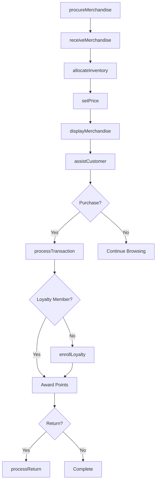
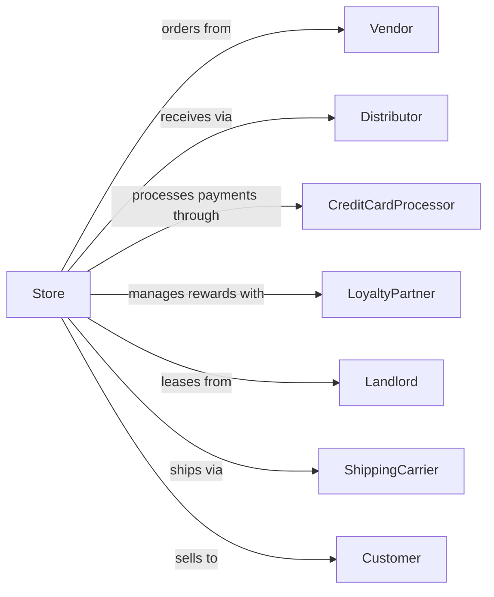

# Department Stores

> Business-as-Code definition for department store retail operations. Models the complete multi-category merchandising lifecycle from vendor procurement through omnichannel sales, customer service, and returns processing.

## Overview

Department stores operate as large-format retailers selling diverse merchandise categories including apparel, cosmetics, home furnishings, electronics, and accessories through distinct departments. This definition exposes actions for merchandise buying, inventory allocation, pricing strategies, customer engagement, and cross-channel fulfillment that drive modern department store operations.

## Actors

| Actor | Description |
|-------|-------------|
| Vendor | Supplies branded merchandise under wholesale or consignment agreements |
| Distributor | Provides logistics and bulk distribution services |
| CreditCardProcessor | Handles payment authorization and settlement |
| LoyaltyPartner | Manages rewards program and customer data |
| Landlord | Owns or leases retail property to the store |
| ShippingCarrier | Delivers online orders and handles returns |
| Customer | Individual purchasing merchandise in-store or online |
| Franchisor | Licenses brand operations for certain departments |

## Roles

| Role | Description |
|------|-------------|
| StoreManager | Oversees all store operations and profitability |
| BuyingManager | Selects merchandise and negotiates vendor terms |
| DepartmentManager | Manages specific category departments and staff |
| SalesAssociate | Assists customers and processes transactions |
| VisualMerchandiser | Designs displays and store presentation |
| InventorySpecialist | Manages stock levels and replenishment |
| CustomerServiceRep | Handles inquiries, returns, and complaints |
| PersonalShopper | Provides one-on-one appointment-based shopping assistance for high-value clients |

## Entities

| Entity | Description |
|--------|-------------|
| Product | Individual SKU with attributes, pricing, and inventory |
| Department | Category grouping of related merchandise |
| PurchaseOrder | Vendor order for merchandise procurement |
| Transaction | Customer purchase with items, payment, and receipt |
| Return | Merchandise returned by customer for refund or exchange |
| Promotion | Discount or offer applied to products or categories |
| LoyaltyAccount | Customer rewards membership with points balance |
| Inventory | Stock quantity by location and status |
| PriceTag | Current and markdown pricing for display |
| GiftCard | Stored value card for purchases |
| Receipt | Transaction record for customer and accounting |
| Planogram | Visual layout specification for product placement |

## Actions

| Action | Description |
|--------|-------------|
| procureMerchandise | Source and order products from vendors |
| receiveMerchandise | Check in and process incoming inventory |
| allocateInventory | Distribute stock across departments and channels |
| setPrice | Establish regular and promotional pricing |
| displayMerchandise | Arrange products according to planogram |
| assistCustomer | Provide personalized shopping assistance |
| processTransaction | Complete sale with payment and receipt |
| processReturn | Handle merchandise returns and refunds |
| applyDiscount | Apply promotions or markdowns to items |
| enrollLoyalty | Register customer in rewards program |
| fulfillOnlineOrder | Pick, pack, and ship e-commerce orders |
| conductInventory | Perform physical inventory count |

## Events

| Event | Description |
|-------|-------------|
| merchandiseOrdered | Purchase order submitted to vendor |
| merchandiseReceived | Inventory arrived and checked in |
| inventoryAllocated | Stock distributed to selling locations |
| priceSet | Product pricing established or changed |
| merchandiseDisplayed | Products placed on sales floor |
| transactionCompleted | Sale finalized with payment |
| returnProcessed | Refund or exchange completed |
| discountApplied | Promotion activated on transaction |
| loyaltyEnrolled | Customer joined rewards program |
| onlineOrderFulfilled | E-commerce order shipped |
| inventoryCounted | Physical count completed |
| markdownTaken | Price reduction applied to merchandise |

## Searches

| Search | Description |
|--------|-------------|
| findProducts | Search merchandise by category, brand, or attributes |
| checkInventory | Query stock levels across locations |
| getCustomer | Look up customer by account or loyalty number |
| findTransactions | Retrieve sales history by date or customer |
| getPromotions | List active discounts and offers |
| findReturns | Search return transactions by reason or date |
| getVendorOrders | Retrieve purchase orders by vendor or status |
| checkPlanogram | View display specifications for department |

## Workflow



## Actor Relationships



## Usage

### Calling Actions

```typescript
import { retailMerchandise } from '@headlessly/retail-merchandise'

const store = retailMerchandise()

// Search merchandise by category, brand, or attributes
const findProductsResult = await store.findProducts({ category: 'featured', inStock: true })

// Query stock levels across locations
const checkInventoryResult = await store.checkInventory({ status: 'active' })

// Procure merchandise from vendor
await store.procureMerchandise({
  vendorId: 'vendor-456',
  items: [
    { sku: 'DRESS-BLK-M', quantity: 50, cost: 45.00 },
    { sku: 'DRESS-BLK-L', quantity: 30, cost: 45.00 }
  ],
  deliveryDate: '2024-03-15'
})

// Process customer transaction
const transaction = await store.processTransaction({
  items: [
    { sku: 'DRESS-BLK-M', quantity: 1, price: 89.99 }
  ],
  loyaltyNumber: 'LYL-789012',
  payment: { method: 'credit', amount: 89.99 }
})

// Handle return
await store.processReturn({
  originalTransactionId: transaction.id,
  items: [{ sku: 'DRESS-BLK-M', quantity: 1, reason: 'size' }],
  refundMethod: 'original'
})
```

### Event-Driven Automation

```typescript
// Auto-reorder low stock items
store.inventoryCounted(async ({ department, lowStockItems }) => {
  for (const item of lowStockItems) {
    if (item.quantity < item.reorderPoint) {
      await store.procureMerchandise({
        vendorId: item.primaryVendor,
        items: [{ sku: item.sku, quantity: item.reorderQuantity }]
      })
    }
  }
})

// Notify customer of loyalty milestone
store.transactionCompleted(async ({ loyaltyNumber, pointsEarned }) => {
  const account = await store.getCustomer({ loyaltyNumber })
  if (account.totalPoints >= 1000 && account.tier === 'silver') {
    await upgradeLoyaltyTier({ loyaltyNumber, newTier: 'gold' })
    await sendTierUpgradeNotification({ customerId: account.id })
  }
})
```
