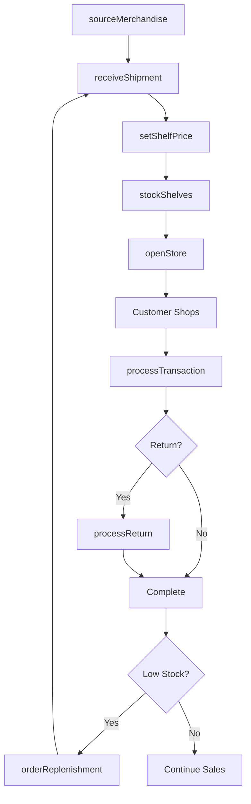
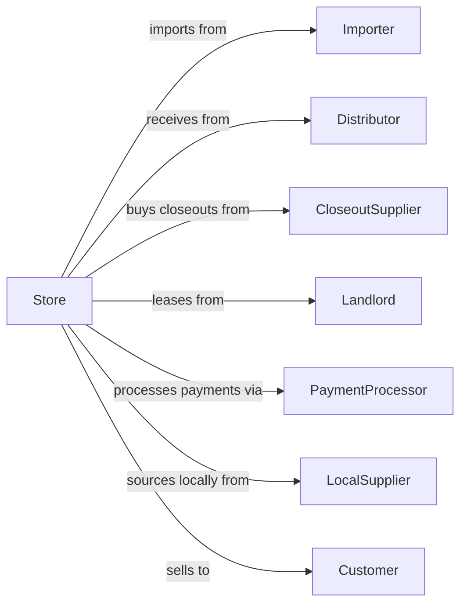

# All Other General Merchandise Retailers

> Business-as-Code definition for general merchandise retail operations. Models the diverse product retail lifecycle from multi-category sourcing through value-focused sales, inventory management, and customer transactions.

## Overview

General merchandise retailers operate variety stores, dollar stores, and general stores selling diverse product categories including housewares, apparel, groceries, and hardware without specialization. This definition exposes actions for value-focused procurement, store operations, inventory management, and customer transactions that drive high-volume, low-margin retail business models.

## Actors

| Actor | Description |
|-------|-------------|
| Importer | Sources low-cost merchandise from overseas manufacturers |
| Distributor | Provides regional distribution and delivery services |
| CloseoutSupplier | Offers discounted excess and liquidation inventory |
| Landlord | Leases retail space in strip malls and shopping centers |
| PaymentProcessor | Handles card and electronic payment transactions |
| LocalSupplier | Provides regional or seasonal merchandise |
| Customer | Individual seeking value-priced merchandise |
| Franchiser | Licenses brand and operations for franchise locations |

## Roles

| Role | Description |
|------|-------------|
| StoreManager | Oversees daily operations and sales performance |
| AssistantManager | Supports manager and supervises staff shifts |
| MerchandiseBuyer | Selects products and negotiates supplier pricing |
| StockAssociate | Receives shipments and restocks shelves |
| Cashier | Processes customer transactions at checkout |
| DistrictManager | Oversees multiple store locations in region |
| LossPrevention | Monitors theft and shrinkage reduction |

## Entities

| Entity | Description |
|--------|-------------|
| Product | Individual SKU with price point and category |
| Category | Merchandise grouping like housewares, food, or apparel |
| Shipment | Incoming delivery from supplier or distribution center |
| Transaction | Customer purchase with items and payment |
| PricePoint | Standard pricing tier like $1, $3, or $5 |
| Planogram | Shelf layout specification for product display |
| Inventory | Stock quantity by store and location |
| Promotion | Weekly ad or seasonal sale pricing |
| Shrinkage | Inventory loss from theft, damage, or error |
| StoreLayout | Floor plan for merchandise zones and checkout |
| Receipt | Transaction record for customer |
| Coupon | Discount offer for customer savings |

## Actions

| Action | Description |
|--------|-------------|
| sourceMerchandise | Identify and order value-priced products |
| receiveShipment | Process incoming inventory deliveries |
| setShelfPrice | Establish pricing at designated price points |
| stockShelves | Place products according to planogram |
| processTransaction | Complete customer purchase at register |
| applyPromotion | Activate weekly ad or sale pricing |
| processReturn | Handle customer returns and exchanges |
| conductCount | Perform inventory counts for accuracy |
| markdownProduct | Reduce prices on slow-moving inventory |
| orderReplenishment | Submit restock orders to distribution |
| investigateShrinkage | Research and address inventory discrepancies |
| openStore | Execute daily opening procedures |

## Events

| Event | Description |
|-------|-------------|
| merchandiseSourced | Products ordered from supplier |
| shipmentReceived | Delivery processed and checked in |
| priceSet | Product pricing established |
| shelvesStocked | Products placed on sales floor |
| transactionCompleted | Customer purchase finalized |
| promotionActivated | Sale pricing went into effect |
| returnProcessed | Refund or exchange completed |
| countCompleted | Inventory count finished |
| markdownApplied | Price reduction taken on products |
| replenishmentOrdered | Restock order submitted |
| shrinkageIdentified | Inventory loss detected |
| storeOpened | Daily operations commenced |

## Searches

| Search | Description |
|--------|-------------|
| findProducts | Search merchandise by category or price point |
| checkInventory | Query stock levels by store or item |
| getTransactions | Retrieve sales by date, register, or cashier |
| findPromotions | List active and upcoming sale events |
| getShrinkageReport | View inventory loss by category or period |
| getShipments | Track incoming deliveries and status |
| findPlanogram | Retrieve shelf layout for category |
| getStoreMetrics | View sales and traffic performance |

## Workflow



## Actor Relationships



## Usage

### Calling Actions

```typescript
import { retailGeneralMerchandise } from '@headlessly/retail-general-merchandise'

const store = retailGeneralMerchandise()

// Search merchandise by category or price point
const findProductsResult = await store.findProducts({ category: 'featured', inStock: true })

// Query stock levels by store or item
const checkInventoryResult = await store.checkInventory({ status: 'active' })

// Source value merchandise
await store.sourceMerchandise({
  supplierId: 'closeout-123',
  items: [
    { sku: 'CLEANING-SPRAY', quantity: 500, cost: 0.75, pricePoint: 1.25 },
    { sku: 'PARTY-SUPPLIES', quantity: 300, cost: 1.50, pricePoint: 3.00 }
  ],
  deliveryDate: '2024-03-20'
})

// Process customer transaction
const transaction = await store.processTransaction({
  items: [
    { sku: 'CLEANING-SPRAY', quantity: 3, price: 1.25 },
    { sku: 'SNACK-MIX', quantity: 2, price: 1.00 }
  ],
  payment: { method: 'cash', amount: 6.00 }
})

// Apply weekly promotion
await store.applyPromotion({
  name: 'Spring Cleaning Sale',
  category: 'cleaning',
  discountPercent: 20,
  startDate: '2024-03-15',
  endDate: '2024-03-22'
})
```

### Event-Driven Automation

```typescript
// Auto-reorder when stock runs low
store.transactionCompleted(async ({ items }) => {
  for (const item of items) {
    const stock = await store.checkInventory({ sku: item.sku })
    if (stock.quantity < stock.reorderPoint) {
      await store.orderReplenishment({
        sku: item.sku,
        quantity: stock.reorderQuantity
      })
    }
  }
})

// Alert on shrinkage threshold
store.countCompleted(async ({ category, expectedCount, actualCount }) => {
  const shrinkageRate = (expectedCount - actualCount) / expectedCount
  if (shrinkageRate > 0.02) {
    await store.investigateShrinkage({
      category,
      variance: expectedCount - actualCount,
      priority: 'high'
    })
    await notifyLossPrevention({ category, shrinkageRate })
  }
})
```
