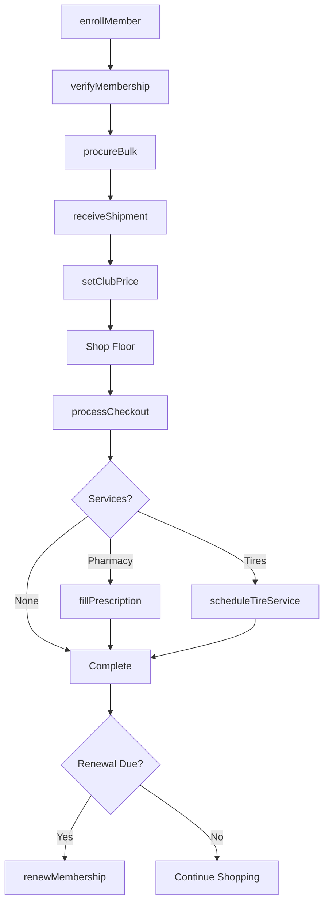
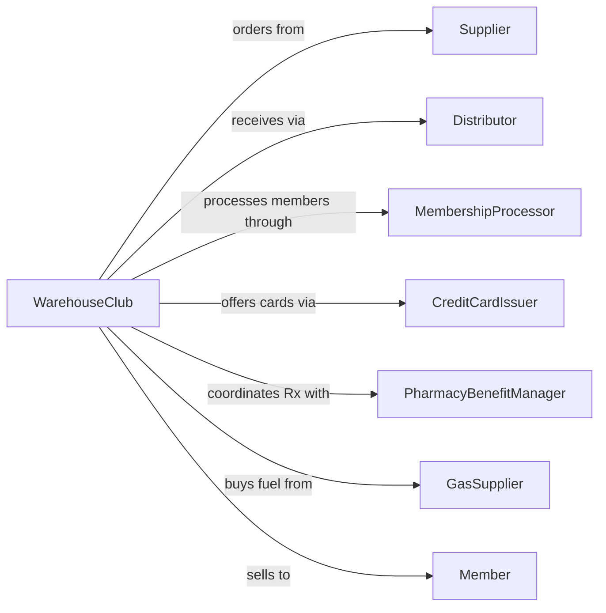

# Warehouse Clubs and Supercenters

> Business-as-Code definition for warehouse club and supercenter retail operations. Models the membership-based bulk retail lifecycle from supplier negotiations through high-volume sales, inventory turnover, and member services.

## Overview

Warehouse clubs and supercenters operate large-format retail facilities selling bulk quantities of groceries, general merchandise, and services at discounted prices to members. This definition exposes actions for membership management, bulk procurement, inventory rotation, checkout operations, and ancillary services like pharmacy, optical, and tire centers that drive member retention and revenue.

## Actors

| Actor | Description |
|-------|-------------|
| Supplier | Provides merchandise in bulk quantities at volume pricing |
| Distributor | Delivers large shipments to warehouse locations |
| MembershipProcessor | Manages member sign-ups, renewals, and billing |
| CreditCardIssuer | Provides co-branded membership credit cards |
| PharmacyBenefitManager | Coordinates prescription drug pricing and claims |
| FoodServiceSupplier | Supplies prepared food court operations |
| Member | Individual or business with paid membership |
| GasSupplier | Provides fuel for member gas stations |

## Roles

| Role | Description |
|------|-------------|
| ClubManager | Oversees all warehouse operations and membership goals |
| MerchandiseManager | Manages product selection and supplier relationships |
| MembershipCoordinator | Handles member services and retention |
| ReceivingManager | Coordinates bulk deliveries and inventory processing |
| FrontEndSupervisor | Manages checkout operations and cashiers |
| FreshManager | Oversees perishable goods including bakery, deli, and produce |
| AncillaryServicesManager | Runs pharmacy, optical, tire, and other service centers |
| DemoSampler | Prepares and distributes product samples to members on the warehouse floor |

## Entities

| Entity | Description |
|--------|-------------|
| Membership | Member account with tier, benefits, and renewal date |
| SKU | Stock keeping unit for bulk packaged products |
| Pallet | Standard shipping unit for warehouse inventory |
| PurchaseOrder | Bulk order to supplier with delivery schedule |
| Transaction | Member purchase with items, payment, and receipt |
| Coupon | Member-only discount or instant savings offer |
| GasPrice | Current fuel pricing at member gas station |
| Prescription | Pharmacy medication order for member |
| ServiceAppointment | Booking for tire, optical, or other services |
| FoodCourtOrder | Prepared food purchase at in-store food court |
| MemberReward | Cash back or rebate earned on purchases |
| InventoryBin | Storage location for products on warehouse floor |

## Actions

| Action | Description |
|--------|-------------|
| enrollMember | Sign up new individual or business membership |
| renewMembership | Process membership renewal and upgrade tier |
| procureBulk | Order large quantities from suppliers at volume pricing |
| receiveShipment | Process pallet deliveries and stock floor |
| setClubPrice | Establish member pricing and instant savings |
| processCheckout | Scan items and complete member transaction |
| verifyMembership | Check membership status at entry or checkout |
| fillPrescription | Process and dispense pharmacy orders |
| scheduleTireService | Book tire installation or rotation appointment |
| processReturn | Handle bulk item returns with membership verification |
| redeemReward | Apply member cash back to purchases |
| orderFoodCourt | Process food court orders for members |

## Events

| Event | Description |
|-------|-------------|
| memberEnrolled | New membership account created |
| membershipRenewed | Member renewed for another term |
| shipmentReceived | Bulk delivery processed and stocked |
| priceUpdated | Club pricing changed on items |
| checkoutCompleted | Member transaction finalized |
| membershipVerified | Member card validated at entry |
| prescriptionFilled | Pharmacy order dispensed |
| serviceCompleted | Tire, optical, or other service finished |
| returnProcessed | Bulk return accepted and refunded |
| rewardRedeemed | Member cash back applied |
| membershipExpired | Member account lapsed without renewal |
| inventoryRotated | Stock moved for freshness or clearance |

## Searches

| Search | Description |
|--------|-------------|
| findProducts | Search inventory by category, brand, or keyword |
| getMember | Look up member by card number or account |
| checkInventory | Query stock levels and bin locations |
| getTransactions | Retrieve member purchase history |
| findCoupons | List active member savings and instant rebates |
| getGasPrice | Current fuel pricing at club location |
| getPrescriptions | Member pharmacy order history |
| getServiceSchedule | Available appointment times for services |

## Workflow



## Actor Relationships



## Usage

### Calling Actions

```typescript
import { retailBulkMerchandise } from '@headlessly/retail-bulk-merchandise'

const club = retailBulkMerchandise()

// Search inventory by category, brand, or keyword
const findProductsResult = await club.findProducts({ category: 'featured', inStock: true })

// Look up member by card number or account
const getMemberResult = await club.getMember({ status: 'active' })

// Enroll new member
const membership = await club.enrollMember({
  type: 'executive',
  primaryMember: {
    name: 'John Smith',
    email: 'john@example.com'
  },
  addOnMembers: [{ name: 'Jane Smith' }],
  paymentMethod: { type: 'credit', cardId: 'card-123' }
})

// Process bulk checkout
const transaction = await club.processCheckout({
  memberId: membership.id,
  items: [
    { sku: 'PAPER-TOWEL-30PK', quantity: 2, price: 24.99 },
    { sku: 'ORGANIC-EGGS-5DZ', quantity: 1, price: 12.99 }
  ],
  coupons: ['INSTANT-SAVE-5'],
  payment: { method: 'memberCard', amount: 57.97 }
})

// Fill pharmacy prescription
await club.fillPrescription({
  memberId: membership.id,
  rxNumber: 'RX-789456',
  quantity: 90,
  pickupTime: '2024-03-15T14:00:00Z'
})
```

### Event-Driven Automation

```typescript
// Send renewal reminder before expiration
club.membershipExpired(async ({ memberId, expirationDate }) => {
  const daysBefore = 30
  await scheduleReminder({
    memberId,
    triggerDate: subtractDays(expirationDate, daysBefore),
    message: 'Your membership expires soon - renew to keep saving!'
  })
})

// Auto-apply executive rewards at checkout
club.checkoutCompleted(async ({ memberId, total, memberTier }) => {
  if (memberTier === 'executive') {
    const rewardRate = 0.02
    await club.redeemReward({
      memberId,
      amount: total * rewardRate,
      source: 'executiveReward'
    })
  }
})
```
