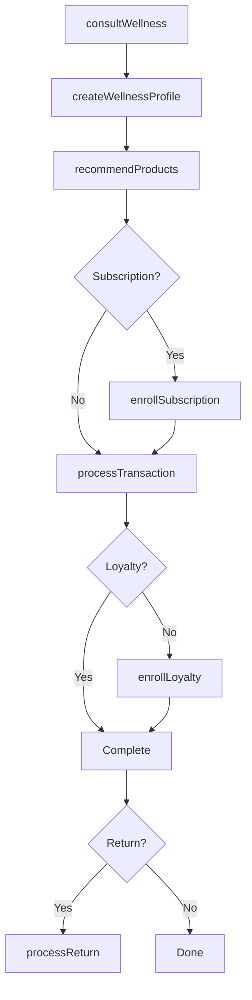
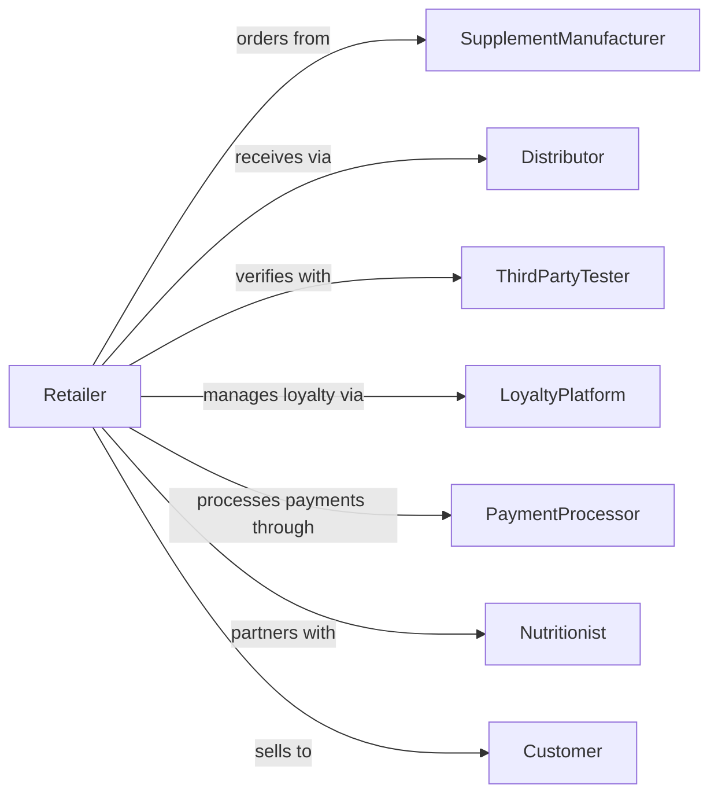

# Food (Health) Supplement Retailers

> Business-as-Code definition for health supplement retail operations. Models the vitamin and nutrition retail lifecycle from product sourcing through customer consultation, wellness programs, and subscription services.

## Overview

Health supplement retailers sell vitamins, minerals, protein supplements, herbal products, and body enhancing supplements through specialty stores. This definition exposes actions for wellness consultation, product recommendation, subscription management, and customer education that drive health-focused retail operations.

## Actors

| Actor | Description |
|-------|-------------|
| SupplementManufacturer | Produces vitamins, minerals, and supplements |
| Distributor | Warehouses and delivers supplement products |
| ThirdPartyTester | Verifies product quality and purity claims |
| LoyaltyPlatform | Manages rewards and subscription programs |
| PaymentProcessor | Handles card and electronic payments |
| Customer | Individual purchasing supplements for wellness |
| Nutritionist | Provides dietary guidance and recommendations |
| Regulator | FDA oversight of supplement labeling and claims |

## Roles

| Role | Description |
|------|-------------|
| StoreManager | Oversees store operations and team |
| WellnessAdvisor | Consults on supplement selection and wellness goals |
| SalesAssociate | Assists customers and processes transactions |
| InventorySpecialist | Manages stock levels and product rotation |
| EducationCoordinator | Organizes wellness workshops and events |
| SubscriptionManager | Handles recurring order programs |

## Entities

| Entity | Description |
|--------|-------------|
| Supplement | Vitamin, mineral, herb, or nutrition product |
| Brand | Supplement brand with quality certifications |
| WellnessProfile | Customer health goals and product preferences |
| Subscription | Recurring auto-ship order program |
| Transaction | Customer purchase with items and payment |
| LoyaltyAccount | Customer rewards membership |
| EducationEvent | Wellness workshop or seminar |
| ProductReview | Customer rating and feedback |
| Inventory | Stock quantity with expiration tracking |
| Bundle | Curated supplement stack for specific goals |
| Return | Product returned within policy window |
| Certification | Third-party quality verification |

## Actions

| Action | Description |
|--------|-------------|
| consultWellness | Discuss health goals and recommend products |
| createWellnessProfile | Build customer health and preference profile |
| recommendProducts | Suggest supplements based on wellness goals |
| processTransaction | Complete purchase with payment |
| enrollSubscription | Set up recurring auto-ship program |
| modifySubscription | Update subscription products or schedule |
| enrollLoyalty | Sign up customer for rewards |
| conductEducation | Host wellness workshop or seminar |
| processReturn | Handle product returns and exchanges |
| createBundle | Assemble supplement stack for goals |
| checkExpiration | Monitor product freshness dates |
| orderInventory | Replenish stock from suppliers |

## Events

| Event | Description |
|-------|-------------|
| wellnessConsulted | Customer received product guidance |
| wellnessProfileCreated | Customer preferences saved |
| productsRecommended | Supplement suggestions provided |
| transactionCompleted | Purchase finalized |
| subscriptionEnrolled | Auto-ship program started |
| subscriptionModified | Recurring order updated |
| loyaltyEnrolled | Customer joined rewards |
| educationConducted | Workshop or seminar completed |
| returnProcessed | Refund or exchange completed |
| bundleCreated | Custom supplement stack assembled |
| expirationAlerted | Products approaching expiration date |
| inventoryOrdered | Restock order submitted |

## Searches

| Search | Description |
|--------|-------------|
| findProducts | Search supplements by type, brand, or goal |
| getWellnessProfile | Retrieve customer health preferences |
| checkInventory | Query stock levels and expirations |
| getSubscriptions | View customer subscription details |
| findEvents | List upcoming wellness workshops |
| getLoyaltyBalance | Check customer rewards points |
| getProductReviews | Retrieve ratings and feedback |
| findBundles | Search curated supplement stacks |

## Workflow



## Actor Relationships



## Usage

### Calling Actions

```typescript
import { retailSupplements } from '@headlessly/retail-supplements'

const store = retailSupplements()

// Search supplements by type, brand, or goal
const findProductsResult = await store.findProducts({ category: 'featured', inStock: true })

// Retrieve customer health preferences
const getWellnessProfileResult = await store.getWellnessProfile({ status: 'active' })

// Create wellness profile
const profile = await store.createWellnessProfile({
  customerId: 'cust-456',
  goals: ['energy', 'immune-support', 'joint-health'],
  dietaryRestrictions: ['vegetarian', 'gluten-free'],
  currentSupplements: ['multivitamin']
})

// Enroll in subscription program
await store.enrollSubscription({
  customerId: 'cust-456',
  products: [
    { sku: 'VITAMIN-D3-5000', quantity: 1 },
    { sku: 'OMEGA-3-FISH-OIL', quantity: 1 }
  ],
  frequency: 'monthly',
  shippingAddress: '123 Wellness Way, Boulder, CO 80301'
})

// Process in-store transaction
const transaction = await store.processTransaction({
  customerId: 'cust-456',
  items: [
    { sku: 'PROTEIN-POWDER-VANILLA', quantity: 1, price: 39.99 },
    { sku: 'PROBIOTIC-50B', quantity: 1, price: 29.99 }
  ],
  loyaltyPointsEarned: 70
})
```

### Event-Driven Automation

```typescript
// Send personalized recommendations
store.wellnessProfileCreated(async ({ customerId, goals }) => {
  const recommendations = await generateRecommendations({ goals })
  await sendWellnessEmail({
    customerId,
    subject: 'Supplements matched to your goals',
    products: recommendations
  })
})

// Remind before subscription ships
store.subscriptionEnrolled(async ({ subscriptionId, nextShipDate }) => {
  await scheduleReminder({
    subscriptionId,
    triggerDate: subtractDays(nextShipDate, 5),
    message: 'Your subscription ships in 5 days - make any changes?'
  })
})
```
