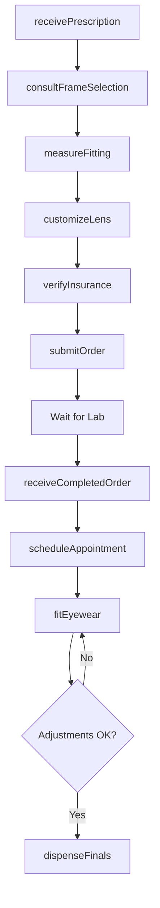
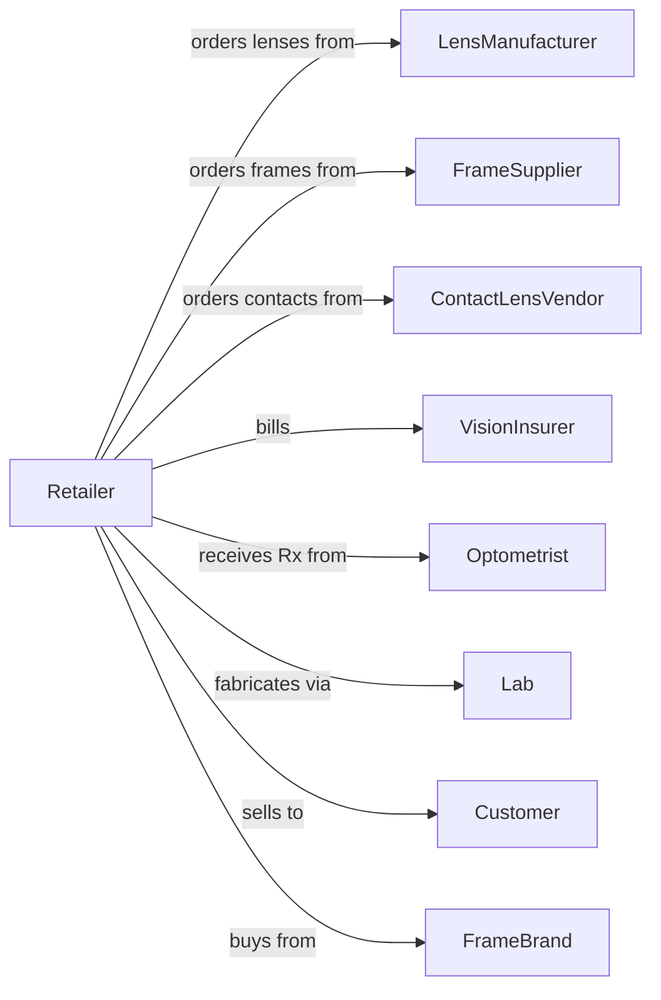

# Optical Goods Retailers

> Business-as-Code definition for optical goods retail operations. Models the eyewear sales lifecycle from eye exam referrals through frame selection, lens fabrication, fitting, and vision care services.

## Overview

Optical goods retailers sell prescription eyeglasses, contact lenses, sunglasses, and related accessories, often with on-site lens grinding and fitting services. This definition exposes actions for prescription processing, frame consultation, lens customization, order fulfillment, and ongoing vision care that define specialty optical retail.

## Actors

| Actor | Description |
|-------|-------------|
| LensManufacturer | Produces prescription and specialty lenses |
| FrameSupplier | Provides eyeglass frames from various brands |
| ContactLensVendor | Supplies branded contact lenses |
| VisionInsurer | Provides vision care coverage and benefits |
| Optometrist | Performs eye exams and writes prescriptions |
| Lab | Grinds and finishes prescription lenses |
| Customer | Individual purchasing eyewear or contacts |
| FrameBrand | Designer brand providing frames and marketing |

## Roles

| Role | Description |
|------|-------------|
| StoreManager | Oversees optical shop operations |
| LicensedOptician | Fits eyewear and interprets prescriptions |
| FrameStylist | Consults on frame selection and style |
| LabTechnician | Operates lens grinding and edging equipment |
| ContactLensSpecialist | Fits and dispenses contact lenses |
| CustomerServiceRep | Handles appointments and customer inquiries |

## Entities

| Entity | Description |
|--------|-------------|
| Prescription | Vision correction specifications from eye exam |
| Frame | Eyeglass frame with brand, style, and dimensions |
| Lens | Prescription or specialty lens with coatings |
| ContactLens | Corrective or cosmetic contact lens product |
| EyewearOrder | Customer order with frame, lens, and services |
| Fitting | Adjustment session for eyewear comfort |
| VisionBenefit | Insurance coverage details and allowances |
| Coating | Lens treatment like anti-reflective or UV |
| Sunglasses | Non-prescription or Rx sun protection eyewear |
| Warranty | Coverage for frame and lens defects |
| Inventory | Frame and lens stock levels |
| Appointment | Scheduled fitting or pickup time |

## Actions

| Action | Description |
|--------|-------------|
| receivePrescription | Accept and verify vision prescription |
| consultFrameSelection | Help customer choose appropriate frames |
| measureFitting | Take pupillary distance and fitting measurements |
| customizeLens | Configure lens type, coatings, and treatments |
| verifyInsurance | Check vision benefits and coverage |
| submitOrder | Send lens order to lab for fabrication |
| receiveCompletedOrder | Receive finished eyewear from lab |
| fitEyewear | Adjust frames for comfort and accuracy |
| dispenseFinals | Complete handoff of finished eyewear |
| orderContactLenses | Process contact lens order |
| processReturn | Handle exchanges and warranty claims |
| scheduleAppointment | Book fitting or pickup appointment |

## Events

| Event | Description |
|-------|-------------|
| prescriptionReceived | Vision Rx accepted and verified |
| framesSelected | Customer chose frame style |
| measurementsTaken | Fitting dimensions recorded |
| lensCustomized | Lens specifications configured |
| insuranceVerified | Benefits confirmed with payer |
| orderSubmitted | Lens order sent to lab |
| orderCompleted | Finished eyewear received from lab |
| eyewearFitted | Frames adjusted for customer |
| eyewearDispensed | Customer received finished product |
| contactsOrdered | Contact lens order submitted |
| returnProcessed | Exchange or warranty claim completed |
| appointmentScheduled | Fitting time booked |

## Searches

| Search | Description |
|--------|-------------|
| findFrames | Search frames by brand, style, or fit |
| getPrescription | Retrieve customer vision prescription |
| checkInsurance | Query vision benefit coverage |
| getOrders | Find orders by customer or status |
| findAppointments | View scheduled fittings |
| checkInventory | Query frame and lens stock |
| getContactLensRx | Retrieve contact lens prescription |
| findWarranties | Check warranty coverage by order |

## Workflow



## Actor Relationships



## Usage

### Calling Actions

```typescript
import { retailOpticalGoods } from '@headlessly/retail-optical-goods'

const store = retailOpticalGoods()

// Search frames by brand, style, or fit
const findFramesResult = await store.findFrames({ status: 'active' })

// Retrieve customer vision prescription
const getPrescriptionResult = await store.getPrescription({ status: 'active' })

// Receive and process prescription
const rx = await store.receivePrescription({
  customerId: 'cust-789',
  source: 'external-optometrist',
  sphereOD: -2.50,
  sphereOS: -2.25,
  cylinderOD: -0.75,
  axisOD: 180,
  add: 1.50,
  expirationDate: '2026-03-15'
})

// Configure custom lens order
const order = await store.submitOrder({
  prescriptionId: rx.id,
  frameId: 'FRAME-RAY-BAN-5228',
  lensType: 'progressive',
  material: 'polycarbonate',
  coatings: ['anti-reflective', 'blue-light', 'scratch-resistant'],
  tint: 'photochromic'
})

// Fit completed eyewear
await store.fitEyewear({
  orderId: order.id,
  adjustments: ['temple-tension', 'nose-pad-angle'],
  customerApproval: true
})
```

### Event-Driven Automation

```typescript
// Notify customer when order ready
store.orderCompleted(async ({ orderId, customerId }) => {
  await notifyCustomer({
    customerId,
    message: 'Your eyewear is ready for pickup!'
  })
  await store.scheduleAppointment({
    customerId,
    orderId,
    type: 'fitting'
  })
})

// Remind customer of prescription expiration
store.prescriptionReceived(async ({ customerId, expirationDate }) => {
  const monthsBefore = 2
  await scheduleReminder({
    customerId,
    triggerDate: subtractMonths(expirationDate, monthsBefore),
    message: 'Your prescription expires soon - schedule your eye exam!'
  })
})
```
