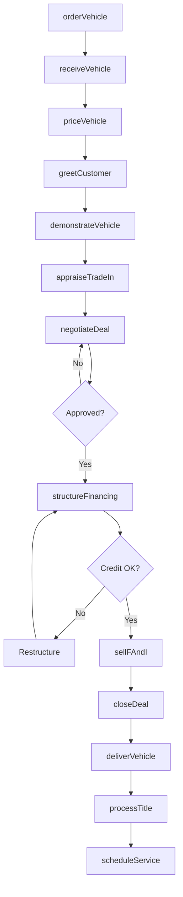
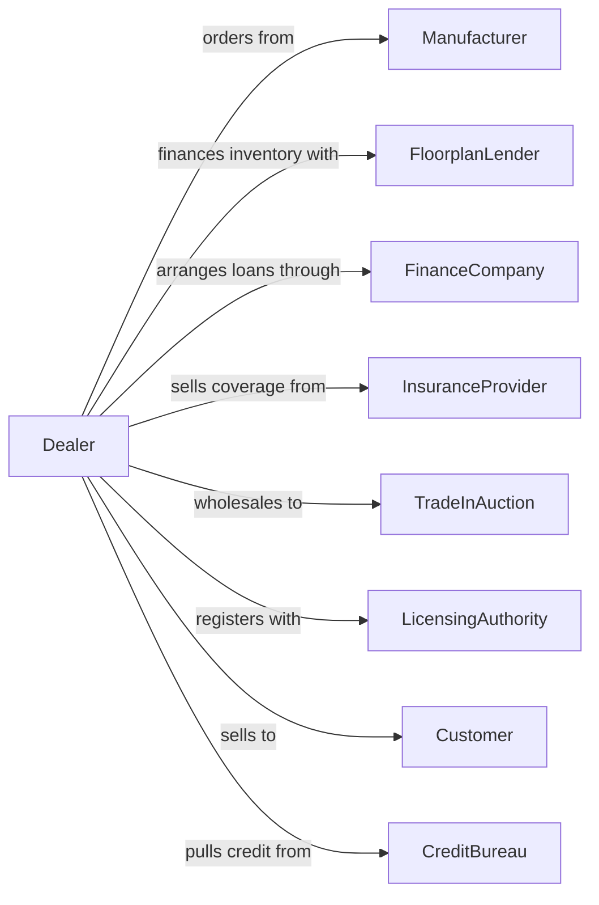

# New Car Dealers

> Business-as-Code definition for new automobile dealership operations. Models the complete vehicle sales lifecycle from manufacturer allocation through customer delivery, financing, and ongoing service relationships.

## Overview

New car dealers operate as franchised retailers selling new automobiles, light trucks, SUVs, and passenger vans under manufacturer agreements. This definition exposes actions for inventory management, customer sales processes, financing arrangements, trade-in valuations, and service department operations that generate recurring revenue.

## Actors

| Actor | Description |
|-------|-------------|
| Manufacturer | OEM providing vehicle allocation, incentives, and warranty support |
| FloorplanLender | Finances dealer vehicle inventory on the lot |
| FinanceCompany | Provides retail financing and leasing for customers |
| InsuranceProvider | Offers vehicle, GAP, and extended warranty coverage |
| TradeInAuction | Wholesale market for disposing of trade-in vehicles |
| LicensingAuthority | State agency handling title, registration, and licensing |
| Customer | Individual or business purchasing or leasing vehicles |
| CreditBureau | Provides consumer credit reports for financing decisions |
| Bank | Handles dealer operating accounts and customer financing |

## Roles

| Role | Description |
|------|-------------|
| DealerPrincipal | Owns the franchise and sets dealership strategy |
| GeneralManager | Oversees all dealership operations and profitability |
| SalesManager | Manages sales team, pricing, and deal approvals |
| SalesConsultant | Works with customers through the purchase process |
| FinanceManager | Structures deals, arranges financing, sells F&I products |
| ServiceManager | Runs the service department and warranty work |
| InventoryManager | Manages vehicle ordering, allocation, and lot organization |
| DetailTechnician | Preps vehicles for delivery with wash, wax, and interior detailing |

## Entities

| Entity | Description |
|--------|-------------|
| Vehicle | New automobile in inventory with VIN, MSRP, and options |
| Allocation | Manufacturer-assigned vehicle quota for ordering |
| Deal | Sales transaction including vehicle, trade, and financing |
| TradeIn | Customer's existing vehicle accepted toward purchase |
| Lease | Contract for vehicle use over fixed term with residual |
| Warranty | Manufacturer coverage for defects and repairs |
| Incentive | Manufacturer rebates, financing rates, or dealer cash |
| Invoice | Dealer cost from manufacturer before holdback |
| Holdback | Manufacturer payment to dealer upon vehicle sale |

## Actions

| Action | Description |
|--------|-------------|
| orderVehicle | Submit order to manufacturer for specific configuration |
| receiveVehicle | Take delivery and add to floor inventory |
| priceVehicle | Set asking price based on market and incentives |
| greetCustomer | Initial engagement and needs assessment |
| demonstrateVehicle | Conduct test drive and feature presentation |
| appraiseTradeIn | Evaluate customer's existing vehicle value |
| negotiateDeal | Work through pricing with customer |
| structureFinancing | Arrange loan or lease terms with lender |
| sellFAndI | Present finance and insurance products |
| closeDeal | Complete paperwork and collect signatures |
| deliverVehicle | Final walkthrough and customer handoff |
| processTitle | Submit title and registration to licensing authority |
| scheduleService | Book first maintenance appointment |

## Events

| Event | Description |
|-------|-------------|
| vehicleOrdered | Order submitted to manufacturer |
| vehicleReceived | Vehicle arrived and added to inventory |
| vehiclePriced | Asking price set on vehicle |
| leadCreated | New customer inquiry recorded |
| testDriveCompleted | Customer finished demonstration drive |
| tradeInAppraised | Trade-in value determined |
| dealNegotiated | Price agreement reached with customer |
| financingApproved | Lender approved customer financing |
| fAndISold | Finance and insurance products added to deal |
| dealClosed | All paperwork signed and deal funded |
| vehicleDelivered | Customer took possession of vehicle |
| titleProcessed | Registration completed with licensing authority |

## Searches

| Search | Description |
|--------|-------------|
| findInventory | Search available vehicles by model, options, price |
| getIncentives | Retrieve current manufacturer programs and rebates |
| checkAllocation | View upcoming manufacturer allocation |
| findCustomer | Look up customer by name, phone, or email |
| getTradeInValue | Query market value for trade-in vehicle |
| getLenderRates | Get current financing rates by credit tier |
| getDealHistory | Retrieve customer's purchase and service history |
| getLeaseReturns | List upcoming lease maturities for remarketing |

## Workflow



## Actor Relationships



## Usage

### Calling Actions

```typescript
import { sellNewCar } from '@headlessly/sell-new-car'

const dealer = sellNewCar()

// Search available vehicles by model, options, price
const findInventoryResult = await dealer.findInventory({ status: 'in-stock', category: 'seasonal' })

// Retrieve current manufacturer programs and rebates
const getIncentivesResult = await dealer.getIncentives({ make: 'honda', month: '2024-06' })

// Receive vehicle from manufacturer
await dealer.receiveVehicle({
  vin: '1HGBH41JXMN109186',
  model: 'Accord',
  trim: 'EX-L',
  msrp: 32500,
  invoice: 29800,
  options: ['navigation', 'sunroof']
})

// Appraise customer trade-in
const appraisal = await dealer.appraiseTradeIn({
  vin: '5YJSA1E26HF123456',
  mileage: 45000,
  condition: 'good',
  accidents: 0
})

// Structure financing for customer
const financing = await dealer.structureFinancing({
  customerId: 'cust-123',
  vehiclePrice: 31000,
  tradeInAllowance: appraisal.value,
  downPayment: 3000,
  term: 60,
  creditScore: 720
})
```

### Event-Driven Automation

```typescript
// Auto-notify sales team on new lead
dealer.leadCreated(async ({ customerId, source, interest }) => {
  await dealer.assignLead({
    customerId,
    salesConsultant: getNextAvailable(),
    priority: source === 'website' ? 'high' : 'normal'
  })
})

// Schedule follow-up after delivery
dealer.vehicleDelivered(async ({ customerId, vehicleId }) => {
  await dealer.scheduleService({
    customerId,
    vehicleId,
    serviceType: 'firstMaintenance',
    targetMileage: 5000
  })

  await sendSatisfactionSurvey({ customerId, delay: '7-days' })
})
```
