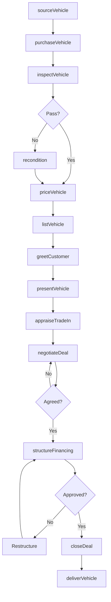

# Used Car Dealers

> Business-as-Code definition for used automobile dealership operations. Models vehicle acquisition, reconditioning, pricing, and retail sales with financing for pre-owned automobiles and light trucks.

## Overview

Used car dealers specialize in retailing pre-owned automobiles, light trucks, SUVs, and vans. This definition exposes actions for vehicle sourcing from auctions, trade-ins, and private sellers, along with reconditioning, certification programs, and retail sales with subprime and standard financing options.

## Actors

| Actor | Description |
|-------|-------------|
| Auction | Wholesale market for acquiring and selling used vehicles |
| PrivateSeller | Individual selling vehicle directly to dealer |
| FinanceCompany | Provides retail financing including subprime loans |
| Reconditioning Vendor | Provides mechanical, body, and detail services |
| VehicleHistoryProvider | Supplies accident and ownership history reports |
| WarrantyProvider | Offers extended service contracts on used vehicles |
| InsuranceCompany | Provides vehicle and GAP coverage |
| LicensingAuthority | Handles title transfers and registration |
| Customer | Individual or business purchasing used vehicles |

## Roles

| Role | Description |
|------|-------------|
| DealerOwner | Owns the business and sets strategy |
| GeneralManager | Oversees operations, inventory, and profitability |
| Buyer | Sources vehicles from auctions and trade-ins |
| SalesManager | Manages sales team and approves deals |
| SalesConsultant | Works customers through the sales process |
| FinanceManager | Structures financing and sells aftermarket products |
| ReconditioningManager | Oversees vehicle preparation and quality |
| TitleClerk | Processes titles, registrations, and licensing paperwork |

## Entities

| Entity | Description |
|--------|-------------|
| Vehicle | Pre-owned automobile with VIN, mileage, and history |
| AcquisitionSource | Origin of vehicle (auction, trade, purchase) |
| VehicleHistory | Carfax or AutoCheck report with accident data |
| ReconditioningOrder | Work order for repairs and preparation |
| Deal | Sales transaction with vehicle, trade, and financing |
| TradeIn | Customer vehicle accepted toward purchase |
| ServiceContract | Extended warranty sold with vehicle |
| BuyHerePayHere | In-house financing with dealer as lender |
| InventoryCost | Total investment including acquisition and recon |

## Actions

| Action | Description |
|--------|-------------|
| sourceVehicle | Identify and bid on vehicles at auction |
| purchaseVehicle | Complete acquisition and take possession |
| inspectVehicle | Perform mechanical and safety inspection |
| recondition | Complete repairs, detail, and preparation |
| priceVehicle | Set retail price based on market and costs |
| listVehicle | Post to website, classifieds, and aggregators |
| greetCustomer | Initial engagement and needs qualification |
| presentVehicle | Show vehicle and conduct test drive |
| appraiseTradeIn | Evaluate customer's existing vehicle |
| negotiateDeal | Work through pricing with customer |
| structureFinancing | Arrange loan with finance company |
| closeDeal | Complete paperwork and fund transaction |
| deliverVehicle | Customer handoff with vehicle orientation |

## Events

| Event | Description |
|-------|-------------|
| vehicleSourced | Vehicle identified at auction or from seller |
| vehiclePurchased | Acquisition completed and vehicle in inventory |
| inspectionCompleted | Mechanical inspection finished |
| reconditioningCompleted | Vehicle preparation done and ready for sale |
| vehiclePriced | Retail price set |
| vehicleListed | Vehicle posted online and on lot |
| leadReceived | Customer inquiry received |
| testDriveCompleted | Customer finished test drive |
| tradeInAppraised | Trade-in value determined |
| dealNegotiated | Price agreement reached |
| financingApproved | Loan approved by finance company |
| dealClosed | Transaction completed and funded |
| vehicleDelivered | Customer took possession |

## Searches

| Search | Description |
|--------|-------------|
| findAuctionVehicles | Search upcoming auction inventory |
| getVehicleHistory | Retrieve accident and ownership history |
| findInventory | Search dealer inventory by make, model, price |
| getMarketValue | Query wholesale and retail market values |
| findCustomer | Look up customer records |
| getLenderPrograms | Get available financing options by credit tier |
| getInventoryCosts | Retrieve total investment by vehicle |
| getDaysOnLot | Track aging inventory for pricing decisions |

## Workflow



## Actor Relationships

```mermaid
graph LR
    D[Dealer]

    D -->|buys from| Auction
    D -->|purchases from| PrivateSeller
    D -->|arranges loans with| FinanceCompany
    D -->|contracts with| ReconditioningVendor
    D -->|pulls reports from| VehicleHistoryProvider
    D -->|sells contracts from| WarrantyProvider
    D -->|sells to| Customer
    D -->|registers with| LicensingAuthority
    D -->|buys from| Reconditioning Vendor
    D -->|insured by| InsuranceCompany
```

## Usage

### Calling Actions

```typescript
import { sellUsedCar } from '@headlessly/sell-used-car'

const dealer = sellUsedCar()

// Search upcoming auction inventory
const findAuctionVehiclesResult = await dealer.findAuctionVehicles({ status: 'active' })

// Retrieve accident and ownership history
const getVehicleHistoryResult = await dealer.getVehicleHistory({ status: 'active' })

// Source vehicle from auction
const vehicle = await dealer.sourceVehicle({
  auctionId: 'manheim-atlanta',
  vin: '2T1BURHE5JC123456',
  maxBid: 15500,
  targetProfit: 2500
})

// Run inspection after purchase
const inspection = await dealer.inspectVehicle({
  vehicleId: vehicle.id,
  checkpoints: ['engine', 'transmission', 'brakes', 'suspension', 'electrical']
})

// Recondition based on inspection
if (inspection.itemsNeeded.length > 0) {
  await dealer.recondition({
    vehicleId: vehicle.id,
    items: inspection.itemsNeeded,
    budget: 1200
  })
}

// Price for retail
await dealer.priceVehicle({
  vehicleId: vehicle.id,
  marketValue: 19500,
  targetMargin: 0.15,
  daysTarget: 45
})
```

### Event-Driven Automation

```typescript
// Auto-reduce price on aging inventory
dealer.vehicleListed(async ({ vehicleId, listedDate }) => {
  scheduleTask({
    at: addDays(listedDate, 30),
    action: async () => {
      const { daysOnLot, currentPrice } = await dealer.getDaysOnLot({ vehicleId })
      if (daysOnLot > 30) {
        await dealer.priceVehicle({
          vehicleId,
          price: currentPrice * 0.95,
          reason: 'age-reduction'
        })
      }
    }
  })
})

// Auto-send to auction if not sold
dealer.vehiclePriced(async ({ vehicleId, priceDropCount }) => {
  if (priceDropCount >= 3) {
    const { profit } = await dealer.getInventoryCosts({ vehicleId })
    if (profit < 500) {
      await dealer.listAtAuction({
        vehicleId,
        reservePrice: 'wholesale'
      })
    }
  }
})
```
