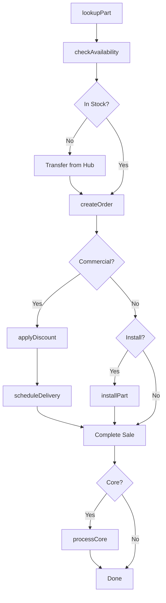
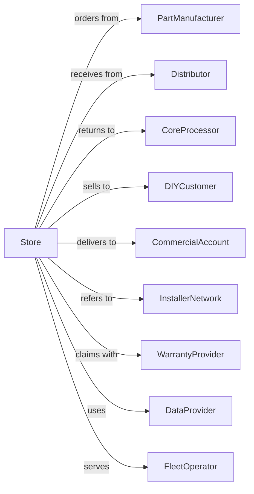

# Automotive Parts and Accessories Retailers

> Business-as-Code definition for automotive parts and accessories retail operations. Models parts lookup, inventory management, DIY and commercial sales, and installation services for replacement parts, performance upgrades, and vehicle accessories.

## Overview

Automotive parts and accessories retailers sell new, used, and rebuilt parts along with accessories and installation services. This definition exposes actions for VIN-based parts lookup, inventory replenishment, commercial account management, core returns, and services like battery testing and installation.

## Actors

| Actor | Description |
|-------|-------------|
| PartManufacturer | OEM and aftermarket parts suppliers |
| Distributor | Regional warehouse providing daily delivery |
| CoreProcessor | Handles remanufactured parts and core returns |
| DIYCustomer | Individual performing own vehicle repairs |
| CommercialAccount | Repair shop buying parts for customer vehicles |
| InstallerNetwork | Third-party shops for installation referrals |
| WarrantyProvider | Administers parts warranty claims |
| DataProvider | Supplies vehicle fitment and catalog data |
| FleetOperator | Business maintaining multiple vehicles |

## Roles

| Role | Description |
|------|-------------|
| StoreManager | Oversees store operations and profitability |
| CommercialManager | Manages professional installer accounts |
| CounterSales | Assists DIY customers with parts lookup |
| CommercialDriver | Delivers parts to commercial accounts |
| InventorySpecialist | Manages stock levels and replenishment |
| HubManager | Coordinates hub store for specialty parts |
| Installer | Performs in-store services like battery install |

## Entities

| Entity | Description |
|--------|-------------|
| Part | Replacement component with part number and fitment |
| Vehicle | Customer's car identified by year/make/model/VIN |
| Fitment | Compatibility data linking parts to vehicles |
| Core | Returnable component for remanufacturing credit |
| CommercialAccount | Business account with terms and pricing |
| WorkOrder | Service ticket for in-store installation |
| Warranty | Coverage terms for part replacement |
| Inventory | Stock on hand at store and hub locations |
| DeliveryRoute | Commercial delivery schedule and stops |

## Actions

| Action | Description |
|--------|-------------|
| lookupPart | Find parts by vehicle or symptom |
| checkAvailability | Verify stock at store, hub, and warehouse |
| createOrder | Build order with parts and services |
| applyDiscount | Apply commercial pricing or promotions |
| processCore | Accept core return and issue credit |
| scheduleDelivery | Arrange delivery to commercial account |
| installPart | Perform in-store installation service |
| testBattery | Diagnose battery and charging system |
| processReturn | Handle customer returns and exchanges |
| replenishStock | Order inventory from warehouse |
| openAccount | Set up new commercial account |
| pullWarranty | Process warranty replacement claim |

## Events

| Event | Description |
|-------|-------------|
| partFound | Part located in catalog |
| availabilityChecked | Stock status confirmed |
| orderCreated | Parts order assembled |
| discountApplied | Pricing adjusted for customer |
| coreReturned | Core accepted and credit issued |
| deliveryScheduled | Commercial delivery arranged |
| partInstalled | In-store service completed |
| batteryTested | Diagnostic results available |
| returnProcessed | Return or exchange completed |
| stockReplenished | Inventory received from warehouse |
| accountOpened | New commercial account activated |
| warrantyPulled | Warranty replacement processed |

## Searches

| Search | Description |
|--------|-------------|
| findParts | Search by part number, vehicle, or description |
| getVehicle | Look up vehicle by VIN or year/make/model |
| checkStock | Query inventory across store network |
| findCommercialAccounts | List accounts by name or territory |
| getDeliverySchedule | View delivery routes and stops |
| getWarrantyHistory | Retrieve warranty claims by customer |
| findCores | List pending core returns |
| getPromotions | View active deals and rebates |

## Workflow



## Actor Relationships



## Usage

### Calling Actions

```typescript
import { sellAutomotiveParts } from '@headlessly/sell-automotive-parts'

const store = sellAutomotiveParts()

// Look up parts by vehicle
const parts = await store.lookupPart({
  vehicle: {
    year: 2019,
    make: 'Toyota',
    model: 'Camry',
    engine: '2.5L'
  },
  category: 'brakes',
  position: 'front'
})

// Check availability across network
const availability = await store.checkAvailability({
  partNumber: parts[0].partNumber,
  locations: ['store', 'hub', 'warehouse']
})

// Create order with commercial pricing
const order = await store.createOrder({
  customerId: 'comm-456',
  items: [
    { partNumber: 'BRK-12345', quantity: 2 },
    { partNumber: 'ROT-67890', quantity: 2 }
  ]
})

await store.applyDiscount({
  orderId: order.id,
  discountType: 'commercial',
  tier: 'platinum'
})
```

### Event-Driven Automation

```typescript
// Auto-reorder low stock items
store.orderCreated(async ({ items }) => {
  for (const item of items) {
    const stock = await store.checkStock({ partNumber: item.partNumber })
    if (stock.onHand < stock.reorderPoint) {
      await store.replenishStock({
        partNumber: item.partNumber,
        quantity: stock.reorderQuantity
      })
    }
  }
})

// Remind customer about core return
store.orderCreated(async ({ orderId, items, customerId }) => {
  const coreItems = items.filter(i => i.hasCoreCharge)
  if (coreItems.length > 0) {
    await scheduleReminder({
      customerId,
      message: 'Return your cores for credit',
      delay: '30-days',
      items: coreItems
    })
  }
})
```
