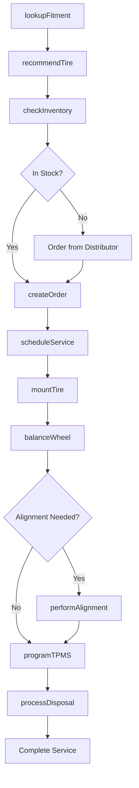
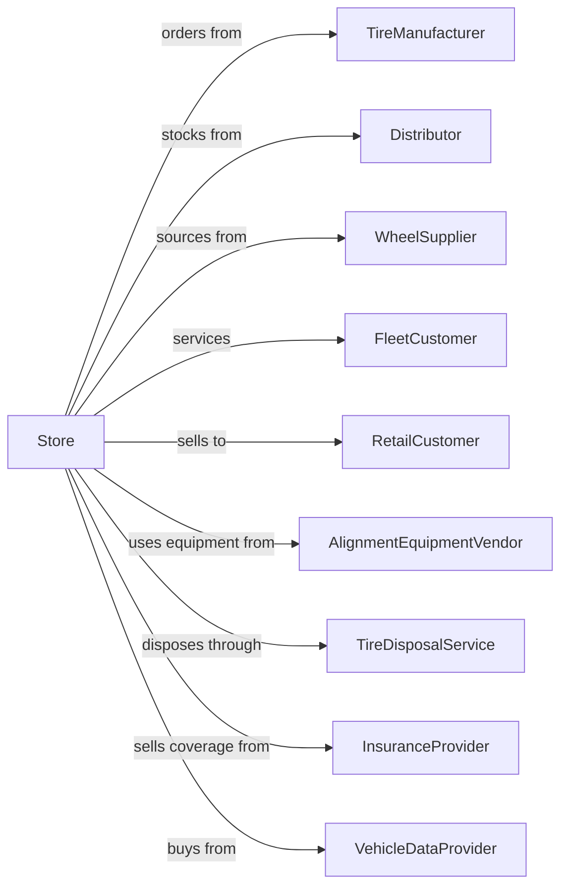

# Tire Dealers

> Business-as-Code definition for tire retail and service operations. Models tire selection, fitment, installation, balancing, alignment, and related automotive services with fleet and commercial account management.

## Overview

Tire dealers retail new and used tires while providing installation, balancing, rotation, and alignment services. This definition exposes actions for tire fitment by vehicle, inventory management across brands and sizes, commercial fleet programs, seasonal tire changeovers, and tire disposal compliance.

## Actors

| Actor | Description |
|-------|-------------|
| TireManufacturer | OEM providing tires and warranty support (Michelin, Goodyear) |
| Distributor | Regional warehouse providing tire inventory |
| WheelSupplier | Provides aftermarket wheels and rims |
| FleetCustomer | Business with multiple vehicles requiring tire service |
| RetailCustomer | Individual purchasing tires for personal vehicle |
| AlignmentEquipmentVendor | Provides alignment machines and calibration |
| TireDisposalService | Handles tire recycling and disposal |
| InsuranceProvider | Offers road hazard protection plans |
| VehicleDataProvider | Supplies fitment data by year/make/model |

## Roles

| Role | Description |
|------|-------------|
| StoreManager | Oversees store operations and profitability |
| SalesAdvisor | Assists customers with tire selection |
| ServiceManager | Manages installation bay operations |
| Technician | Performs tire mounting, balancing, and alignment |
| FleetCoordinator | Manages commercial and fleet accounts |
| InventoryManager | Manages tire stock and ordering |
| AlignmentSpecialist | Performs precision alignment services |

## Entities

| Entity | Description |
|--------|-------------|
| Tire | Rubber tire with size, speed rating, and load index |
| Wheel | Rim or alloy wheel for tire mounting |
| Vehicle | Customer car with fitment specifications |
| Fitment | Tire size and specifications for vehicle |
| ServiceOrder | Work ticket for installation and services |
| Alignment | Suspension adjustment specifications |
| FleetAccount | Commercial account with negotiated pricing |
| Warranty | Mileage warranty and road hazard coverage |
| TPMS | Tire pressure monitoring system sensor |

## Actions

| Action | Description |
|--------|-------------|
| lookupFitment | Find tire sizes by vehicle year/make/model |
| recommendTire | Suggest tires based on driving needs and budget |
| checkInventory | Verify stock across store and warehouse |
| createOrder | Build order with tires and services |
| mountTire | Install tire on wheel |
| balanceWheel | Balance wheel and tire assembly |
| performAlignment | Adjust suspension angles to specification |
| rotateTires | Move tires to different positions |
| repairTire | Patch or plug repairable punctures |
| programTPMS | Configure tire pressure sensors |
| scheduleService | Book appointment for tire service |
| processDisposal | Handle old tire recycling |

## Events

| Event | Description |
|-------|-------------|
| fitmentFound | Vehicle tire specifications identified |
| tireRecommended | Appropriate tire options presented |
| inventoryChecked | Stock availability confirmed |
| orderCreated | Tire and service order built |
| tireMounted | Tire installed on wheel |
| wheelBalanced | Wheel balanced to specification |
| alignmentCompleted | Suspension adjusted to spec |
| tiresRotated | Tire positions changed |
| tireRepaired | Puncture sealed |
| tpmsProgrammed | Sensors configured |
| serviceScheduled | Appointment booked |
| tiresDisposed | Old tires sent for recycling |

## Searches

| Search | Description |
|--------|-------------|
| findTires | Search by size, brand, or vehicle |
| getVehicleFitment | Look up OE specifications by VIN |
| checkStock | Query inventory across locations |
| findFleetAccounts | List commercial accounts |
| getServiceHistory | Retrieve customer service records |
| getAlignmentSpecs | Look up alignment angles by vehicle |
| findAppointments | View scheduled services |
| getWarrantyStatus | Check warranty coverage by tire |

## Workflow



## Actor Relationships



## Usage

### Calling Actions

```typescript
import { sellTires } from '@headlessly/sell-tires'

const store = sellTires()

// Search by size, brand, or vehicle
const findTiresResult = await store.findTires({ status: 'active' })

// Look up OE specifications by VIN
const getVehicleFitmentResult = await store.getVehicleFitment({ status: 'active' })

// Look up fitment for vehicle
const fitment = await store.lookupFitment({
  year: 2022,
  make: 'Honda',
  model: 'Accord',
  trim: 'Sport'
})

// Get tire recommendations
const recommendations = await store.recommendTire({
  size: fitment.oeSize,
  drivingStyle: 'touring',
  climate: 'all-season',
  budget: 'mid-range'
})

// Create order with installation
const order = await store.createOrder({
  customerId: 'cust-123',
  tires: {
    productId: recommendations[0].id,
    quantity: 4
  },
  services: ['mount', 'balance', 'alignment', 'tpms'],
  disposalFee: true
})
```

### Event-Driven Automation

```typescript
// Schedule rotation reminder
store.tireMounted(async ({ customerId, vehicleId, tireSet }) => {
  await scheduleReminder({
    customerId,
    vehicleId,
    service: 'rotation',
    interval: '5000-miles',
    message: 'Time for tire rotation'
  })
})

// Notify fleet manager on service completion
store.alignmentCompleted(async ({ vehicleId, fleetAccountId, readings }) => {
  if (fleetAccountId) {
    await notifyFleetManager({
      fleetAccountId,
      vehicleId,
      service: 'alignment',
      readings,
      nextRecommended: '12-months'
    })
  }
})
```
