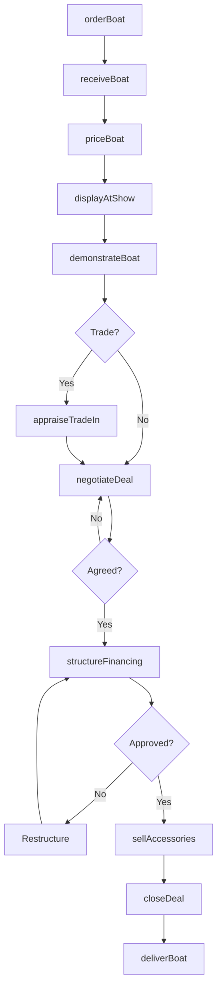
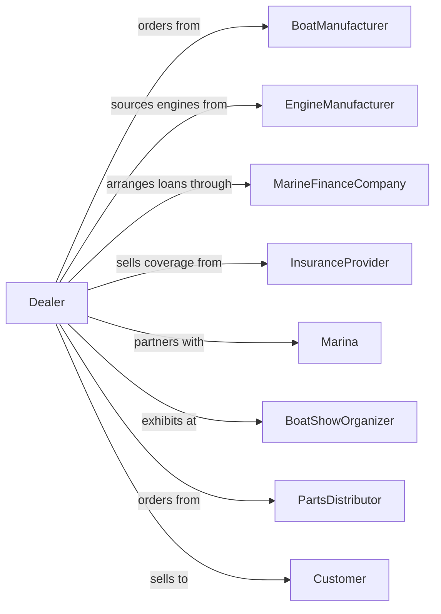

# Boat Dealers

> Business-as-Code definition for boat dealership operations. Models the complete marine retail lifecycle from manufacturer ordering through customer delivery, financing, winterization, and ongoing service for powerboats, sailboats, and personal watercraft.

## Overview

Boat dealers retail new and used boats, outboard motors, boat trailers, and marine supplies. This definition exposes actions for managing seasonal inventory, marine financing, boat shows, service including winterization and commissioning, slip rentals, and parts sales for engines and marine electronics.

## Actors

| Actor | Description |
|-------|-------------|
| BoatManufacturer | OEM providing boats, hulls, and warranty support |
| EngineManufacturer | Provides outboard and inboard marine engines |
| MarineFinanceCompany | Specializes in boat loans and seasonal payments |
| InsuranceProvider | Offers marine coverage including liability and hull |
| Marina | Provides slips, storage, and launch facilities |
| BoatShowOrganizer | Hosts shows for inventory display and sales |
| TrailerManufacturer | Provides boat trailers for trailerable vessels |
| PartsDistributor | Supplies marine parts and electronics |
| Customer | Individual or family purchasing watercraft |

## Roles

| Role | Description |
|------|-------------|
| DealerOwner | Owns dealership and manufacturer relationships |
| GeneralManager | Oversees sales, service, and marina operations |
| SalesManager | Manages sales team and boat show strategy |
| SalesConsultant | Guides customers through boat selection |
| MarineFinanceManager | Structures boat loans and protection products |
| ServiceManager | Runs shop for engine service and repairs |
| PartsManager | Manages marine parts and accessories inventory |
| MarinaTechnician | Handles commissioning, winterization, and storage |
| MarineElectronicsInstaller | Installs GPS, sonar, radar, and entertainment systems on vessels |

## Entities

| Entity | Description |
|--------|-------------|
| Boat | Watercraft unit with hull, engine, and electronics |
| Engine | Outboard or inboard motor with horsepower rating |
| Trailer | Towable support for trailerable boats |
| Electronics | Navigation, fishfinder, and communication systems |
| Slip | Marina berth for boat storage |
| Commissioning | Spring preparation for water launch |
| Winterization | Fall preparation for off-season storage |
| Deal | Sales transaction with boat, engine, and financing |
| TradeIn | Customer's existing boat accepted toward purchase |

## Actions

| Action | Description |
|--------|-------------|
| orderBoat | Submit factory order for hull and rigging |
| receiveBoat | Take delivery and complete water test |
| priceBoat | Set asking price based on market and options |
| displayAtShow | Present inventory at boat show |
| demonstrateBoat | Conduct sea trial with customer |
| appraiseTradeIn | Evaluate customer's existing boat |
| negotiateDeal | Work through pricing with customer |
| structureFinancing | Arrange marine loan with seasonal payments |
| sellAccessories | Add electronics, covers, and gear to sale |
| closeDeal | Complete paperwork and registration |
| deliverBoat | Launch and hand off to customer |
| winterize | Prepare boat for winter storage |
| commission | Spring preparation for season launch |

## Events

| Event | Description |
|-------|-------------|
| boatOrdered | Factory order submitted |
| boatReceived | Unit arrived and water tested |
| boatPriced | Asking price set |
| showDisplayed | Inventory set up at boat show |
| seaTrialCompleted | Customer finished demonstration |
| tradeInAppraised | Trade-in value determined |
| dealNegotiated | Price agreement reached |
| financingApproved | Marine loan approved |
| accessoriesSold | Add-ons included in sale |
| dealClosed | Transaction completed |
| boatDelivered | Customer took possession |
| winterized | Boat prepared for off-season storage |
| commissioned | Boat ready for season launch |

## Searches

| Search | Description |
|--------|-------------|
| findInventory | Search boats by type, length, engine, price |
| getManufacturerSpecs | View available configurations and options |
| findShows | List upcoming boat shows and deadlines |
| getTradeValue | Query market value for trade-in boat |
| getLenderPrograms | Get marine financing options |
| findSlips | Search available marina slips |
| getServiceSchedule | View winterization and commissioning queue |
| findParts | Search marine parts by engine or system |

## Workflow



## Actor Relationships



## Usage

### Calling Actions

```typescript
import { sellBoats } from '@headlessly/sell-boats'

const dealer = sellBoats()

// Search boats by type, length, engine, price
const findInventoryResult = await dealer.findInventory({ status: 'in-stock', category: 'seasonal' })

// View available configurations and options
const getManufacturerSpecsResult = await dealer.getManufacturerSpecs({ status: 'active' })

// Order new boat with engine package
await dealer.orderBoat({
  manufacturer: 'boston-whaler',
  model: 'Montauk 190',
  hullColor: 'white',
  engine: {
    manufacturer: 'mercury',
    model: 'FourStroke',
    horsepower: 150
  },
  options: ['ttop', 'livewells', 'fishfinder'],
  trailer: true
})

// Conduct sea trial
const trial = await dealer.demonstrateBoat({
  boatId: 'boat-123',
  customerId: 'cust-789',
  location: 'demo-dock',
  duration: 60,
  waterConditions: 'calm'
})

// Structure seasonal payment financing
const financing = await dealer.structureFinancing({
  customerId: 'cust-789',
  boatPrice: 65000,
  trailerPrice: 3500,
  downPayment: 10000,
  term: 144,
  seasonalPayments: true
})
```

### Event-Driven Automation

```typescript
// Schedule winterization in fall
dealer.boatDelivered(async ({ customerId, boatId }) => {
  await dealer.scheduleService({
    customerId,
    boatId,
    serviceType: 'winterization',
    targetDate: getNextNovember(),
    notify: true
  })
})

// Commission boats in spring
dealer.winterized(async ({ boatId, customerId, storageLocation }) => {
  await scheduleTask({
    at: getNextApril(),
    action: async () => {
      await dealer.commission({
        boatId,
        services: ['engineService', 'bottomPaint', 'electronics'],
        targetLaunch: getMemorialDayWeekend()
      })
    }
  })
})
```
