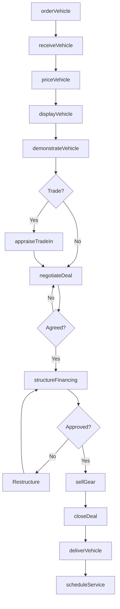
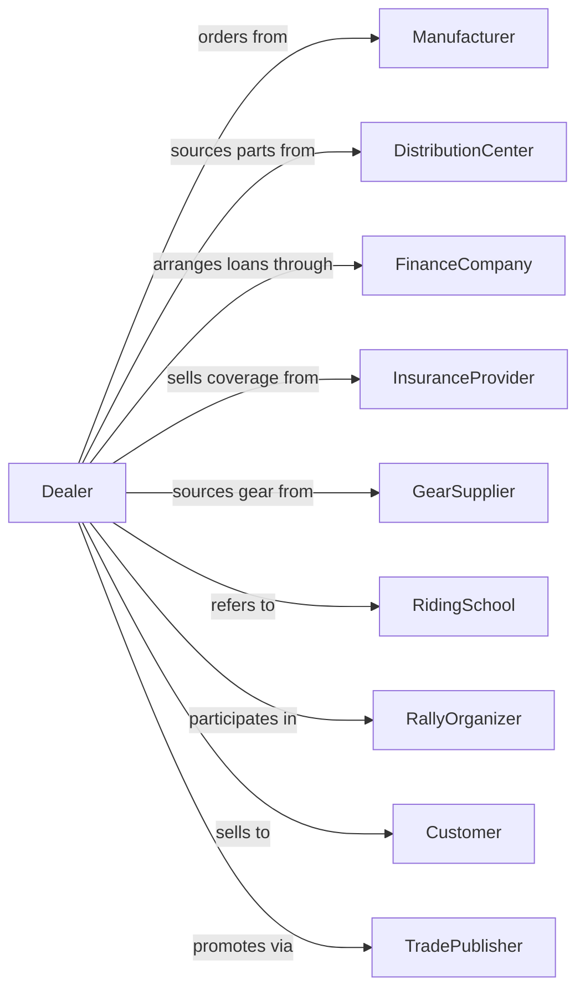

# Motorcycle, ATV, and All Other Motor Vehicle Dealers

> Business-as-Code definition for motorcycle and powersports dealership operations. Models the complete retail lifecycle for motorcycles, ATVs, UTVs, scooters, and personal watercraft including sales, financing, parts, accessories, and service.

## Overview

Motorcycle and powersports dealers retail new and used motorcycles, all-terrain vehicles (ATVs), utility vehicles (UTVs), scooters, mopeds, and personal watercraft. This definition exposes actions for managing multi-brand inventories, seasonal demand, rider gear and accessories, financing with extended terms, and manufacturer-certified service operations.

## Actors

| Actor | Description |
|-------|-------------|
| Manufacturer | OEM providing vehicles and warranty support (Harley, Honda, Polaris) |
| DistributionCenter | Regional hub for parts and accessories |
| FinanceCompany | Provides powersports loans and seasonal payment plans |
| InsuranceProvider | Offers motorcycle and ATV coverage |
| GearSupplier | Provides helmets, riding gear, and apparel |
| RidingSchool | Offers safety courses and rider training |
| RallyOrganizer | Hosts events like Sturgis or brand rallies |
| TradePublisher | Industry media for advertising and promotion |
| Customer | Individual purchasing powersports vehicle |

## Roles

| Role | Description |
|------|-------------|
| DealerPrincipal | Owns dealership and brand franchise agreements |
| GeneralManager | Oversees all dealership departments |
| SalesManager | Manages sales floor and inventory turns |
| SalesConsultant | Works with customers on vehicle selection |
| FinanceManager | Structures deals and sells protection products |
| ServiceManager | Runs shop for warranty and maintenance work |
| PartsManager | Manages parts counter and accessories |
| FitSpecialist | Ensures proper bike fit and gear sizing |

## Entities

| Entity | Description |
|--------|-------------|
| Motorcycle | Street, cruiser, sport, or touring bike |
| ATV | All-terrain vehicle for off-road recreation |
| UTV | Side-by-side utility vehicle |
| Scooter | Motorized scooter or moped |
| PWC | Personal watercraft (jet ski) |
| Gear | Helmets, jackets, gloves, and riding apparel |
| Part | OEM and aftermarket components |
| Deal | Sales transaction with vehicle and financing |
| TradeIn | Customer's existing vehicle for trade allowance |

## Actions

| Action | Description |
|--------|-------------|
| orderVehicle | Submit factory order for specific unit |
| receiveVehicle | Take delivery and complete PDI |
| priceVehicle | Set asking price based on market |
| displayVehicle | Arrange showroom for customer browsing |
| demonstrateVehicle | Conduct test ride with customer |
| appraiseTradeIn | Evaluate customer's existing vehicle |
| negotiateDeal | Work through pricing with customer |
| structureFinancing | Arrange loan with seasonal options |
| sellGear | Add helmets, jackets, and accessories |
| closeDeal | Complete paperwork and registration |
| deliverVehicle | Customer handoff with orientation |
| scheduleService | Book maintenance appointments |
| orderParts | Source OEM and aftermarket parts |

## Events

| Event | Description |
|-------|-------------|
| vehicleOrdered | Factory order submitted |
| vehicleReceived | Unit arrived and PDI completed |
| vehiclePriced | Asking price set |
| testRideCompleted | Customer finished demonstration |
| tradeInAppraised | Trade-in value determined |
| dealNegotiated | Price agreement reached |
| financingApproved | Loan approved |
| gearSold | Riding gear added to sale |
| dealClosed | Transaction completed |
| vehicleDelivered | Customer took possession |
| serviceScheduled | Maintenance appointment booked |
| partOrdered | Part ordered from distributor |

## Searches

| Search | Description |
|--------|-------------|
| findInventory | Search vehicles by type, make, model, price |
| getManufacturerPrograms | View current incentives and financing |
| findGear | Search helmets and apparel by size and style |
| getTradeValue | Query market value for trade-in |
| getLenderRates | Get financing rates by credit tier |
| getServiceSchedule | View open service appointments |
| findParts | Search parts by VIN or part number |
| getRallySchedule | List upcoming events and rallies |

## Workflow



## Actor Relationships



## Usage

### Calling Actions

```typescript
import { sellMotorcycle } from '@headlessly/sell-motorcycle'

const dealer = sellMotorcycle()

// Search vehicles by type, make, model, price
const findInventoryResult = await dealer.findInventory({ status: 'in-stock', category: 'seasonal' })

// View current incentives and financing
const getManufacturerProgramsResult = await dealer.getManufacturerPrograms({ status: 'active' })

// Order new motorcycle from manufacturer
await dealer.orderVehicle({
  manufacturer: 'harley-davidson',
  model: 'Street Glide',
  year: 2024,
  color: 'vivid-black',
  options: ['navigation', 'bluetooth', 'floorboards']
})

// Conduct test ride
const ride = await dealer.demonstrateVehicle({
  vehicleId: 'moto-123',
  customerId: 'cust-456',
  route: 'demo-loop',
  endorsementVerified: true
})

// Add gear to deal
await dealer.sellGear({
  dealId: 'deal-789',
  items: [
    { type: 'helmet', brand: 'shoei', size: 'L' },
    { type: 'jacket', brand: 'alpinestars', size: 'XL' },
    { type: 'gloves', brand: 'dainese', size: 'L' }
  ]
})
```

### Event-Driven Automation

```typescript
// Recommend safety course after purchase
dealer.vehicleDelivered(async ({ customerId, vehicleType }) => {
  if (vehicleType === 'motorcycle') {
    const hasEndorsement = await checkEndorsement(customerId)
    if (!hasEndorsement) {
      await recommendRidingCourse({
        customerId,
        course: 'MSF-BasicRider',
        discount: 50
      })
    }
  }
})

// Schedule seasonal service
dealer.dealClosed(async ({ customerId, vehicleId, vehicleType }) => {
  if (['atv', 'utv', 'pwc'].includes(vehicleType)) {
    await dealer.scheduleService({
      customerId,
      vehicleId,
      serviceType: 'winterization',
      targetMonth: 'november'
    })
  }
})
```
