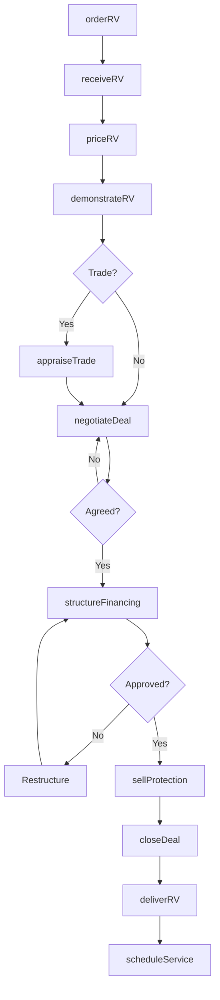
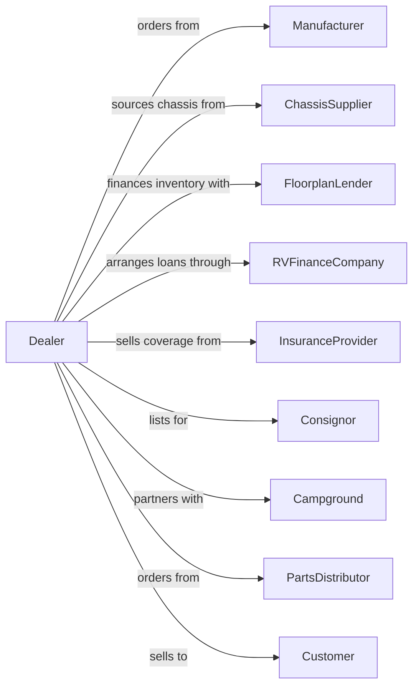

# Recreational Vehicle Dealers

> Business-as-Code definition for recreational vehicle dealership operations. Models the complete RV sales lifecycle from manufacturer orders through customer delivery, financing, service, and parts for motorhomes, travel trailers, and fifth wheels.

## Overview

Recreational vehicle dealers retail new and used motorhomes, travel trailers, fifth wheels, and campers with associated parts, accessories, and service. This definition exposes actions for managing large-ticket sales, extended financing terms, consignment inventory, seasonal demand patterns, and service revenue from RV-specific systems.

## Actors

| Actor | Description |
|-------|-------------|
| Manufacturer | OEM providing motorhomes, trailers, and warranty support |
| ChassisSupplier | Provides motorhome chassis (Ford, Freightliner) |
| FloorplanLender | Finances dealer RV inventory |
| RVFinanceCompany | Provides extended-term consumer financing and loans |
| InsuranceProvider | Offers RV-specific coverage and extended warranties |
| Consignor | Private owner placing RV with dealer for sale |
| Campground | Refers customers and provides RV community access |
| PartsDistributor | Supplies RV parts, appliances, and accessories |
| Customer | Individual or family purchasing RV for recreation |

## Roles

| Role | Description |
|------|-------------|
| DealerPrincipal | Owns the dealership and manufacturer relationships |
| GeneralManager | Oversees sales, service, and parts operations |
| SalesManager | Manages sales team and inventory mix |
| SalesConsultant | Guides customers through RV selection and purchase |
| FinanceManager | Structures deals with extended terms and products |
| ServiceManager | Runs service department for RV-specific repairs |
| PartsManager | Manages parts inventory and accessory sales |
| ConsignmentManager | Handles private RV consignment relationships |

## Entities

| Entity | Description |
|--------|-------------|
| RV | Recreational vehicle unit (motorhome, trailer, fifth wheel) |
| Chassis | Motorhome base with engine and drivetrain |
| FloorPlan | Interior layout configuration and amenities |
| TradeIn | Customer's existing RV accepted toward purchase |
| Consignment | Private RV listed for sale by dealer on owner's behalf |
| Warranty | Manufacturer coverage for defects and systems |
| ServiceOrder | Work order for repairs and maintenance |
| Part | RV-specific components and accessories |
| Deal | Sales transaction with financing and products |

## Actions

| Action | Description |
|--------|-------------|
| orderRV | Submit factory order for specific configuration |
| receiveRV | Take delivery and complete PDI inspection |
| priceRV | Set asking price based on market and features |
| acceptConsignment | Take private RV on consignment for resale |
| demonstrateRV | Walk through features and conduct test drive |
| appraiseTrade | Evaluate customer's existing RV for trade value |
| negotiateDeal | Work through pricing with customer |
| structureFinancing | Arrange 10-20 year financing with lender |
| sellProtection | Present extended service and protection plans |
| closeDeal | Complete paperwork and funding |
| deliverRV | Conduct orientation and customer handoff |
| scheduleService | Book service appointments for maintenance |
| orderParts | Source parts for service and retail sales |

## Events

| Event | Description |
|-------|-------------|
| rvOrdered | Factory order submitted |
| rvReceived | Unit arrived and PDI completed |
| rvPriced | Asking price set on unit |
| consignmentAccepted | Private RV taken on consignment |
| walkThroughCompleted | Customer finished demonstration |
| tradeAppraised | Trade-in value determined |
| dealNegotiated | Price agreement reached |
| financingApproved | Loan approved for extended term |
| protectionSold | Extended warranty added to deal |
| dealClosed | Transaction completed and funded |
| rvDelivered | Customer took possession with orientation |
| serviceScheduled | Maintenance appointment booked |
| partOrdered | Part ordered from distributor |

## Searches

| Search | Description |
|--------|-------------|
| findInventory | Search RVs by type, length, features, price |
| getFactoryOptions | View available configurations from manufacturer |
| findConsignments | List private RVs available for consignment |
| getTradeValue | Query wholesale value for trade-in RV |
| getLenderPrograms | Get financing options with extended terms |
| getServiceHistory | Retrieve maintenance records for unit |
| findParts | Search parts by unit, system, or part number |
| getSeasonalTrends | Analyze demand patterns for inventory planning |

## Workflow



## Actor Relationships



## Usage

### Calling Actions

```typescript
import { sellRecreationalVehicle } from '@headlessly/sell-recreational-vehicle'

const dealer = sellRecreationalVehicle()

// Search RVs by type, length, features, price
const findInventoryResult = await dealer.findInventory({ status: 'in-stock', category: 'seasonal' })

// View available configurations from manufacturer
const getFactoryOptionsResult = await dealer.getFactoryOptions({ status: 'active' })

// Order new motorhome from factory
await dealer.orderRV({
  manufacturer: 'winnebago',
  model: 'View',
  floorPlan: '24D',
  chassis: 'mercedes-sprinter',
  options: ['solarPanel', 'lithiumBatteries', 'washerDryer'],
  targetDelivery: '2024-03-15'
})

// Appraise customer trade-in
const appraisal = await dealer.appraiseTrade({
  vin: '5B4MP67G573123456',
  year: 2019,
  make: 'Thor',
  model: 'Ace',
  mileage: 28000,
  condition: 'good'
})

// Structure extended financing
const financing = await dealer.structureFinancing({
  customerId: 'cust-456',
  salePrice: 165000,
  tradeAllowance: appraisal.value,
  downPayment: 25000,
  term: 180, // 15 years
  creditScore: 740
})
```

### Event-Driven Automation

```typescript
// Schedule seasonal checkup after delivery
dealer.rvDelivered(async ({ customerId, rvId, deliveryDate }) => {
  // Schedule winterization service
  await dealer.scheduleService({
    customerId,
    rvId,
    serviceType: 'winterization',
    targetDate: getNextOctober(deliveryDate)
  })
})

// Notify consignor on price adjustments
dealer.rvPriced(async ({ rvId, consignorId, newPrice, previousPrice }) => {
  if (consignorId && newPrice < previousPrice) {
    await notifyConsignor({
      consignorId,
      rvId,
      newPrice,
      reason: 'market-adjustment'
    })
  }
})
```
