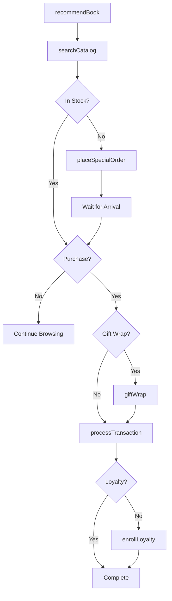
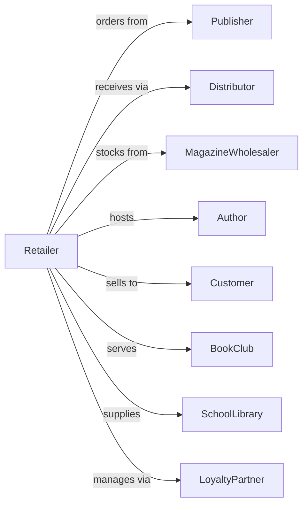

# Book Retailers and News Dealers

> Business-as-Code definition for book and news retail operations. Models the literary retail lifecycle from publisher sourcing through customer recommendations, author events, and book club programs.

## Overview

Book retailers and news dealers sell new books, magazines, newspapers, and periodicals through bookstores and newsstands. This definition exposes actions for book recommendations, special orders, author events, book clubs, and returns processing that drive literary retail.

## Actors

| Actor | Description |
|-------|-------------|
| Publisher | Releases books and distributes to retailers |
| Distributor | Warehouses and delivers books and periodicals |
| MagazineWholesaler | Supplies newspapers and magazines |
| Author | Creates content and participates in events |
| Customer | Individual purchasing books or periodicals |
| BookClub | Reading group meeting at store |
| SchoolLibrary | Institution ordering books |
| LoyaltyPartner | Manages customer rewards program |

## Roles

| Role | Description |
|------|-------------|
| StoreManager | Oversees store operations |
| Bookseller | Recommends books and assists customers |
| EventCoordinator | Organizes author signings and book clubs |
| BuyingManager | Selects inventory and manages returns |
| ChildrensSpecialist | Curates and recommends kids books |
| SalesAssociate | Assists customers and processes sales |
| CafeManager | Runs in-store cafe operations |

## Entities

| Entity | Description |
|--------|-------------|
| Book | Title with ISBN, author, and genre |
| Magazine | Periodical publication |
| Newspaper | Daily or weekly news publication |
| Transaction | Customer purchase with payment |
| SpecialOrder | Customer request for unavailable title |
| AuthorEvent | Signing, reading, or discussion |
| BookClubMeeting | Reading group session |
| LoyaltyAccount | Customer rewards membership |
| StaffPick | Employee book recommendation |
| Return | Unsold inventory returned to publisher |
| Inventory | Stock by title and format |
| Bestseller | High-volume selling title |

## Actions

| Action | Description |
|--------|-------------|
| recommendBook | Suggest titles based on preferences |
| processTransaction | Complete sale with payment |
| placeSpecialOrder | Request unavailable title |
| hostAuthorEvent | Conduct signing or reading |
| facilitateBookClub | Lead reading group discussion |
| createStaffPick | Add employee recommendation |
| processReturn | Send unsold inventory back to publisher |
| enrollLoyalty | Sign up customer for rewards |
| orderInventory | Request titles from publisher or distributor |
| manageBestsellers | Track and stock high-volume titles |
| searchCatalog | Look up title availability |
| giftWrap | Wrap purchases for gifting |

## Events

| Event | Description |
|-------|-------------|
| bookRecommended | Title suggested to customer |
| transactionCompleted | Sale finalized |
| specialOrderPlaced | Title request submitted |
| authorEventHosted | Signing or reading completed |
| bookClubFacilitated | Discussion session held |
| staffPickCreated | Recommendation added |
| returnProcessed | Unsold inventory shipped back |
| loyaltyEnrolled | Customer joined rewards |
| inventoryOrdered | Titles requested from supplier |
| bestsellerUpdated | High-volume list refreshed |
| catalogSearched | Title lookup completed |
| giftWrapped | Purchase wrapped |

## Searches

| Search | Description |
|--------|-------------|
| findBooks | Search by title, author, or ISBN |
| findMagazines | Search periodicals by title |
| getSpecialOrders | Pending title requests |
| getAuthorEvents | Upcoming signings and readings |
| getBookClubs | Active reading groups |
| getStaffPicks | Employee recommendations |
| checkInventory | Stock by title |
| getBestsellers | Current high-volume titles |

## Workflow



## Actor Relationships



## Usage

### Calling Actions

```typescript
import { retailBooks } from '@headlessly/retail-books'

const store = retailBooks()

// Search by title, author, or ISBN
const findBooksResult = await store.findBooks({ status: 'active' })

// Search periodicals by title
const findMagazinesResult = await store.findMagazines({ status: 'active' })

// Recommend books for customer
const recommendations = await store.recommendBook({
  customerId: 'cust-456',
  preferences: {
    genres: ['literary-fiction', 'historical'],
    recentPurchases: ['ISBN-978-0-123'],
    readingLevel: 'adult'
  }
})

// Place special order for unavailable title
await store.placeSpecialOrder({
  customerId: 'cust-456',
  isbn: '978-0-456-78901',
  title: 'Rare Literary Work',
  notifyWhenAvailable: true
})

// Process book sale with loyalty
const transaction = await store.processTransaction({
  customerId: 'cust-456',
  items: [
    { isbn: '978-0-123-45678', title: 'New Release', price: 28.99 },
    { isbn: '978-0-987-65432', title: 'Staff Pick', price: 16.99 }
  ],
  loyaltyId: 'BOOKWORM-789',
  giftWrap: true
})

// Host author event
await store.hostAuthorEvent({
  author: 'Jane Writer',
  title: 'Her New Novel',
  eventType: 'signing',
  date: '2024-04-15',
  time: '19:00',
  rsvpRequired: true,
  maxAttendees: 50
})
```

### Event-Driven Automation

```typescript
// Notify customer when special order arrives
store.inventoryOrdered(async ({ items }) => {
  for (const item of items) {
    const orders = await store.getSpecialOrders({ isbn: item.isbn })
    for (const order of orders) {
      await notifyCustomer({
        customerId: order.customerId,
        message: `"${item.title}" has arrived!`
      })
    }
  }
})

// Send book club reminder
store.bookClubFacilitated(async ({ clubId, nextMeetingDate, nextBook }) => {
  await scheduleReminder({
    clubId,
    triggerDate: subtractDays(nextMeetingDate, 7),
    message: `Book club meets next week! Have you finished "${nextBook}"?`
  })
})
```
