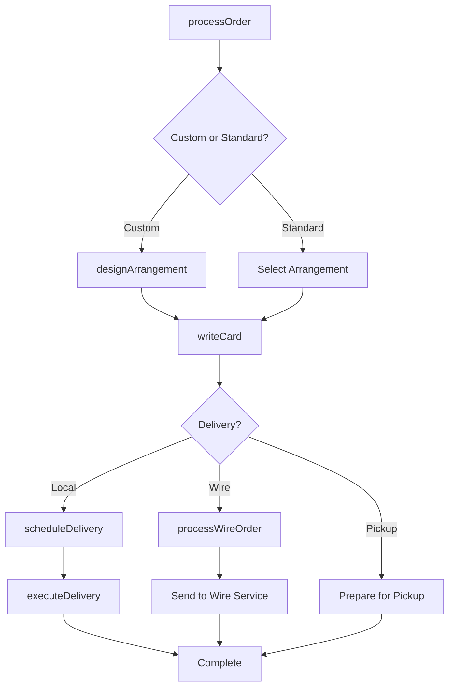
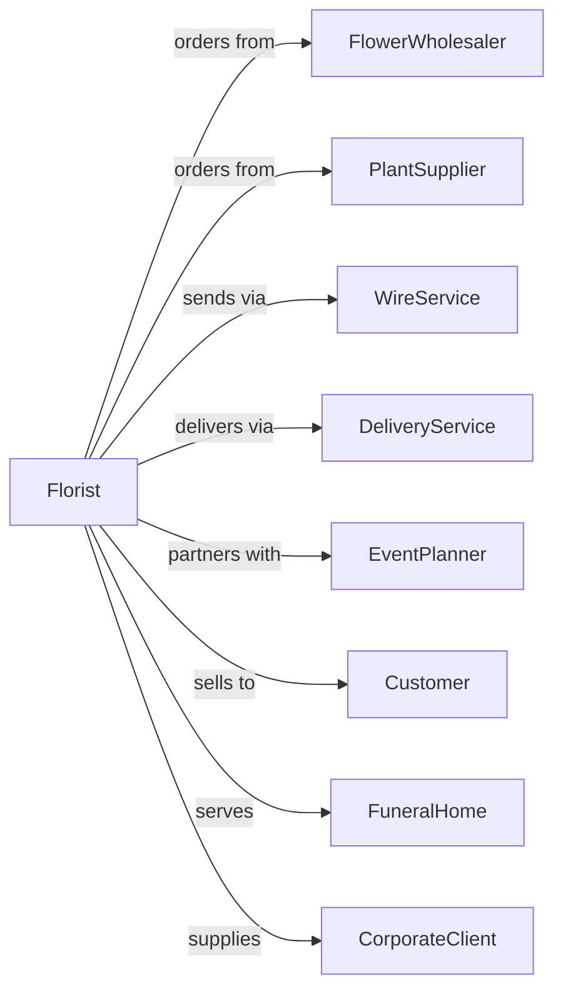

# Florists

> Business-as-Code definition for florist retail operations. Models the floral sales lifecycle from wholesale sourcing through arrangement design, order fulfillment, delivery, and event services.

## Overview

Florists retail cut flowers, floral arrangements, and potted plants through shops and delivery services. This definition exposes actions for arrangement design, order processing, delivery scheduling, wedding and event services, and sympathy orders that drive floral retail.

## Actors

| Actor | Description |
|-------|-------------|
| FlowerWholesaler | Supplies fresh cut flowers and greenery |
| PlantSupplier | Provides potted plants and succulents |
| WireService | Facilitates out-of-area order fulfillment |
| DeliveryService | Handles local flower delivery |
| EventPlanner | Coordinates wedding and event florals |
| Customer | Individual ordering flowers |
| FuneralHome | Partners for sympathy arrangements |
| CorporateClient | Business ordering regular arrangements |

## Roles

| Role | Description |
|------|-------------|
| ShopOwner | Operates florist business |
| FloralDesigner | Creates custom arrangements |
| SalesAssociate | Takes orders and assists customers |
| DeliveryDriver | Transports arrangements to recipients |
| EventFlorist | Designs wedding and event installations |
| InventoryManager | Manages flower freshness and stock |

## Entities

| Entity | Description |
|--------|-------------|
| Flower | Cut flower variety with availability |
| Arrangement | Designed floral piece with flowers and container |
| Plant | Potted plant or succulent |
| Order | Customer purchase with delivery details |
| Delivery | Scheduled flower delivery |
| WireOrder | Out-of-area order through wire service |
| EventContract | Wedding or event floral agreement |
| SympathyOrder | Funeral flower arrangement |
| Subscription | Recurring flower delivery program |
| Inventory | Fresh flower stock with shelf life |
| Container | Vase, basket, or arrangement vessel |
| Card | Message card with arrangement |

## Actions

| Action | Description |
|--------|-------------|
| designArrangement | Create custom floral piece |
| processOrder | Accept and process customer order |
| scheduleDelivery | Book flower delivery time |
| executeDelivery | Transport arrangement to recipient |
| processWireOrder | Handle out-of-area order |
| createEventProposal | Design wedding or event florals |
| executEvent | Install event floral arrangements |
| processSympathyOrder | Handle funeral arrangements |
| enrollSubscription | Set up recurring delivery |
| checkFreshness | Monitor flower inventory quality |
| orderFlowers | Restock from wholesaler |
| writeCard | Add message to arrangement |

## Events

| Event | Description |
|-------|-------------|
| arrangementDesigned | Custom piece created |
| orderProcessed | Customer order accepted |
| deliveryScheduled | Delivery time booked |
| deliveryExecuted | Arrangement delivered |
| wireOrderProcessed | Out-of-area order sent |
| eventProposalCreated | Wedding proposal submitted |
| eventExecuted | Event florals installed |
| sympathyOrderProcessed | Funeral arrangement sent |
| subscriptionEnrolled | Recurring delivery started |
| freshnessChecked | Inventory quality verified |
| flowersOrdered | Wholesaler order placed |
| cardWritten | Message added to arrangement |

## Searches

| Search | Description |
|--------|-------------|
| findArrangements | Search by occasion or price |
| findFlowers | Search available blooms |
| getOrders | Pending and completed orders |
| getDeliveries | Scheduled deliveries by date |
| getEventContracts | Upcoming weddings and events |
| checkInventory | Fresh flower stock |
| getSubscriptions | Active recurring deliveries |
| getSympathyOrders | Funeral arrangement orders |

## Workflow



## Actor Relationships



## Usage

### Calling Actions

```typescript
import { retailFlowers } from '@headlessly/retail-flowers'

const florist = retailFlowers()

// Search by occasion or price
const findArrangementsResult = await florist.findArrangements({ status: 'active' })

// Search available blooms
const findFlowersResult = await florist.findFlowers({ status: 'active' })

// Design custom arrangement
const arrangement = await florist.designArrangement({
  occasion: 'birthday',
  style: 'garden',
  size: 'large',
  colorPalette: ['pink', 'white', 'green'],
  budget: 85.00,
  specialRequests: 'Include peonies if available'
})

// Process order with delivery
const order = await florist.processOrder({
  customerId: 'cust-456',
  items: [{ arrangementId: arrangement.id, price: 85.00 }],
  recipient: {
    name: 'Jane Smith',
    address: '456 Oak Lane, Portland, OR 97201'
  },
  cardMessage: 'Happy Birthday! Love, John',
  deliveryDate: '2024-03-20'
})

// Create event proposal for wedding
await florist.createEventProposal({
  clientId: 'bride-789',
  eventType: 'wedding',
  eventDate: '2024-06-15',
  venue: 'Rose Garden Estate',
  items: [
    { type: 'bridal-bouquet', quantity: 1, estimate: 250 },
    { type: 'centerpiece', quantity: 15, estimate: 75 },
    { type: 'arch-installation', quantity: 1, estimate: 800 }
  ]
})
```

### Event-Driven Automation

```typescript
// Confirm delivery completion
florist.deliveryExecuted(async ({ orderId, customerId, recipientName }) => {
  await notifyCustomer({
    customerId,
    message: `Your flowers were delivered to ${recipientName}!`
  })
})

// Remind subscription customers
florist.subscriptionEnrolled(async ({ subscriptionId, nextDeliveryDate }) => {
  await scheduleReminder({
    subscriptionId,
    triggerDate: subtractDays(nextDeliveryDate, 3),
    message: 'Your flower delivery is coming in 3 days!'
  })
})
```
