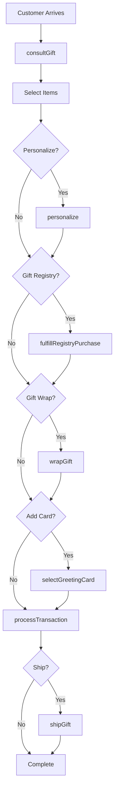
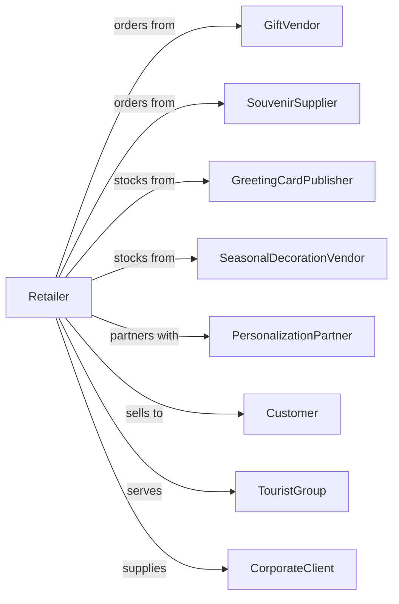

# Gift, Novelty, and Souvenir Retailers

> Business-as-Code definition for gift and souvenir retail operations. Models the specialty merchandise lifecycle from vendor sourcing through gift registry, personalization services, seasonal merchandising, and gift packaging.

## Overview

Gift, novelty, and souvenir retailers sell gifts, novelty merchandise, souvenirs, greeting cards, seasonal decorations, and curios through specialty stores in tourist areas, malls, and standalone locations. This definition exposes actions for gift selection assistance, personalization services, gift wrapping, registry management, and seasonal inventory planning that drive gift retail.

## Actors

| Actor | Description |
|-------|-------------|
| GiftVendor | Supplies gifts and novelty items |
| SouvenirSupplier | Provides location-branded merchandise |
| GreetingCardPublisher | Distributes cards and stationery |
| SeasonalDecorationVendor | Supplies holiday merchandise |
| PersonalizationPartner | Provides engraving and custom printing |
| Customer | Individual purchasing gifts |
| TouristGroup | Visitors purchasing souvenirs |
| CorporateClient | Business ordering promotional gifts |

## Roles

| Role | Description |
|------|-------------|
| StoreManager | Oversees store operations |
| SalesAssociate | Assists customers and processes sales |
| GiftConsultant | Helps select gifts for occasions |
| PersonalizationSpecialist | Operates engraving and printing |
| VisualMerchandiser | Creates displays and arrangements |
| InventoryManager | Manages seasonal stock rotation |
| GiftWrapper | Provides premium wrapping services |

## Entities

| Entity | Description |
|--------|-------------|
| GiftItem | Merchandise for gifting |
| Souvenir | Location-branded memorabilia |
| GreetingCard | Card for occasions and holidays |
| SeasonalItem | Holiday decoration or merchandise |
| Transaction | Customer purchase with payment |
| Personalization | Custom engraving or printing job |
| GiftRegistry | Occasion wish list |
| GiftWrap | Premium packaging service |
| Inventory | Stock by category and season |
| CorporateOrder | Bulk promotional item purchase |
| Coupon | Discount offer for purchase |
| LoyaltyAccount | Customer rewards membership |

## Actions

| Action | Description |
|--------|-------------|
| consultGift | Help select gift for occasion |
| processTransaction | Complete sale with payment |
| personalize | Engrave or print custom message |
| wrapGift | Provide premium gift packaging |
| createRegistry | Set up gift registry for occasion |
| fulfillRegistryPurchase | Process gift from registry |
| processCorporateOrder | Handle bulk promotional order |
| merchandiseSeasonal | Set up seasonal displays |
| orderInventory | Restock from suppliers |
| enrollLoyalty | Sign up customer for rewards |
| shipGift | Ship purchase to recipient |
| selectGreetingCard | Help choose appropriate card |

## Events

| Event | Description |
|-------|-------------|
| giftConsulted | Gift selection advice provided |
| transactionCompleted | Sale finalized |
| personalized | Custom engraving or printing done |
| giftWrapped | Premium packaging completed |
| registryCreated | Gift registry set up |
| registryPurchaseFulfilled | Gift purchased from registry |
| corporateOrderProcessed | Bulk order placed |
| seasonalMerchandised | Displays updated for season |
| inventoryOrdered | Supplier restock placed |
| loyaltyEnrolled | Customer joined rewards |
| giftShipped | Package sent to recipient |
| greetingCardSelected | Card chosen for purchase |

## Searches

| Search | Description |
|--------|-------------|
| findGifts | Search by occasion, price, or recipient |
| findSouvenirs | Search location-branded items |
| getRegistries | Gift registries by name or event |
| getPersonalizations | Pending custom orders |
| checkInventory | Stock by category |
| getCorporateOrders | Business orders by status |
| getSeasonalItems | Current seasonal merchandise |
| getLoyaltyBalance | Customer rewards points |

## Workflow



## Actor Relationships



## Usage

### Calling Actions

```typescript
import { retailGifts } from '@headlessly/retail-gifts'

const store = retailGifts()

// Search by occasion, price, or recipient
const findGiftsResult = await store.findGifts({ status: 'active' })

// Search location-branded items
const findSouvenirsResult = await store.findSouvenirs({ status: 'active' })

// Consult on gift selection
const recommendations = await store.consultGift({
  occasion: 'wedding',
  relationship: 'friend',
  interests: ['home', 'cooking'],
  budget: { min: 50, max: 100 }
})

// Process personalized gift
const personalization = await store.personalize({
  itemId: 'CRYSTAL-VASE-001',
  type: 'engraving',
  text: 'Smith Wedding - June 2024',
  font: 'script',
  rushOrder: false
})

// Create wedding gift registry
const registry = await store.createRegistry({
  eventType: 'wedding',
  coupleName: 'John & Jane Smith',
  eventDate: '2024-06-15',
  contactEmail: 'smithwedding@example.com',
  items: [
    { itemId: 'CRYSTAL-VASE-001', quantity: 1 },
    { itemId: 'PHOTO-FRAME-SILVER', quantity: 2 }
  ]
})

// Process corporate gift order
await store.processCorporateOrder({
  companyName: 'Acme Corp',
  items: [
    { itemId: 'DESK-CLOCK-EXEC', quantity: 50 }
  ],
  personalization: { type: 'logo-print', artwork: 'acme-logo.png' },
  deliveryDate: '2024-12-15'
})
```

### Event-Driven Automation

```typescript
// Notify registry owner when gift purchased
store.registryPurchaseFulfilled(async ({ registryId, itemName }) => {
  const registry = await store.getRegistries({ registryId })
  await notifyCustomer({
    email: registry.contactEmail,
    message: `Someone purchased ${itemName} from your registry!`
  })
})

// Notify when personalization ready
store.personalized(async ({ orderId, customerId }) => {
  await notifyCustomer({
    customerId,
    message: 'Your personalized item is ready for pickup!'
  })
})
```
