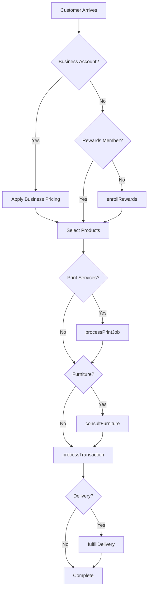
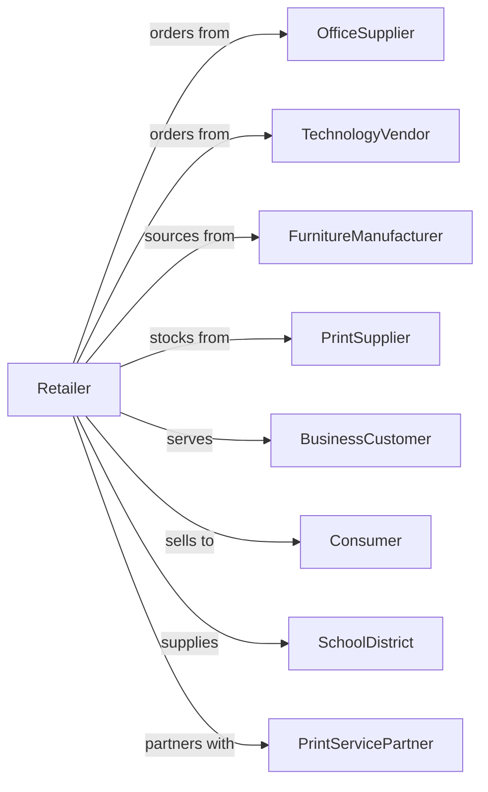

# Office Supplies and Stationery Retailers

> Business-as-Code definition for office supply retail operations. Models the commercial and consumer supply chain from vendor sourcing through business account management, print services, and technology solutions.

## Overview

Office supplies and stationery retailers sell new office supplies, stationery, school supplies, office equipment, furniture, and technology products through retail stores and business delivery services. This definition exposes actions for business account management, print and copy services, technology solutions, custom orders, and inventory replenishment that drive office supply retail.

## Actors

| Actor | Description |
|-------|-------------|
| OfficeSupplier | Provides core office supply products |
| TechnologyVendor | Supplies computers, printers, and electronics |
| FurnitureManufacturer | Produces desks, chairs, and storage |
| PrintSupplier | Provides paper, ink, and toner |
| BusinessCustomer | Company with commercial account |
| Consumer | Individual purchasing supplies |
| SchoolDistrict | Institution ordering school supplies |
| PrintServicePartner | Provides commercial print fulfillment |

## Roles

| Role | Description |
|------|-------------|
| StoreManager | Oversees store operations |
| SalesAssociate | Assists customers and processes sales |
| BusinessAccountRep | Manages corporate customer relationships |
| PrintCenterTech | Operates print and copy services |
| TechnologySpecialist | Advises on computers and electronics |
| InventoryManager | Manages stock and replenishment |
| FurnitureConsultant | Plans office furniture layouts |

## Entities

| Entity | Description |
|--------|-------------|
| Product | Office supply item with SKU and pricing |
| BusinessAccount | Commercial customer with credit terms |
| PrintJob | Custom printing or copying order |
| Technology | Computer, printer, or electronic device |
| Furniture | Desk, chair, or storage unit |
| Transaction | Customer purchase with payment |
| StandingOrder | Recurring supply delivery |
| Inventory | Stock levels by product and location |
| Coupon | Discount offer for purchase |
| Subscription | Ink or supply delivery program |
| ShippingOrder | Business delivery with tracking |
| RewardsAccount | Customer loyalty membership |

## Actions

| Action | Description |
|--------|-------------|
| processTransaction | Complete sale with payment |
| createBusinessAccount | Set up commercial customer account |
| processPrintJob | Execute print or copy order |
| orderFurniture | Place office furniture order |
| setupTechnology | Configure and sell tech products |
| fulfillDelivery | Ship products to business customer |
| processStandingOrder | Execute recurring supply order |
| enrollRewards | Sign up customer for loyalty program |
| applyDiscount | Apply coupon or business pricing |
| configureSubscription | Set up recurring supply delivery |
| consultFurniture | Plan office layout and furniture |
| orderInventory | Restock from suppliers |

## Events

| Event | Description |
|-------|-------------|
| transactionCompleted | Sale finalized |
| businessAccountCreated | Commercial account set up |
| printJobCompleted | Print order finished |
| furnitureOrdered | Furniture purchase placed |
| technologySetup | Tech product configured |
| deliveryFulfilled | Business order delivered |
| standingOrderProcessed | Recurring order executed |
| rewardsEnrolled | Customer joined loyalty program |
| discountApplied | Coupon or pricing applied |
| subscriptionConfigured | Recurring delivery started |
| furnitureConsulted | Office layout planned |
| inventoryOrdered | Supplier restock placed |

## Searches

| Search | Description |
|--------|-------------|
| findProducts | Search by category, brand, or SKU |
| getBusinessAccounts | Commercial accounts by status |
| getPrintJobs | Print orders by status or date |
| getDeliveries | Scheduled business deliveries |
| checkInventory | Stock levels by product |
| getStandingOrders | Active recurring orders |
| getRewardsBalance | Customer loyalty points |
| getTransactions | Sales history by date or account |

## Workflow



## Actor Relationships



## Usage

### Calling Actions

```typescript
import { retailOfficeSupplies } from '@headlessly/retail-office-supplies'

const store = retailOfficeSupplies()

// Search by category, brand, or SKU
const findProductsResult = await store.findProducts({ category: 'featured', inStock: true })

// Commercial accounts by status
const getBusinessAccountsResult = await store.getBusinessAccounts({ status: 'active' })

// Create business account
const account = await store.createBusinessAccount({
  companyName: 'Acme Corporation',
  contactName: 'John Smith',
  contactEmail: 'john@acme.com',
  creditLimit: 5000,
  paymentTerms: 'net-30',
  taxExempt: false
})

// Process print job
const printJob = await store.processPrintJob({
  customerId: 'cust-456',
  jobType: 'color-copies',
  quantity: 500,
  paperSize: 'letter',
  paperType: 'premium-gloss',
  finishing: ['staple', 'three-hole-punch'],
  rushOrder: false
})

// Set up standing order for business
await store.processStandingOrder({
  accountId: account.id,
  items: [
    { sku: 'PAPER-COPY-10RM', quantity: 10 },
    { sku: 'INK-HP-951XL-BK', quantity: 5 },
    { sku: 'PEN-BIC-BLUE-12', quantity: 4 }
  ],
  frequency: 'monthly',
  deliveryDay: 'first-monday'
})
```

### Event-Driven Automation

```typescript
// Notify when print job ready
store.printJobCompleted(async ({ jobId, customerId }) => {
  await notifyCustomer({
    customerId,
    message: 'Your print job is ready for pickup!'
  })
})

// Auto-reorder when inventory low
store.transactionCompleted(async ({ items }) => {
  for (const item of items) {
    const stock = await store.checkInventory({ sku: item.sku })
    if (stock.quantity < stock.reorderPoint) {
      await store.orderInventory({
        sku: item.sku,
        quantity: stock.reorderQuantity
      })
    }
  }
})
```
