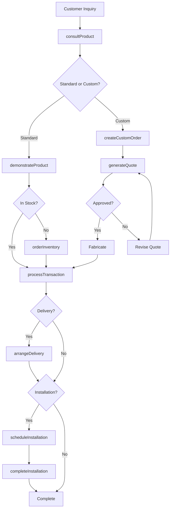
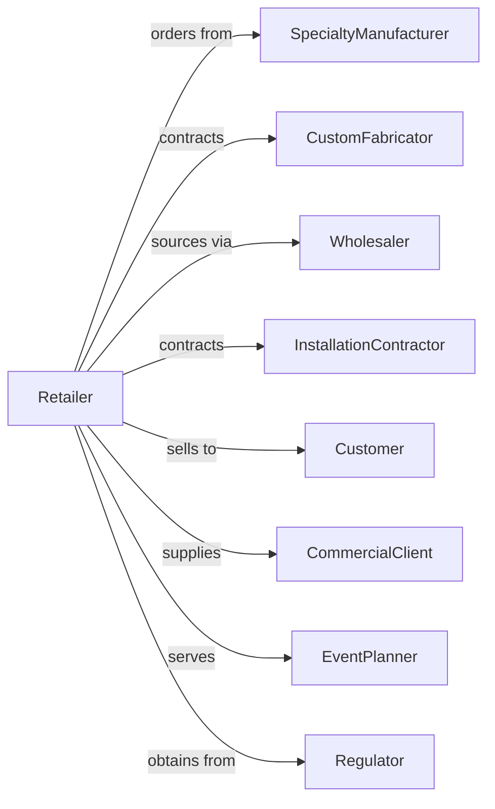

# All Other Miscellaneous Retailers

> Business-as-Code definition for specialty miscellaneous retail operations. Models diverse niche retail from vendor sourcing through specialized product knowledge, custom orders, and targeted customer service across unique product categories.

## Overview

All other miscellaneous retailers sell specialized merchandise not classified elsewhere including swimming pools, hot tubs, trophy shops, monument dealers, fireworks, auction houses, and other specialty goods. This definition exposes actions for specialized consultation, custom fabrication, installation services, and niche market expertise that drive specialty retail.

## Actors

| Actor | Description |
|-------|-------------|
| SpecialtyManufacturer | Produces niche products |
| CustomFabricator | Creates made-to-order items |
| Wholesaler | Distributes specialty merchandise |
| InstallationContractor | Provides product installation |
| Customer | Individual purchasing specialty goods |
| CommercialClient | Business ordering specialty items |
| EventPlanner | Coordinates special occasions |
| Regulator | Oversees permits for restricted items |

## Roles

| Role | Description |
|------|-------------|
| StoreOwner | Operates specialty retail business |
| ProductSpecialist | Expert in niche product category |
| SalesAssociate | Assists customers and processes sales |
| CustomOrderCoordinator | Manages made-to-order requests |
| InstallationManager | Schedules and oversees installations |
| InventoryManager | Manages specialized stock |
| DeliveryCoordinator | Arranges product delivery |

## Entities

| Entity | Description |
|--------|-------------|
| Product | Specialty merchandise item |
| CustomOrder | Made-to-order product request |
| Transaction | Customer purchase with payment |
| Installation | Product setup at customer location |
| Delivery | Product transport to customer |
| Quote | Price estimate for custom work |
| Permit | Required authorization for restricted items |
| Inventory | Stock by product category |
| Warranty | Product coverage terms |
| ServiceContract | Ongoing maintenance agreement |
| Return | Merchandise returned within policy |
| Catalog | Product offerings and specifications |

## Actions

| Action | Description |
|--------|-------------|
| consultProduct | Advise on specialty product selection |
| processTransaction | Complete sale with payment |
| createCustomOrder | Accept made-to-order request |
| generateQuote | Provide price estimate |
| scheduleInstallation | Book product setup |
| completeInstallation | Finish product installation |
| arrangeDelivery | Schedule product transport |
| obtainPermit | Secure required authorization |
| orderInventory | Restock from suppliers |
| processReturn | Handle merchandise returns |
| setupServiceContract | Create maintenance agreement |
| demonstrateProduct | Show product features and use |

## Events

| Event | Description |
|-------|-------------|
| productConsulted | Advice provided |
| transactionCompleted | Sale finalized |
| customOrderCreated | Made-to-order accepted |
| quoteGenerated | Price estimate provided |
| installationScheduled | Setup date booked |
| installationCompleted | Product installed |
| deliveryArranged | Transport scheduled |
| permitObtained | Authorization secured |
| inventoryOrdered | Supplier restock placed |
| returnProcessed | Refund or exchange completed |
| serviceContractSetup | Maintenance agreement created |
| productDemonstrated | Features shown to customer |

## Searches

| Search | Description |
|--------|-------------|
| findProducts | Search by category or specification |
| getCustomOrders | Made-to-order requests by status |
| getQuotes | Pending price estimates |
| getInstallations | Scheduled and completed setups |
| getDeliveries | Pending product transports |
| checkInventory | Stock by product |
| getServiceContracts | Active maintenance agreements |
| getPermits | Authorization status |

## Workflow



## Actor Relationships



## Usage

### Calling Actions

```typescript
import { retailSpecialtyGoods } from '@headlessly/retail-specialty-goods'

const store = retailSpecialtyGoods()

// Search by category or specification
const findProductsResult = await store.findProducts({ category: 'featured', inStock: true })

// Made-to-order requests by status
const getCustomOrdersResult = await store.getCustomOrders({ status: 'active' })

// Consult on hot tub selection
const consultation = await store.consultProduct({
  customerId: 'cust-456',
  category: 'hot-tub',
  requirements: {
    seating: 6,
    jets: 'premium',
    features: ['led-lighting', 'bluetooth-audio'],
    installation: 'indoor-outdoor'
  }
})

// Generate custom order quote
const quote = await store.generateQuote({
  customerId: 'cust-789',
  category: 'trophy',
  specifications: {
    type: 'corporate-award',
    material: 'crystal',
    engraving: 'Employee of the Year 2024',
    logo: true,
    quantity: 12
  }
})

// Process sale with installation
const transaction = await store.processTransaction({
  customerId: 'cust-456',
  items: [
    { sku: 'HOTTUB-PREMIUM-6P', quantity: 1, price: 8999 },
    { sku: 'COVER-PREMIUM', quantity: 1, price: 499 }
  ]
})

// Schedule installation
await store.scheduleInstallation({
  transactionId: transaction.id,
  address: '456 Oak Drive',
  preferredDate: '2024-04-15',
  requirements: ['electrical-hookup', 'concrete-pad'],
  contactPhone: '555-123-4567'
})

// Set up service contract
await store.setupServiceContract({
  customerId: 'cust-456',
  productId: 'HOTTUB-PREMIUM-6P',
  plan: 'comprehensive',
  term: '24-months',
  includesChemicals: true
})
```

### Event-Driven Automation

```typescript
// Notify when custom order ready
store.customOrderCreated(async ({ orderId, customerId, estimatedCompletion }) => {
  await scheduleReminder({
    customerId,
    triggerDate: subtractDays(estimatedCompletion, 3),
    message: 'Your custom order will be ready soon!'
  })
})

// Follow up after installation
store.installationCompleted(async ({ customerId, productCategory }) => {
  await scheduleFollowUp({
    customerId,
    delay: '7-days',
    message: `How are you enjoying your new ${productCategory}? Let us know if you need anything!`
  })
})
```
