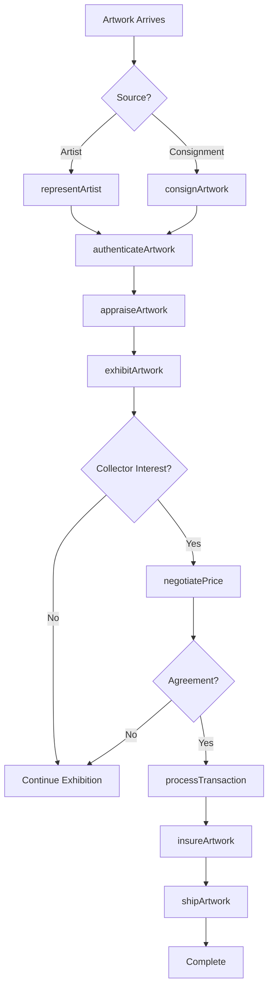
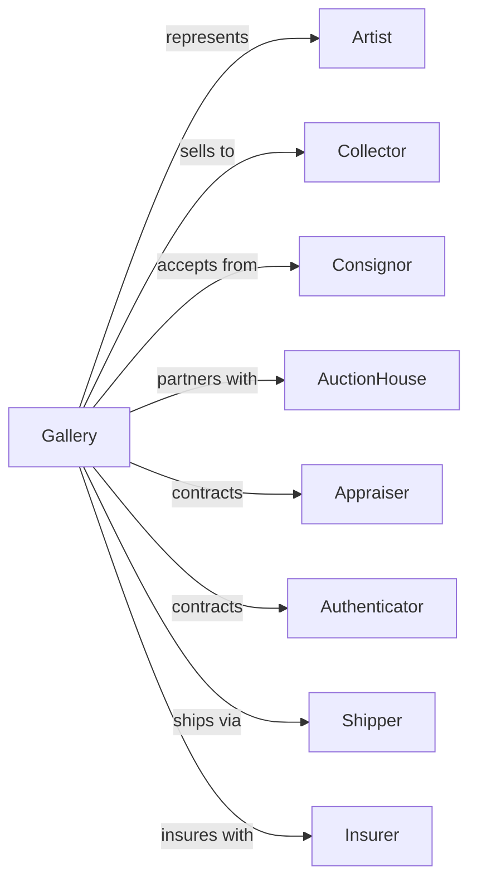

# Art Dealers

> Business-as-Code definition for art retail operations. Models the fine art sales lifecycle from artist sourcing through gallery exhibitions, artwork authentication, sales negotiation, and collector relationship management.

## Overview

Art dealers retail original and limited edition art works through galleries, private showings, and art fairs. This definition exposes actions for artist representation, exhibition curation, artwork authentication, price negotiation, consignment management, and collector services that drive fine art retail.

## Actors

| Actor | Description |
|-------|-------------|
| Artist | Creates original artwork for sale |
| Collector | Individual or institution acquiring art |
| Consignor | Owner placing artwork for sale |
| AuctionHouse | Partners for high-value sales |
| Appraiser | Provides artwork valuation |
| Authenticator | Verifies artwork provenance and authenticity |
| Shipper | Handles specialized art transport |
| Insurer | Provides artwork insurance coverage |

## Roles

| Role | Description |
|------|-------------|
| GalleryOwner | Directs gallery operations and strategy |
| GalleryDirector | Manages exhibitions and artist relationships |
| SalesAssociate | Assists collectors and processes sales |
| Curator | Selects and arranges exhibitions |
| Registrar | Manages inventory and documentation |
| ArtHandler | Installs and handles artwork safely |
| ClientAdvisor | Builds relationships with major collectors |

## Entities

| Entity | Description |
|--------|-------------|
| Artwork | Original or limited edition piece |
| Artist | Creator represented by gallery |
| Exhibition | Curated show of artworks |
| Transaction | Sale with payment and documentation |
| Consignment | Artwork placed for sale by owner |
| Certificate | Authentication and provenance documentation |
| Appraisal | Professional valuation of artwork |
| Invoice | Sales documentation with terms |
| Inventory | Gallery stock with locations |
| Collector | Customer with purchase history |
| ArtFair | External exhibition and sales event |
| Commission | Artist or consignor sales percentage |

## Actions

| Action | Description |
|--------|-------------|
| exhibitArtwork | Display piece in gallery show |
| processTransaction | Complete sale with documentation |
| authenticateArtwork | Verify provenance and authenticity |
| appraiseArtwork | Provide professional valuation |
| consignArtwork | Accept piece for sale from owner |
| negotiatePrice | Discuss terms with collector |
| representArtist | Sign artist for gallery representation |
| curatShow | Select and arrange exhibition |
| shipArtwork | Arrange specialized transport |
| insureArtwork | Secure coverage for piece |
| hostOpening | Conduct exhibition opening event |
| participateArtFair | Exhibit at external fair |

## Events

| Event | Description |
|-------|-------------|
| artworkExhibited | Piece displayed in show |
| transactionCompleted | Sale finalized |
| artworkAuthenticated | Provenance verified |
| artworkAppraised | Valuation completed |
| artworkConsigned | Piece accepted for sale |
| priceNegotiated | Terms agreed with collector |
| artistRepresented | Artist signed to gallery |
| showCurated | Exhibition arranged |
| artworkShipped | Transport completed |
| artworkInsured | Coverage secured |
| openingHosted | Exhibition opening completed |
| artFairParticipated | External fair concluded |

## Searches

| Search | Description |
|--------|-------------|
| findArtworks | Search by artist, medium, or price |
| findArtists | Search represented artists |
| getExhibitions | Current and upcoming shows |
| getConsignments | Consigned pieces by status |
| getTransactions | Sales history by date or collector |
| getAppraisals | Completed valuations |
| getCollectors | Clients by purchase history |
| getArtFairs | Upcoming fair participation |

## Workflow



## Actor Relationships



## Usage

### Calling Actions

```typescript
import { retailArt } from '@headlessly/retail-art'

const gallery = retailArt()

// Search by artist, medium, or price
const findArtworksResult = await gallery.findArtworks({ status: 'active' })

// Search represented artists
const findArtistsResult = await gallery.findArtists({ status: 'active' })

// Represent new artist
const artist = await gallery.representArtist({
  artistName: 'Jane Contemporary',
  medium: 'oil-on-canvas',
  style: 'abstract-expressionism',
  commissionRate: 50,
  exclusiveRegions: ['north-america'],
  contractTerm: '3-years'
})

// Consign artwork from collector
const consignment = await gallery.consignArtwork({
  consignorId: 'collector-789',
  artwork: {
    title: 'Untitled Blue',
    artist: 'Mark Rothko',
    medium: 'oil-on-canvas',
    year: 1957,
    dimensions: '90 x 60 inches'
  },
  minimumPrice: 2500000,
  consignmentPeriod: '12-months',
  commissionRate: 10
})

// Authenticate and appraise
const authentication = await gallery.authenticateArtwork({
  artworkId: consignment.artworkId,
  provenanceDocuments: ['purchase-receipt.pdf', 'exhibition-history.pdf'],
  authenticator: 'art-authority-inc'
})

const appraisal = await gallery.appraiseArtwork({
  artworkId: consignment.artworkId,
  purpose: 'sale',
  comparables: true
})

// Process sale to collector
await gallery.processTransaction({
  artworkId: consignment.artworkId,
  collectorId: 'collector-456',
  salePrice: 2750000,
  paymentTerms: '50-percent-deposit',
  includeFraming: true,
  shippingArrangement: 'white-glove'
})
```

### Event-Driven Automation

```typescript
// Notify consignor when artwork sells
gallery.transactionCompleted(async ({ artworkId, salePrice }) => {
  const artwork = await gallery.findArtworks({ artworkId })
  if (artwork.consignorId) {
    const commission = salePrice * (artwork.commissionRate / 100)
    await notifyConsignor({
      consignorId: artwork.consignorId,
      message: `Your artwork sold for $${salePrice}. Your proceeds: $${salePrice - commission}`
    })
  }
})

// Alert collectors about new artist work
gallery.artworkExhibited(async ({ artistId, artworkTitle, exhibitionId }) => {
  const collectors = await gallery.getCollectors({ interestedArtists: [artistId] })
  for (const collector of collectors) {
    await notifyCollector({
      collectorId: collector.id,
      message: `New work by ${collector.artistName}: "${artworkTitle}" now on view`
    })
  }
})
```
