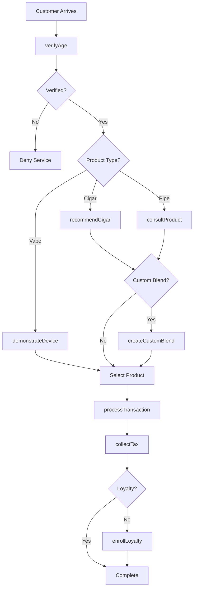
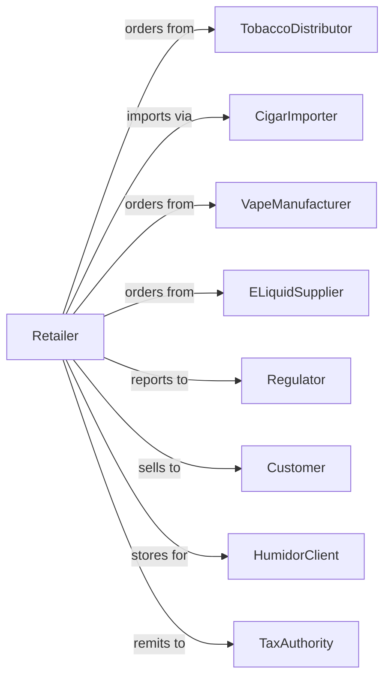

# Tobacco, Electronic Cigarette, and Other Smoking Supplies Retailers

> Business-as-Code definition for tobacco and vape retail operations. Models the specialty tobacco sales lifecycle from vendor sourcing through age verification, product education, loyalty programs, and regulatory compliance.

## Overview

Tobacco retailers sell cigarettes, electronic cigarettes, cigars, tobacco, pipes, and smoking supplies through specialty shops, tobacconists, and vape stores. This definition exposes actions for age verification, product consultation, custom blending, humidor services, loyalty programs, and regulatory compliance that drive tobacco retail.

## Actors

| Actor | Description |
|-------|-------------|
| TobaccoDistributor | Supplies cigarettes and tobacco products |
| CigarImporter | Sources premium cigars |
| VapeManufacturer | Produces e-cigarettes and vape devices |
| ELiquidSupplier | Provides vape juices and flavors |
| Regulator | Oversees tobacco sales compliance |
| Customer | Individual purchasing tobacco products |
| HumidorClient | Customer with cigar storage subscription |
| TaxAuthority | Collects tobacco excise taxes |

## Roles

| Role | Description |
|------|-------------|
| StoreOwner | Operates tobacco retail business |
| SalesAssociate | Assists customers and processes sales |
| Tobacconist | Expert in cigars and pipe tobacco |
| VapeSpecialist | Advises on e-cigarettes and devices |
| ComplianceOfficer | Ensures regulatory adherence |
| HumidorManager | Maintains cigar storage facility |
| BlendSpecialist | Creates custom pipe tobacco blends |

## Entities

| Entity | Description |
|--------|-------------|
| Cigarette | Manufactured tobacco cigarettes |
| Cigar | Premium or mass-market cigar |
| PipeTobacco | Loose tobacco for pipes |
| VapeDevice | Electronic cigarette or vaporizer |
| ELiquid | Vape juice with nicotine levels |
| Transaction | Customer purchase with age verification |
| HumidorLocker | Personal cigar storage unit |
| CustomBlend | Personalized tobacco mixture |
| Inventory | Stock by product category |
| LoyaltyAccount | Customer rewards membership |
| AgeVerification | Identity check for legal age |
| TaxStamp | Required tobacco tax documentation |

## Actions

| Action | Description |
|--------|-------------|
| verifyAge | Confirm customer meets legal age |
| processTransaction | Complete sale with compliance |
| consultProduct | Advise on cigars or vape products |
| createCustomBlend | Mix personalized pipe tobacco |
| rentHumidorLocker | Set up cigar storage subscription |
| maintainHumidor | Service humidity and temperature |
| enrollLoyalty | Sign up customer for rewards |
| orderInventory | Restock from distributors |
| reportCompliance | Submit regulatory documentation |
| demonstrateDevice | Show vape device operation |
| recommendCigar | Suggest cigar based on preferences |
| collectTax | Process tobacco excise taxes |

## Events

| Event | Description |
|-------|-------------|
| ageVerified | Customer identity confirmed |
| transactionCompleted | Sale finalized |
| productConsulted | Advice provided |
| customBlendCreated | Personalized tobacco mixed |
| humidorLockerRented | Storage subscription started |
| humidorMaintained | Service completed |
| loyaltyEnrolled | Customer joined rewards |
| inventoryOrdered | Distributor restock placed |
| complianceReported | Regulatory filing submitted |
| deviceDemonstrated | Vape operation shown |
| cigarRecommended | Suggestion provided |
| taxCollected | Excise tax processed |

## Searches

| Search | Description |
|--------|-------------|
| findCigars | Search by brand, origin, or strength |
| findVapeProducts | Search devices and e-liquids |
| findTobacco | Search pipe and rolling tobacco |
| getHumidorLockers | Active storage subscriptions |
| getCustomBlends | Customer tobacco recipes |
| checkInventory | Stock by product |
| getLoyaltyBalance | Customer rewards points |
| getComplianceReports | Regulatory filings |

## Workflow



## Actor Relationships



## Usage

### Calling Actions

```typescript
import { retailTobacco } from '@headlessly/retail-tobacco'

const store = retailTobacco()

// Search by brand, origin, or strength
const findCigarsResult = await store.findCigars({ status: 'active' })

// Search devices and e-liquids
const findVapeProductsResult = await store.findVapeProducts({ status: 'active' })

// Verify age and process sale
const verification = await store.verifyAge({
  customerId: 'cust-456',
  documentType: 'drivers-license',
  documentNumber: 'DL-123456',
  birthDate: '1990-05-15'
})

// Recommend cigars based on preferences
const recommendations = await store.recommendCigar({
  preferences: {
    strength: 'medium',
    flavor: ['cedar', 'coffee'],
    priceRange: { min: 10, max: 25 },
    origin: 'nicaragua'
  }
})

// Process transaction with tax
const transaction = await store.processTransaction({
  customerId: 'cust-456',
  items: [
    { sku: 'CIGAR-PADRON-1964', quantity: 5, unitPrice: 18.00 },
    { sku: 'CUTTER-XIKAR', quantity: 1, unitPrice: 45.00 }
  ],
  ageVerificationId: verification.id,
  loyaltyId: 'REWARDS-789'
})

// Set up humidor locker
await store.rentHumidorLocker({
  customerId: 'cust-456',
  lockerSize: 'large',
  monthlyRate: 75,
  initialStock: [
    { cigarId: 'CIGAR-COHIBA-ROBUSTO', quantity: 10 },
    { cigarId: 'CIGAR-DAVIDOFF-GRAND-CRU', quantity: 5 }
  ]
})
```

### Event-Driven Automation

```typescript
// Monitor humidor conditions
store.humidorMaintained(async ({ lockerId, humidity, temperature }) => {
  if (humidity < 65 || humidity > 72) {
    await alertManager({
      priority: 'high',
      message: `Humidor ${lockerId} humidity out of range: ${humidity}%`
    })
  }
})

// Remind about locker renewal
store.humidorLockerRented(async ({ customerId, lockerId, renewalDate }) => {
  await scheduleReminder({
    customerId,
    triggerDate: subtractDays(renewalDate, 14),
    message: 'Your humidor locker subscription renews in 2 weeks'
  })
})
```
