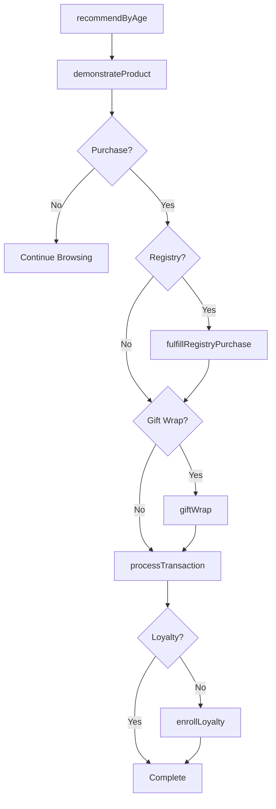
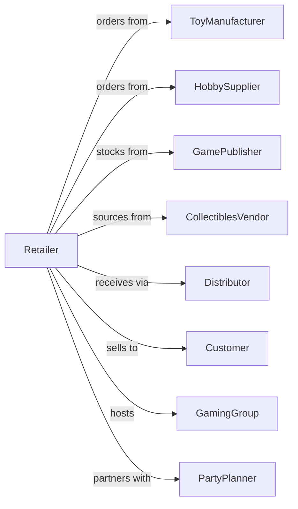

# Hobby, Toy, and Game Retailers

> Business-as-Code definition for hobby, toy, and game retail operations. Models the specialty toy and hobby sales lifecycle from vendor sourcing through product demonstration, events, and community engagement.

## Overview

Hobby, toy, and game retailers sell toys, games, model kits, craft supplies, and collectibles through specialty stores with expert knowledge and community events. This definition exposes actions for product demonstration, in-store events, collector services, and birthday registry programs that drive specialty toy and hobby retail.

## Actors

| Actor | Description |
|-------|-------------|
| ToyManufacturer | Produces toys and games |
| HobbySupplier | Provides model kits and craft supplies |
| GamePublisher | Releases board games and card games |
| CollectiblesVendor | Supplies limited edition and collectible items |
| Distributor | Warehouses and delivers merchandise |
| Customer | Individual purchasing toys or hobby supplies |
| GamingGroup | Community members for in-store play |
| PartyPlanner | Organizes birthday parties at store |

## Roles

| Role | Description |
|------|-------------|
| StoreManager | Oversees store operations |
| HobbyExpert | Advises on model building and crafts |
| GameSpecialist | Recommends and demonstrates games |
| EventCoordinator | Organizes gaming nights and events |
| SalesAssociate | Assists customers and processes sales |
| RegistryConsultant | Manages birthday wish lists |
| DemoHost | Runs product demonstrations |

## Entities

| Entity | Description |
|--------|-------------|
| Toy | Children's toy product |
| Game | Board game, card game, or video game |
| ModelKit | Hobby assembly kit |
| CraftSupply | Art and craft materials |
| Collectible | Limited edition or collector item |
| Transaction | Customer purchase with payment |
| GiftRegistry | Birthday or occasion wish list |
| Event | Gaming night, demo, or party |
| PreOrder | Reserved item before release |
| Inventory | Stock by category and availability |
| Loyalty | Customer rewards membership |
| Return | Merchandise returned within policy |

## Actions

| Action | Description |
|--------|-------------|
| demonstrateProduct | Show and explain toy or game |
| recommendByAge | Suggest items for child's age |
| processTransaction | Complete sale with payment |
| createRegistry | Set up birthday gift registry |
| fulfillRegistryPurchase | Process gift from registry |
| hostEvent | Run gaming night or demo event |
| acceptPreOrder | Reserve upcoming release |
| processReturn | Handle merchandise returns |
| enrollLoyalty | Sign up customer for rewards |
| orderCollectible | Request limited edition item |
| checkAgeRating | Verify product appropriateness |
| giftWrap | Wrap purchases for gifting |

## Events

| Event | Description |
|-------|-------------|
| productDemonstrated | Toy or game showcased |
| ageRecommended | Age-appropriate item suggested |
| transactionCompleted | Sale finalized |
| registryCreated | Birthday wish list set up |
| registryPurchaseFulfilled | Gift purchased from list |
| eventHosted | Gaming night or demo completed |
| preOrderAccepted | Release reserved |
| returnProcessed | Refund or exchange completed |
| loyaltyEnrolled | Customer joined rewards |
| collectibleOrdered | Limited item requested |
| giftWrapped | Purchase wrapped |
| productReleased | Pre-ordered item available |

## Searches

| Search | Description |
|--------|-------------|
| findToys | Search by category, age, or brand |
| findGames | Search games by type or player count |
| getRegistries | View gift registries by name or date |
| getEvents | Upcoming in-store events |
| getPreOrders | Pending pre-order reservations |
| checkInventory | Query stock levels |
| getLoyaltyBalance | Customer rewards points |
| getCollectibles | Limited edition availability |

## Workflow



## Actor Relationships



## Usage

### Calling Actions

```typescript
import { retailToys } from '@headlessly/retail-toys'

const store = retailToys()

// Search by category, age, or brand
const findToysResult = await store.findToys({ status: 'active' })

// Search games by type or player count
const findGamesResult = await store.findGames({ status: 'active' })

// Create birthday gift registry
const registry = await store.createRegistry({
  childName: 'Emma',
  birthdate: '2024-05-20',
  age: 7,
  interests: ['building', 'art', 'animals'],
  parentContact: 'parent@example.com'
})

// Recommend and sell age-appropriate toys
const recommendations = await store.recommendByAge({
  age: 7,
  interests: ['building', 'art'],
  budget: 100
})

const transaction = await store.processTransaction({
  items: [
    { sku: 'LEGO-FRIENDS-SET', quantity: 1, price: 39.99 },
    { sku: 'ART-KIT-DELUXE', quantity: 1, price: 29.99 }
  ],
  giftWrap: true,
  loyaltyId: 'REWARDS-123'
})

// Host game night event
await store.hostEvent({
  type: 'game-night',
  game: 'Settlers of Catan',
  date: '2024-03-22',
  time: '18:00',
  maxParticipants: 16,
  registrationRequired: true
})
```

### Event-Driven Automation

```typescript
// Notify registry creator when gift purchased
store.registryPurchaseFulfilled(async ({ registryId, itemSku }) => {
  const registry = await store.getRegistries({ registryId })
  await notifyParent({
    email: registry.parentContact,
    message: 'A gift was purchased from your registry!'
  })
})

// Notify pre-order customers when item releases
store.productReleased(async ({ productId, productName }) => {
  const preOrders = await store.getPreOrders({ productId })
  for (const order of preOrders) {
    await notifyCustomer({
      customerId: order.customerId,
      message: `${productName} is now available for pickup!`
    })
  }
})
```
