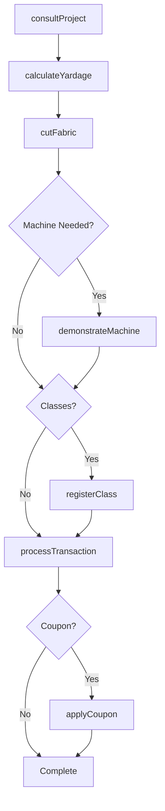
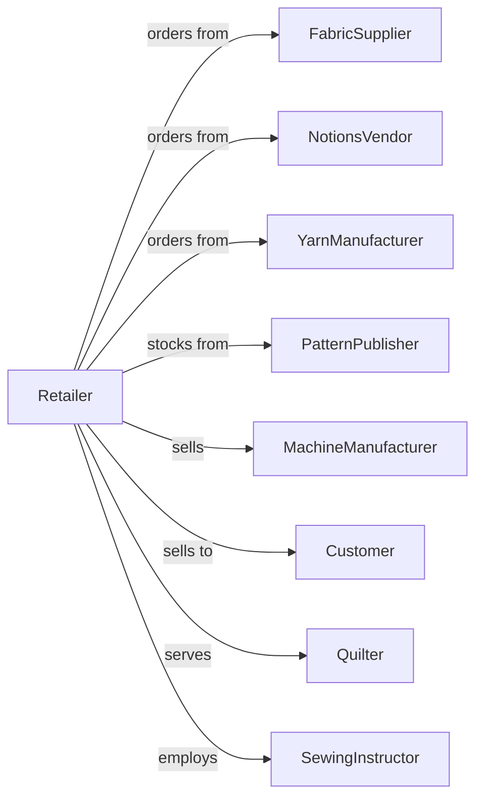

# Sewing, Needlework, and Piece Goods Retailers

> Business-as-Code definition for fabric and sewing supply retail operations. Models the craft and sewing sales lifecycle from vendor sourcing through fabric cutting, project consultation, classes, and machine service.

## Overview

Sewing, needlework, and piece goods retailers sell fabrics, patterns, yarns, notions, sewing machines, and craft supplies. This definition exposes actions for fabric cutting, project consultation, sewing classes, machine service, and custom order management that drive craft retail operations.

## Actors

| Actor | Description |
|-------|-------------|
| FabricSupplier | Provides bolts of fabric and textiles |
| NotionsVendor | Supplies buttons, zippers, thread, and accessories |
| YarnManufacturer | Produces yarns and fibers for needlework |
| PatternPublisher | Creates and distributes sewing patterns |
| MachineManufacturer | Produces sewing and embroidery machines |
| Customer | Individual purchasing sewing and craft supplies |
| Quilter | Hobbyist creating quilts and textile art |
| SewingInstructor | Teaches classes and workshops |

## Roles

| Role | Description |
|------|-------------|
| StoreManager | Oversees store operations |
| FabricSpecialist | Advises on fabrics and project selection |
| CuttingAssociate | Measures and cuts fabric to order |
| MachineSpecialist | Demonstrates and sells sewing machines |
| ClassInstructor | Teaches sewing and needlework classes |
| SalesAssociate | Assists customers and processes sales |
| ServiceTechnician | Repairs and maintains sewing machines |

## Entities

| Entity | Description |
|--------|-------------|
| Fabric | Textile sold by the yard or bolt |
| Pattern | Sewing or craft project instructions |
| Yarn | Fiber for knitting, crocheting, or weaving |
| Notion | Button, zipper, thread, or accessory |
| SewingMachine | Machine for sewing or embroidery |
| Transaction | Customer purchase with payment |
| FabricCut | Customer order cut from bolt |
| Class | Sewing or craft instruction session |
| Project | Customer project with fabric and supplies |
| CustomOrder | Special fabric or supply request |
| ServiceTicket | Machine repair request |
| Coupon | Discount offer for purchase |

## Actions

| Action | Description |
|--------|-------------|
| consultProject | Advise on fabric and supplies for project |
| cutFabric | Measure and cut fabric to customer order |
| demonstrateMachine | Show sewing machine features |
| processTransaction | Complete sale with payment |
| registerClass | Enroll customer in instruction class |
| conductClass | Teach sewing or craft workshop |
| serviceMachine | Repair or tune sewing machine |
| processCustomOrder | Request special fabric or supplies |
| calculateYardage | Determine fabric needed for project |
| applyCoupon | Apply discount to purchase |
| orderFabric | Restock from supplier |
| checkBolt | Query fabric availability by bolt |

## Events

| Event | Description |
|-------|-------------|
| projectConsulted | Fabric and supply advice provided |
| fabricCut | Customer fabric order cut |
| machineDemonstrated | Sewing machine showcased |
| transactionCompleted | Sale finalized |
| classRegistered | Customer enrolled in class |
| classConducted | Instruction session completed |
| machineServiced | Repair or tune completed |
| customOrderProcessed | Special request submitted |
| yardageCalculated | Fabric requirement determined |
| couponApplied | Discount applied |
| fabricOrdered | Supplier restock placed |
| boltChecked | Fabric availability queried |

## Searches

| Search | Description |
|--------|-------------|
| findFabric | Search by type, color, or pattern |
| findPatterns | Search patterns by project type |
| findYarn | Search by fiber, weight, or color |
| getClasses | Upcoming instruction sessions |
| getServiceTickets | Machine repair requests |
| checkBoltInventory | Fabric stock by bolt |
| getCustomOrders | Pending special requests |
| getTransactions | Sales history |

## Workflow



## Actor Relationships



## Usage

### Calling Actions

```typescript
import { retailFabric } from '@headlessly/retail-fabric'

const store = retailFabric()

// Search by type, color, or pattern
const findFabricResult = await store.findFabric({ status: 'active' })

// Search patterns by project type
const findPatternsResult = await store.findPatterns({ status: 'active' })

// Consult on quilting project
const project = await store.consultProject({
  customerId: 'cust-456',
  projectType: 'quilt',
  size: 'queen',
  style: 'patchwork'
})

const yardage = await store.calculateYardage({
  projectId: project.id,
  pattern: 'LOG-CABIN-QUILT',
  fabricSelections: ['COTTON-PRINT-A', 'COTTON-SOLID-B']
})

// Cut fabric for customer
const cuts = await store.cutFabric({
  customerId: 'cust-456',
  items: [
    { fabricId: 'COTTON-PRINT-A', yards: 3.5 },
    { fabricId: 'COTTON-SOLID-B', yards: 2.0 }
  ]
})

// Register for quilting class
await store.registerClass({
  customerId: 'cust-456',
  classId: 'BEGINNER-QUILTING',
  date: '2024-03-23',
  time: '10:00'
})
```

### Event-Driven Automation

```typescript
// Send project follow-up
store.transactionCompleted(async ({ customerId, items }) => {
  const hasFabric = items.some(i => i.category === 'fabric')
  if (hasFabric) {
    await scheduleFollowUp({
      customerId,
      delay: '14-days',
      message: 'How is your project coming along? Need any help?'
    })
  }
})

// Remind about class
store.classRegistered(async ({ customerId, classId, classDate }) => {
  await scheduleReminder({
    customerId,
    triggerDate: subtractDays(classDate, 2),
    message: 'Your sewing class is in 2 days!'
  })
})
```
