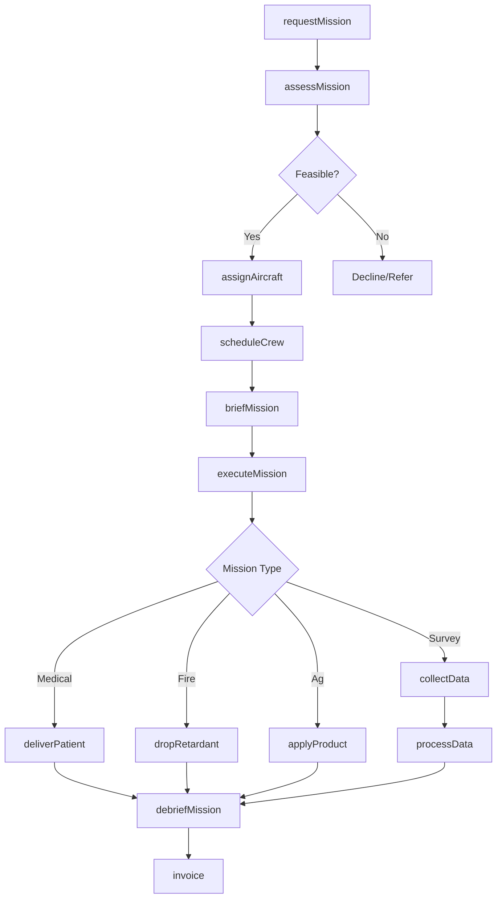
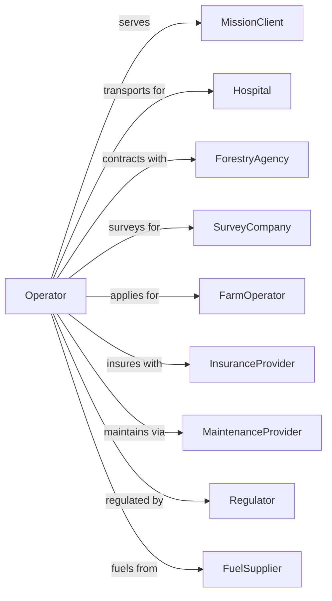

# Other Nonscheduled Air Transportation

> Business-as-Code definition for specialty air services including aerial survey, firefighting, medical transport, and other mission-specific flying operations.

## Overview

Other nonscheduled air transportation encompasses specialty flying services beyond passenger and freight charter, including aerial surveying, crop dusting, firefighting, air ambulance, banner towing, and aerial photography. This definition exposes actions for managing diverse mission types with specialized aircraft and crew requirements.

## Actors

| Actor | Description |
|-------|-------------|
| MissionClient | Company or agency requiring specialty air service |
| Hospital | Medical facility requesting air ambulance |
| ForestryAgency | Government entity contracting firefighting |
| SurveyCompany | Organization requiring aerial mapping |
| FarmOperator | Agricultural client for crop application |
| InsuranceProvider | Covers aviation and mission liability |
| MaintenanceProvider | Services specialized aircraft equipment |
| Regulator | FAA oversight of specialty operations |
| FuelSupplier | Provides aviation fuel at base and field |

## Roles

| Role | Description |
|------|-------------|
| Pilot | Commands aircraft for specialty missions |
| FlightMedic | Provides patient care during air ambulance |
| SurveyOperator | Operates mapping and sensing equipment |
| FirefightingCrew | Manages aerial firefighting operations |
| AgriculturalPilot | Operates crop dusting and spraying |
| MissionCoordinator | Plans and schedules specialty flights |
| Dispatcher | Monitors operations and coordinates response |
| EquipmentTechnician | Maintains specialized mission equipment |

## Entities

| Entity | Description |
|--------|-------------|
| Mission | Specialty flight assignment with objectives |
| Aircraft | Plane or helicopter configured for mission type |
| Patient | Individual transported by air ambulance |
| SurveyArea | Geographic region for aerial mapping |
| FireZone | Area requiring aerial firefighting support |
| SprayArea | Field requiring aerial application |
| Equipment | Specialized gear for mission execution |
| FlightPlan | Route and altitude for mission |
| Weather | Conditions affecting mission viability |
| Invoice | Billing for completed services |

## Actions

| Action | Description |
|--------|-------------|
| requestMission | Submit specialty flight requirement |
| assessMission | Evaluate feasibility and requirements |
| assignAircraft | Select appropriate aircraft for mission |
| scheduleCrew | Assign qualified pilots and specialists |
| briefMission | Conduct pre-flight planning and safety review |
| executeMission | Perform specialty flying operation |
| collectData | Gather survey, photo, or sensor information |
| deliverPatient | Transport medical patient to facility |
| dropRetardant | Release firefighting chemicals |
| applyProduct | Dispense agricultural chemicals |
| debriefMission | Review outcomes and document results |
| processData | Analyze collected survey information |
| invoice | Bill client for completed mission |
| reportIncident | Document safety events or issues |

## Events

| Event | Description |
|-------|-------------|
| missionRequested | Specialty flight inquiry received |
| missionAssessed | Feasibility and requirements confirmed |
| aircraftAssigned | Appropriate aircraft selected |
| crewScheduled | Pilots and specialists assigned |
| missionBriefed | Pre-flight planning completed |
| missionLaunched | Aircraft departed for mission |
| dataCollected | Survey or sensor information gathered |
| patientPickedUp | Medical patient aboard aircraft |
| patientDelivered | Patient transferred to medical facility |
| retardantDropped | Firefighting chemicals released |
| productApplied | Agricultural application completed |
| missionCompleted | Flight objectives achieved |
| dataProcessed | Survey information analyzed |
| invoiced | Client billed for services |

## Searches

| Search | Description |
|--------|-------------|
| findAircraft | List available aircraft by mission type |
| getMission | Retrieve mission details and status |
| checkWeather | Get conditions for mission planning |
| findCrews | List qualified personnel by specialty |
| getPatientStatus | Track air ambulance patient |
| getSurveyData | Retrieve collected mapping information |
| getFireStatus | Monitor active firefighting operations |
| getMissionHistory | Review past operations by type |

## Workflow



## Actor Relationships



## Usage

### Calling Actions

```typescript
import { flyNonscheduledAir } from '@headlessly/fly-nonscheduled-air'

const specialty = flyNonscheduledAir()

// Find aircraft configured for medical missions
const aircraft = await specialty.findAircraft({ missionType: 'air-ambulance', range: 500, available: true })

// Check weather for mission planning
const weather = await specialty.checkWeather({ route: ['KJFK', 'KBOS'], timeframe: '6-hours' })

// Request air ambulance mission
const medicalMission = await specialty.requestMission({
  type: 'airAmbulance',
  pickupLocation: { lat: 35.2271, lng: -80.8431, facility: 'Regional Hospital' },
  destination: { lat: 35.7796, lng: -78.6382, facility: 'Trauma Center' },
  patient: {
    condition: 'critical',
    weight: 180,
    equipment: ['ventilator', 'cardiac-monitor']
  },
  urgency: 'immediate'
})

// Request aerial survey mission
const surveyMission = await specialty.requestMission({
  type: 'aerialSurvey',
  surveyArea: {
    coordinates: [[35.0, -80.0], [35.5, -80.0], [35.5, -79.5], [35.0, -79.5]],
    squareMiles: 250
  },
  sensors: ['lidar', 'multispectral'],
  resolution: 'high',
  deliverables: ['orthomosaic', 'dem', 'contours']
})

// Execute crop application
await specialty.applyProduct({
  missionId: 'ag-2024-156',
  fieldId: 'farm-north-40',
  product: 'fungicide',
  applicationRate: 2.5,
  windSpeed: 5
})
```

### Event-Driven Automation

```typescript
// Auto-dispatch air ambulance
specialty.missionRequested(async ({ missionId, type, urgency }) => {
  if (type === 'airAmbulance' && urgency === 'immediate') {
    const aircraft = await specialty.findAircraft({
      type: 'helicopter',
      equipped: ['medical'],
      status: 'available'
    })

    if (aircraft.length > 0) {
      await specialty.assignAircraft({
        missionId,
        aircraftId: aircraft[0].id
      })
      await specialty.scheduleCrew({
        missionId,
        required: ['pilot', 'flightMedic', 'flightNurse']
      })
    }
  }
})

// Auto-process survey data
specialty.missionCompleted(async ({ missionId, type }) => {
  if (type === 'aerialSurvey') {
    const mission = await specialty.getMission({ missionId })

    await specialty.processData({
      missionId,
      rawData: mission.collectedData,
      outputFormats: mission.deliverables
    })

    await sendNotification({
      to: mission.client.email,
      subject: 'Survey Mission Complete',
      body: 'Your aerial survey data is being processed. Results within 48 hours.'
    })
  }
})
```
