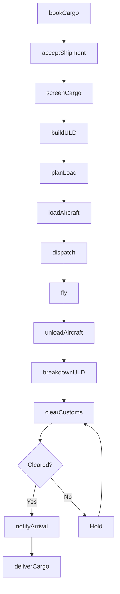
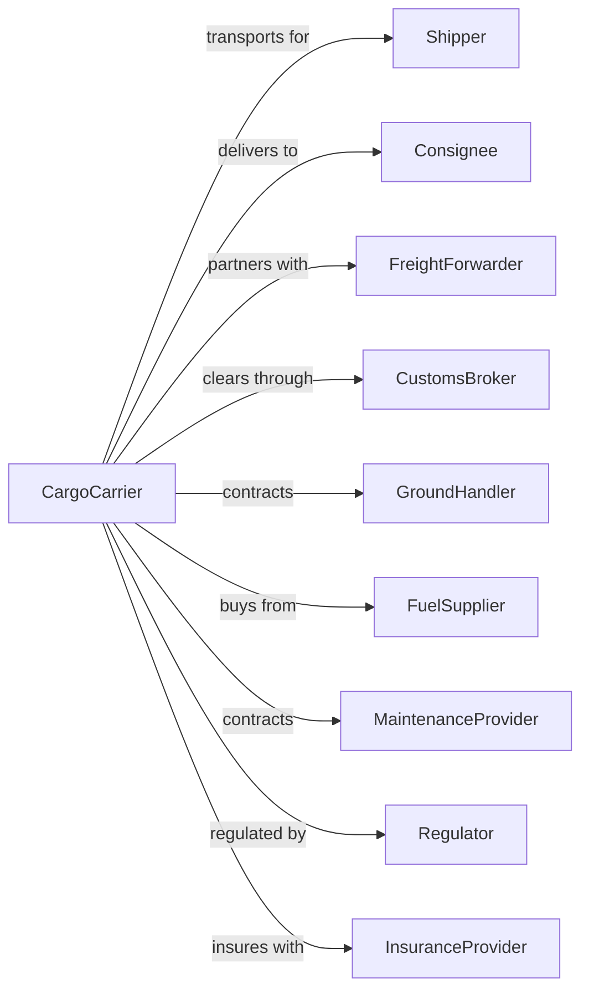

# Scheduled Freight Air Transportation

> Business-as-Code definition for scheduled air cargo operations. Models the complete freight lifecycle from booking and acceptance through flight operations and delivery.

## Overview

Scheduled freight air transportation involves operating regular cargo flights on fixed routes and timetables, moving goods between airports without passenger service. This definition exposes actions for managing cargo bookings, load planning, customs clearance, and freight tracking across global air cargo networks.

## Actors

| Actor | Description |
|-------|-------------|
| Shipper | Company or individual sending freight |
| Consignee | Recipient of shipped cargo |
| FreightForwarder | Arranges transportation and documentation |
| CustomsBroker | Handles import/export clearance |
| GroundHandler | Provides cargo loading and unloading services |
| FuelSupplier | Provides aviation fuel for aircraft |
| MaintenanceProvider | Performs aircraft maintenance |
| Regulator | FAA, TSA, and customs authorities |
| InsuranceProvider | Covers cargo loss and damage |

## Roles

| Role | Description |
|------|-------------|
| CargoAgent | Accepts shipments and processes documentation |
| LoadMaster | Plans cargo placement for weight and balance |
| Pilot | Commands freighter aircraft |
| FirstOfficer | Assists pilot in flight operations |
| Dispatcher | Plans routes and monitors operations |
| RampAgent | Loads and unloads cargo containers |
| TrackingSpecialist | Monitors shipment status and exceptions |
| ComplianceOfficer | Ensures regulatory and security compliance |

## Entities

| Entity | Description |
|--------|-------------|
| Shipment | Cargo consignment with origin and destination |
| AirWaybill | Contract of carriage and shipment documentation |
| Flight | Scheduled cargo service between airports |
| Aircraft | Freighter with cargo configuration |
| ULD | Unit load device (container or pallet) |
| Route | City pair with scheduled frequency |
| Rate | Price per kilogram or dimensional weight |
| Manifest | List of all cargo aboard flight |
| CustomsEntry | Import/export declaration |
| TrackingEvent | Status update for shipment location |

## Actions

| Action | Description |
|--------|-------------|
| bookCargo | Reserve space on scheduled freight flight |
| acceptShipment | Receive cargo and verify documentation |
| screenCargo | Perform security inspection of shipment |
| buildULD | Load cargo into containers or on pallets |
| planLoad | Calculate weight distribution and balance |
| loadAircraft | Place ULDs aboard freighter |
| dispatch | Release flight for departure |
| fly | Operate cargo flight to destination |
| unloadAircraft | Remove ULDs at destination |
| breakdownULD | Extract individual shipments from containers |
| clearCustoms | Process import/export declarations |
| notifyArrival | Alert consignee of cargo availability |
| deliverCargo | Release shipment to consignee or agent |
| traceShipment | Locate cargo and update tracking |

## Events

| Event | Description |
|-------|-------------|
| cargoBooked | Space reserved on flight |
| shipmentAccepted | Cargo received at origin warehouse |
| cargoScreened | Security inspection completed |
| uldBuilt | Cargo containerized and ready |
| loadPlanCompleted | Weight and balance approved |
| aircraftLoaded | All cargo aboard freighter |
| departed | Flight left origin airport |
| arrived | Flight reached destination airport |
| aircraftUnloaded | Cargo removed from freighter |
| uldBroken | Shipments extracted from containers |
| customsCleared | Import/export approved |
| customsHoldPlaced | Shipment held by customs for inspection |
| arrivalNotified | Consignee informed of availability |
| cargoDelivered | Shipment released to recipient |
| shipmentTraced | Location and status confirmed |

## Searches

| Search | Description |
|--------|-------------|
| findCapacity | List available space on scheduled flights |
| trackShipment | Get real-time shipment status and location |
| getAirWaybill | Retrieve shipment documentation |
| getFlightManifest | List all cargo aboard specific flight |
| getRates | Get pricing for route and commodity |
| findFlights | List scheduled cargo services by route |
| getCustomsStatus | Check clearance status for shipment |
| getExceptions | List shipments with delays or issues |

## Workflow



## Actor Relationships



## Usage

### Calling Actions

```typescript
import { flyScheduledFreight } from '@headlessly/fly-scheduled-freight'

const carrier = flyScheduledFreight()

// Find available cargo capacity
const capacity = await carrier.findCapacity({
  origin: 'MEM',
  destination: 'CGN',
  departureDate: '2024-06-20',
  weight: 5000,
  dimensions: { length: 300, width: 200, height: 160 }
})

// Book cargo space
const booking = await carrier.bookCargo({
  flightId: capacity[0].flightId,
  shipper: { name: 'Tech Corp', address: '123 Industrial Blvd' },
  consignee: { name: 'Euro Dist', address: '456 Warehouse St, Cologne' },
  commodity: 'electronics',
  pieces: 25,
  weight: 5000,
  hazmat: false
})

// Accept shipment at warehouse
await carrier.acceptShipment({
  awbNumber: booking.awbNumber,
  actualPieces: 25,
  actualWeight: 4980
})
```

### Event-Driven Automation

```typescript
// Auto-notify on arrival
carrier.arrived(async ({ flightId, airport }) => {
  const manifest = await carrier.getFlightManifest({ flightId })

  for (const shipment of manifest.shipments) {
    await sendNotification({
      to: shipment.consignee.email,
      subject: 'Cargo Arrival Notification',
      body: `Your shipment ${shipment.awbNumber} has arrived at ${airport}`
    })
  }
})

// Auto-escalate customs holds
carrier.customsHoldPlaced(async ({ awbNumber, reason }) => {
  const shipment = await carrier.getAirWaybill({ awbNumber })

  await createTicket({
    priority: 'high',
    subject: `Customs Hold: ${awbNumber}`,
    description: `Shipment held at customs. Reason: ${reason}`,
    assignTo: 'customs-team'
  })
})
```
