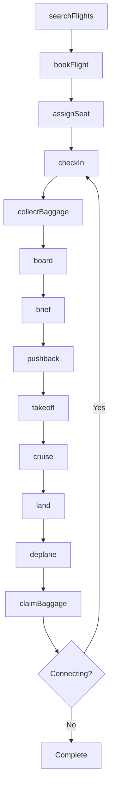
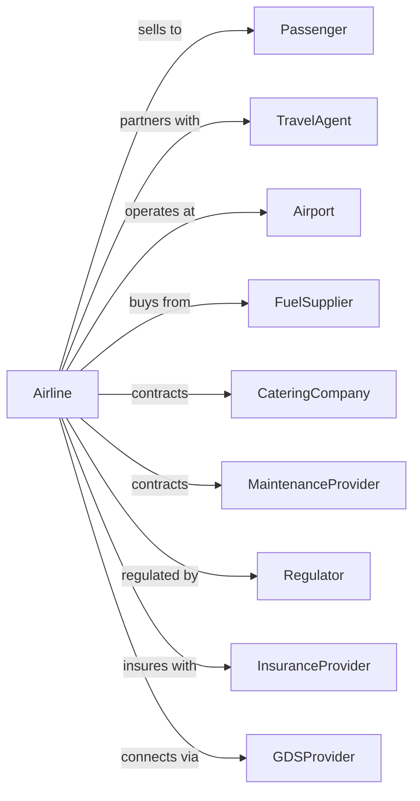

# Scheduled Passenger Air Transportation

> Business-as-Code definition for scheduled passenger airline operations. Models the complete flight lifecycle from route planning and booking through boarding, flight operations, and passenger arrival.

## Overview

Scheduled passenger air transportation involves operating regular flights on fixed routes and timetables, transporting passengers between airports. This definition exposes actions for managing reservations, check-in, boarding, flight operations, and arrival services across hub-and-spoke or point-to-point networks.

## Actors

| Actor | Description |
|-------|-------------|
| Passenger | Traveler purchasing tickets and boarding flights |
| TravelAgent | Books flights on behalf of passengers |
| Airport | Provides terminal facilities, gates, and ground infrastructure |
| FuelSupplier | Provides aviation fuel for aircraft |
| CateringCompany | Supplies in-flight meals and beverages |
| MaintenanceProvider | Performs aircraft maintenance and repairs |
| Regulator | FAA and TSA oversight of safety and security |
| InsuranceProvider | Provides aviation liability and hull coverage |
| GDSProvider | Global distribution system for booking connectivity |

## Roles

| Role | Description |
|------|-------------|
| Pilot | Commands aircraft and ensures flight safety |
| FirstOfficer | Assists pilot and serves as second-in-command |
| FlightAttendant | Ensures passenger safety and provides cabin service |
| Dispatcher | Plans routes, monitors weather, and coordinates flights |
| GateAgent | Manages boarding and passenger processing |
| ReservationAgent | Handles bookings, changes, and customer inquiries |
| LoadPlanner | Calculates weight and balance for safe loading |
| CrewScheduler | Assigns pilots and flight attendants to flights |

## Entities

| Entity | Description |
|--------|-------------|
| Flight | Scheduled service between origin and destination |
| Aircraft | Airplane asset with registration and configuration |
| Route | City pair with scheduled frequency |
| Reservation | Passenger booking with itinerary and fare |
| Ticket | Electronic document for confirmed travel |
| Seat | Assigned or available cabin position |
| BoardingPass | Document authorizing gate entry and boarding |
| FlightCrew | Assigned pilots and flight attendants |
| Fare | Price structure for route and class |
| Delay | Disruption affecting scheduled departure or arrival |

## Actions

| Action | Description |
|--------|-------------|
| searchFlights | Find available flights for origin-destination pair |
| bookFlight | Create reservation and issue ticket |
| assignSeat | Allocate specific seat to passenger |
| checkIn | Process passenger for flight and issue boarding pass |
| collectBaggage | Accept checked luggage and tag for routing |
| board | Allow passengers to enter aircraft |
| brief | Conduct pre-flight safety and operational briefing |
| pushback | Move aircraft from gate to taxiway |
| takeoff | Depart runway and begin flight |
| cruise | Operate aircraft at altitude en route |
| land | Touch down at destination airport |
| deplane | Allow passengers to exit aircraft |
| claimBaggage | Deliver checked luggage to passengers |
| rebookPassenger | Reassign passenger to alternative flight |

## Events

| Event | Description |
|-------|-------------|
| flightSearched | Available flights returned to customer |
| flightBooked | Reservation confirmed and ticket issued |
| seatAssigned | Passenger assigned to specific seat |
| checkedIn | Passenger processed and boarding pass issued |
| baggageCollected | Luggage accepted and tagged |
| boardingStarted | Gate opened for passenger boarding |
| boardingCompleted | All passengers aboard and door closed |
| departed | Aircraft left gate |
| aircraftBecameAirborne | Aircraft took off from runway |
| landed | Aircraft touched down at destination |
| arrived | Aircraft reached gate at destination |
| deplaned | Passengers exited aircraft |
| baggageClaimed | Luggage delivered to passenger |
| flightDelayed | Schedule disruption announced |
| flightCancelled | Scheduled flight cancelled |
| passengerRebooked | Customer moved to alternative flight |

## Searches

| Search | Description |
|--------|-------------|
| findFlights | List flights by route, date, and class availability |
| getReservation | Retrieve booking details by confirmation code |
| checkSeatMap | View available and occupied seats on flight |
| getFlightStatus | Get real-time departure and arrival information |
| findConnections | List valid connecting itineraries |
| getCrewAssignments | Retrieve crew roster for flight |
| getDelays | List disrupted flights and rebooking options |
| getFareRules | Retrieve ticket change and refund policies |

## Workflow



## Actor Relationships



## Usage

### Calling Actions

```typescript
import { flyScheduledPassenger } from '@headlessly/fly-scheduled-passenger'

const airline = flyScheduledPassenger()

// Search for available flights
const flights = await airline.searchFlights({
  origin: 'LAX',
  destination: 'JFK',
  departureDate: '2024-06-15',
  passengers: 2,
  cabinClass: 'economy'
})

// Book a flight
const reservation = await airline.bookFlight({
  flightId: flights[0].id,
  passengers: [
    { firstName: 'John', lastName: 'Smith', email: 'john@example.com' },
    { firstName: 'Jane', lastName: 'Smith', email: 'jane@example.com' }
  ],
  paymentMethod: 'creditCard'
})

// Check in passengers
await airline.checkIn({
  confirmationCode: reservation.confirmationCode,
  passengerId: reservation.passengers[0].id
})
```

### Event-Driven Automation

```typescript
// Auto-notify passengers of delays
airline.flightDelayed(async ({ flightId, newDepartureTime, reason }) => {
  const passengers = await airline.getReservation({ flightId })

  for (const passenger of passengers) {
    await sendNotification({
      to: passenger.email,
      subject: 'Flight Delay Notification',
      body: `Your flight has been delayed to ${newDepartureTime}. Reason: ${reason}`
    })
  }
})

// Auto-rebook on cancellation
airline.flightCancelled(async ({ flightId }) => {
  const bookings = await airline.getReservation({ flightId })

  for (const booking of bookings) {
    const alternatives = await airline.findFlights({
      origin: booking.origin,
      destination: booking.destination,
      departureDate: booking.departureDate
    })

    if (alternatives.length > 0) {
      await airline.rebookPassenger({
        reservationId: booking.id,
        newFlightId: alternatives[0].id
      })
    }
  }
})
```
