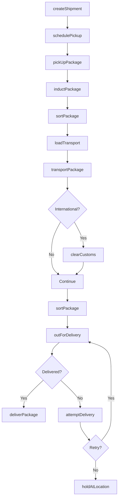
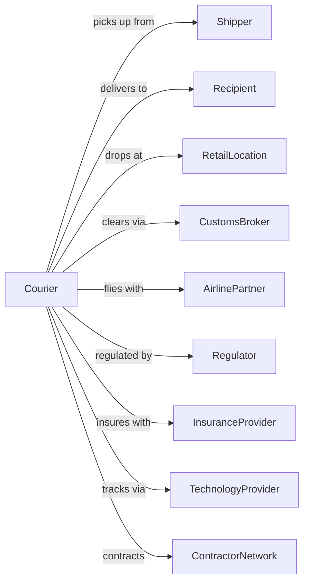

# Couriers and Express Delivery Services

> Business-as-Code definition for express parcel and package delivery operations. Models the complete delivery lifecycle from pickup through hub sorting, air/ground transport, and final delivery.

## Overview

Couriers and express delivery services provide time-definite package delivery through integrated air and ground networks, moving parcels between metropolitan areas and internationally. This definition exposes actions for managing pickup, sorting, linehaul transport, customs clearance, and last-mile delivery with real-time tracking.

## Actors

| Actor | Description |
|-------|-------------|
| Shipper | Customer sending packages |
| Recipient | Package destination |
| RetailLocation | Drop-off and pickup access point |
| CustomsBroker | Handles international clearance |
| AirlinePartner | Provides air cargo capacity |
| Regulator | TSA, DOT, and customs authorities |
| InsuranceProvider | Covers package loss and damage |
| TechnologyProvider | Tracking and visibility systems |
| ContractorNetwork | Independent delivery drivers |

## Roles

| Role | Description |
|------|-------------|
| CourierDriver | Picks up and delivers packages |
| HubSorter | Processes packages through facility |
| FlightCoordinator | Manages air network operations |
| CustomsSpecialist | Clears international shipments |
| CustomerService | Handles inquiries and issues |
| RouteOptimizer | Plans delivery sequences |
| SortManager | Oversees hub operations |
| ClaimsProcessor | Handles loss and damage |

## Entities

| Entity | Description |
|--------|-------------|
| Package | Parcel with tracking number |
| Shipment | One or more packages in transaction |
| TrackingNumber | Unique package identifier |
| Hub | Sorting and distribution facility |
| Route | Delivery driver sequence |
| ServiceLevel | Delivery speed commitment |
| Zone | Geographic pricing area |
| CustomsEntry | International declaration |
| Scan | Package location event |
| Rate | Price for delivery service |

## Actions

| Action | Description |
|--------|-------------|
| createShipment | Generate label and tracking |
| schedulePickup | Arrange driver collection |
| pickUpPackage | Collect from shipper |
| inductPackage | Enter into sort system |
| sortPackage | Route through hub to destination |
| loadTransport | Place on truck or aircraft |
| transportPackage | Move between hubs |
| clearCustoms | Process international entry |
| outForDelivery | Dispatch for final delivery |
| deliverPackage | Complete delivery to recipient |
| attemptDelivery | Record failed delivery |
| holdAtLocation | Redirect to pickup point |
| trackPackage | Query shipment status |
| fileClaim | Report loss or damage |

## Events

| Event | Description |
|-------|-------------|
| shipmentCreated | Label and tracking generated |
| pickupScheduled | Collection arranged |
| packagePickedUp | Collected from shipper |
| packageInducted | Entered sort facility |
| packageSorted | Routed to destination |
| inTransit | Moving between hubs |
| customsCleared | International entry approved |
| customsRequired | Package flagged for customs processing |
| outForDelivery | On vehicle for delivery |
| packageDelivered | Completed to recipient |
| deliveryAttempted | Unable to complete |
| heldAtLocation | Available for pickup |
| packageTracked | Status queried |
| claimFiled | Loss/damage reported |
| exceptionOccurred | Delay or issue recorded |

## Searches

| Search | Description |
|--------|-------------|
| trackPackage | Get real-time package location |
| getShipment | Retrieve shipment details |
| findRates | Calculate delivery pricing |
| getTransitTime | Estimate delivery date |
| locateDropoff | Find nearby retail locations |
| getDeliveryProof | Retrieve signature/photo |
| findPickupTimes | List available collection slots |
| getCustomsStatus | Check clearance progress |

## Workflow



## Actor Relationships



## Usage

### Calling Actions

```typescript
import { deliverExpressParcels } from '@headlessly/deliver-express-parcels'

const courier = deliverExpressParcels()

// Create shipment with label
const shipment = await courier.createShipment({
  shipper: {
    name: 'Tech Store',
    address: '123 Commerce St',
    city: 'New York',
    state: 'NY',
    zip: '10001'
  },
  recipient: {
    name: 'John Customer',
    address: '456 Residential Ave',
    city: 'Los Angeles',
    state: 'CA',
    zip: '90001'
  },
  packages: [{ weight: 5, dimensions: { l: 12, w: 8, h: 6 } }],
  serviceLevel: 'next-day-air'
})

// Track package
const tracking = await courier.trackPackage({
  trackingNumber: shipment.trackingNumber
})

// Schedule pickup
await courier.schedulePickup({
  shipmentId: shipment.id,
  pickupDate: '2024-06-15',
  pickupWindow: { start: '14:00', end: '18:00' }
})
```

### Event-Driven Automation

```typescript
// Auto-notify on out for delivery
courier.outForDelivery(async ({ trackingNumber, estimatedTime }) => {
  const shipment = await courier.getShipment({ trackingNumber })

  await sendSMS({
    to: shipment.recipient.phone,
    message: `Your package is out for delivery. Expected by ${estimatedTime}`
  })
})

// Auto-hold after failed attempts
courier.deliveryAttempted(async ({ trackingNumber, attemptCount }) => {
  if (attemptCount >= 3) {
    await courier.holdAtLocation({
      trackingNumber,
      locationId: findNearestAccessPoint(shipment.recipient.zip)
    })

    await sendNotification({
      to: shipment.recipient.email,
      subject: 'Package being held for pickup',
      body: 'After 3 delivery attempts, your package is available for pickup.'
    })
  }
})

// Auto-clear customs
courier.customsRequired(async ({ trackingNumber, countryCode }) => {
  const shipment = await courier.getShipment({ trackingNumber })

  if (shipment.declaredValue < 800) {
    await courier.clearCustoms({
      trackingNumber,
      entryType: 'informal',
      autoClear: true
    })
  }
})
```
