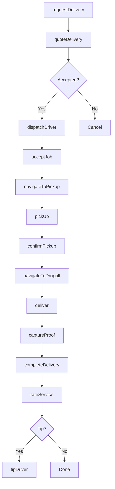
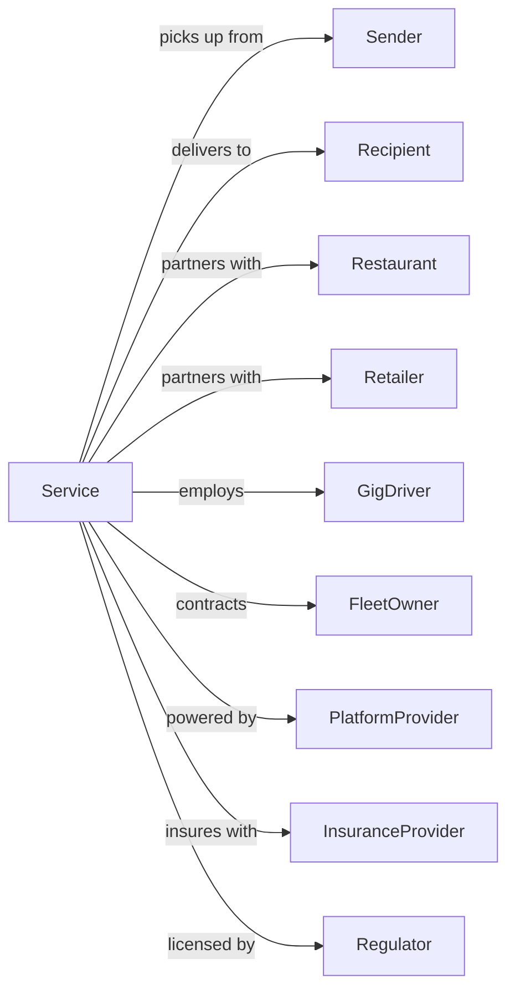

# Local Messengers and Local Delivery

> Business-as-Code definition for same-day local courier and delivery operations. Models the complete on-demand delivery lifecycle from order through dispatch, pickup, and delivery within metropolitan areas.

## Overview

Local messengers and delivery services provide point-to-point same-day delivery within metropolitan areas, handling documents, packages, groceries, food, and other items. This definition exposes actions for managing real-time dispatch, route optimization, driver tracking, and proof of delivery.

## Actors

| Actor | Description |
|-------|-------------|
| Sender | Customer requesting delivery |
| Recipient | Destination for delivery |
| Restaurant | Food service partner |
| Retailer | Store for product delivery |
| GigDriver | Independent contractor courier |
| FleetOwner | Operates vehicle fleet |
| PlatformProvider | Technology for dispatch/matching |
| InsuranceProvider | Covers driver and cargo |
| Regulator | Local business licensing |

## Roles

| Role | Description |
|------|-------------|
| Courier | Picks up and delivers items |
| Dispatcher | Assigns and monitors deliveries |
| CustomerSupport | Handles inquiries and issues |
| FleetManager | Oversees driver operations |
| RouteOptimizer | Plans efficient routes |
| QualityMonitor | Tracks service metrics |
| OnboardingSpecialist | Recruits and trains drivers |
| PartnerManager | Manages merchant relationships |

## Entities

| Entity | Description |
|--------|-------------|
| Delivery | Single pickup-to-dropoff job |
| Order | Customer request for delivery |
| Item | Package, document, or goods |
| Driver | Courier performing delivery |
| Route | Planned delivery sequence |
| Vehicle | Bike, car, or van used |
| Zone | Geographic service area |
| Proof | Delivery confirmation photo/signature |
| Rating | Customer feedback score |
| Fare | Price for delivery service |

## Actions

| Action | Description |
|--------|-------------|
| requestDelivery | Create delivery order |
| quoteDelivery | Calculate price for route |
| dispatchDriver | Assign courier to job |
| acceptJob | Driver confirms assignment |
| navigateToPickup | Route driver to sender |
| pickUp | Collect item from sender |
| confirmPickup | Verify item collected |
| navigateToDropoff | Route driver to recipient |
| deliver | Complete delivery to recipient |
| captureProof | Take photo or get signature |
| completeDelivery | Close out job |
| rateService | Submit feedback score |
| tipDriver | Add gratuity |
| contactSupport | Request assistance |

## Events

| Event | Description |
|-------|-------------|
| deliveryRequested | Order created |
| deliveryQuoted | Price calculated |
| driverDispatched | Courier assigned |
| jobAccepted | Driver confirmed |
| courierEnRoutedToPickup | Heading to sender |
| courierArrivedAtPickup | At sender location |
| itemPickedUp | Collected and verified |
| courierEnRoutedToDropoff | Heading to recipient |
| courierArrivedAtDropoff | At delivery location |
| delivered | Item handed off |
| proofCaptured | Confirmation obtained |
| deliveryCompleted | Job closed |
| serviceRated | Feedback received |
| driverTipped | Gratuity added |

## Searches

| Search | Description |
|--------|-------------|
| trackDelivery | Get real-time delivery status |
| findDrivers | List available couriers |
| getQuote | Calculate delivery price |
| getDeliveryHistory | List past deliveries |
| getDriverLocation | Track courier position |
| getProofOfDelivery | Retrieve confirmation |
| findZones | List service areas |
| getDriverRatings | Review courier performance |

## Workflow



## Actor Relationships



## Usage

### Calling Actions

```typescript
import { deliverLocalParcels } from '@headlessly/deliver-local-parcels'

const delivery = deliverLocalParcels()

// Request same-day delivery
const order = await delivery.requestDelivery({
  pickup: {
    address: '123 Office Tower',
    contactName: 'Jane Admin',
    phone: '555-1234',
    instructions: 'Lobby reception desk'
  },
  dropoff: {
    address: '456 Law Firm Plaza',
    contactName: 'John Attorney',
    phone: '555-5678',
    instructions: 'Suite 1500'
  },
  items: [{ description: 'Legal documents', quantity: 1 }],
  priority: 'rush',
  vehicleType: 'bike'
})

// Track delivery in progress
const status = await delivery.trackDelivery({
  deliveryId: order.id
})

// Get proof after completion
const proof = await delivery.getProofOfDelivery({
  deliveryId: order.id
})
```

### Event-Driven Automation

```typescript
// Auto-notify on driver assignment
delivery.driverDispatched(async ({ deliveryId, driverId, eta }) => {
  const order = await delivery.trackDelivery({ deliveryId })

  await sendSMS({
    to: order.pickup.phone,
    message: `Driver assigned! ${order.driverName} will arrive in ${eta} minutes.`
  })
})

// Auto-notify recipient when en route
delivery.itemPickedUp(async ({ deliveryId }) => {
  const order = await delivery.trackDelivery({ deliveryId })

  await sendSMS({
    to: order.dropoff.phone,
    message: `Your delivery is on the way! Track: ${order.trackingLink}`
  })
})

// Auto-prompt for rating
delivery.delivered(async ({ deliveryId, recipientPhone }) => {
  await delay(30000) // Wait 30 seconds

  await sendSMS({
    to: recipientPhone,
    message: 'How was your delivery? Reply 1-5 to rate your courier.'
  })
})

// Auto-reassign on driver timeout
delivery.jobAccepted(async ({ deliveryId, driverId }) => {
  setTimeout(async () => {
    const status = await delivery.trackDelivery({ deliveryId })

    if (status.phase === 'accepted' && !status.courierEnRoutedToPickup) {
      await delivery.dispatchDriver({
        deliveryId,
        excludeDriver: driverId,
        reason: 'timeout'
      })
    }
  }, 600000) // 10 minute timeout
})
```
