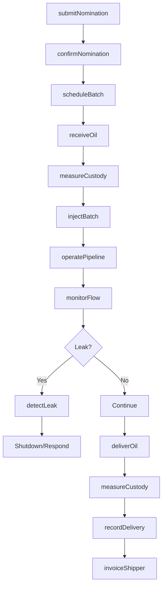
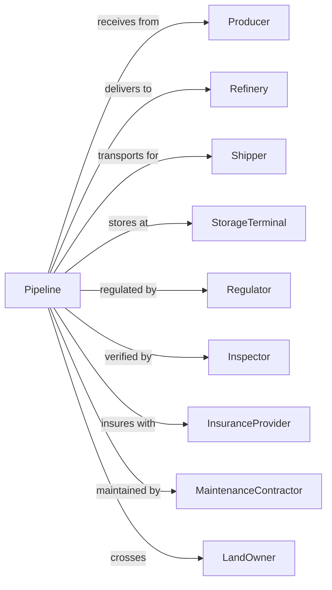

# Pipeline Transportation of Crude Oil

> Business-as-Code definition for crude oil pipeline operations. Models the complete pipeline lifecycle from nomination through batching, transport, and delivery at refineries.

## Overview

Pipeline transportation of crude oil involves operating pipeline systems to move crude oil from production fields and import terminals to refineries and storage facilities. This definition exposes actions for managing nominations, scheduling, batching, custody transfer, and pipeline integrity across gathering and trunk line systems.

## Actors

| Actor | Description |
|-------|-------------|
| Producer | Oil well operator shipping crude |
| Refinery | Destination for crude oil delivery |
| Shipper | Company nominating barrels for transport |
| StorageTerminal | Tank farm for crude storage |
| Regulator | FERC, PHMSA, and state agencies |
| Inspector | Third-party quality and quantity |
| InsuranceProvider | Covers spill and liability |
| MaintenanceContractor | Performs pipeline repairs |
| LandOwner | Right-of-way property owner |

## Roles

| Role | Description |
|------|-------------|
| PipelineOperator | Manages pipeline system |
| ControlRoomOperator | Monitors SCADA and flow |
| SchedulingCoordinator | Plans nominations and batches |
| CustodyTransferTech | Measures receipt and delivery |
| IntegrityEngineer | Assesses pipeline condition |
| LeakDetectionSpecialist | Monitors for releases |
| RightOfWayAgent | Manages land access |
| RegulatoryCompliance | Ensures permit compliance |

## Entities

| Entity | Description |
|--------|-------------|
| Pipeline | Trunk or gathering line system |
| Batch | Volume of crude in transit |
| Nomination | Shipper request for capacity |
| Crude | Oil type and quality specification |
| Tariff | Published transportation rate |
| Meter | Custody transfer measurement |
| PumpStation | Facility moving oil through line |
| Tank | Storage vessel at terminal |
| SCADA | Supervisory control system |
| RightOfWay | Land use agreement |

## Actions

| Action | Description |
|--------|-------------|
| submitNomination | Request pipeline capacity |
| confirmNomination | Accept shipper volume |
| scheduleBatch | Plan crude movement |
| receiveOil | Accept crude at origin |
| measureCustody | Record transfer quantity |
| injectBatch | Begin movement into pipeline |
| operatePipeline | Move oil through system |
| monitorFlow | Track SCADA readings |
| detectLeak | Identify pipeline release |
| deliverOil | Transfer to destination |
| recordDelivery | Document receipt at refinery |
| invoice Shipper | Bill for transportation |
| inspectPipeline | Assess integrity and condition |
| maintainLine | Perform repairs and upkeep |

## Events

| Event | Description |
|-------|-------------|
| nominationSubmitted | Capacity request received |
| nominationConfirmed | Volume accepted |
| batchScheduled | Movement planned |
| oilReceived | Crude accepted at origin |
| custodyMeasured | Transfer recorded |
| batchInjected | Movement started |
| pipelineBecameOperational | Oil flowing through system |
| flowMonitored | SCADA readings logged |
| leakDetected | Release identified |
| oilDelivered | Crude transferred |
| deliveryRecorded | Receipt documented |
| shipperInvoiced | Bill sent |
| pipelineInspected | Condition assessed |
| lineMaintained | Repairs completed |

## Searches

| Search | Description |
|--------|-------------|
| getNominations | List shipper requests |
| getBatchStatus | Track crude in transit |
| getPipelineStatus | Get line operating conditions |
| getMeterReadings | Retrieve custody data |
| getTariffs | Get current transportation rates |
| getCapacity | Check available space |
| getDeliveryHistory | List past deliveries |
| getIntegrityReports | Review pipeline condition |

## Workflow



## Actor Relationships



## Usage

### Calling Actions

```typescript
import { pipeCrudeOil } from '@headlessly/pipe-crude-oil'

const pipeline = pipeCrudeOil()

// Submit nomination for crude transport
const nomination = await pipeline.submitNomination({
  shipper: 'permian-producer',
  originTerminal: 'midland-hub',
  destinationTerminal: 'houston-refinery',
  volume: 50000, // barrels
  crudeType: 'WTI',
  effectiveMonth: '2024-07',
  requestedDays: [1, 5, 10, 15, 20, 25]
})

// Track batch in transit
const batch = await pipeline.getBatchStatus({
  batchId: 'BATCH-2024-1234'
})

// Monitor pipeline operations
const status = await pipeline.getPipelineStatus({
  lineId: 'permian-gulf-trunk'
})
```

### Event-Driven Automation

```typescript
// Auto-alert on leak detection
pipeline.leakDetected(async ({ lineId, location, severity }) => {
  // Immediate shutdown
  await pipeline.operatePipeline({
    lineId,
    action: 'emergency-shutdown'
  })

  await sendAlert({
    to: 'emergency-response@pipeline.com',
    priority: 'critical',
    subject: `Leak Detected: ${lineId}`,
    body: `Location: ${location}, Severity: ${severity}`
  })

  await notifyRegulator({
    agency: 'PHMSA',
    incident: 'pipeline-release',
    lineId,
    location
  })
})

// Auto-confirm nominations
pipeline.nominationSubmitted(async ({ nominationId, shipper, volume }) => {
  const capacity = await pipeline.getCapacity({
    month: nomination.effectiveMonth
  })

  if (capacity.available >= volume) {
    await pipeline.confirmNomination({
      nominationId,
      status: 'confirmed'
    })
  } else {
    await pipeline.confirmNomination({
      nominationId,
      status: 'prorated',
      allocatedVolume: capacity.available * (volume / capacity.requested)
    })
  }
})
```
