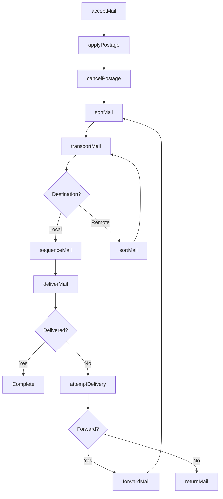
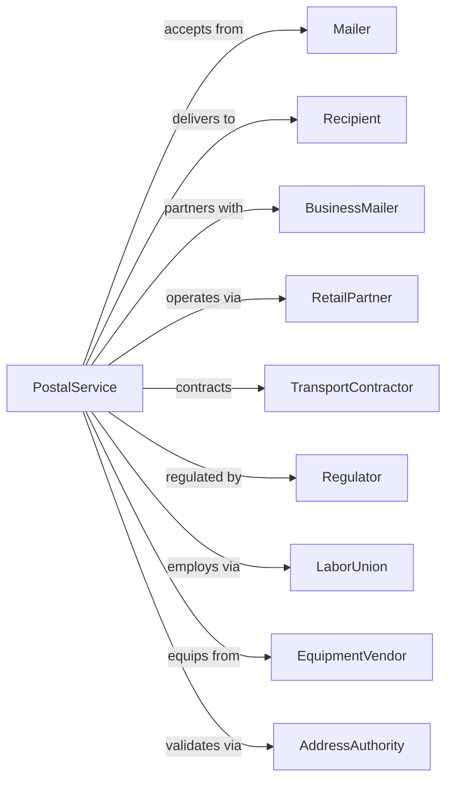

# Postal Service

> Business-as-Code definition for universal mail service operations. Models the complete postal lifecycle from acceptance through processing, transportation, and delivery under universal service obligation.

## Overview

Postal service involves operating mail collection, processing, transportation, and delivery networks under universal service obligation, handling letters, flats, packages, and periodicals to every address. This definition exposes actions for managing mail acceptance, sorting, routing, and last-mile delivery across all geographic areas.

## Actors

| Actor | Description |
|-------|-------------|
| Mailer | Business or individual sending mail |
| Recipient | Destination address for mail |
| BusinessMailer | High-volume commercial mailer |
| RetailPartner | Store offering postal services |
| TransportContractor | Provides air and surface transport |
| Regulator | Postal regulatory commission |
| LaborUnion | Represents postal workers |
| EquipmentVendor | Supplies sorting machinery |
| AddressAuthority | Maintains address database |

## Roles

| Role | Description |
|------|-------------|
| MailCarrier | Delivers mail on route |
| ClerkWindow | Serves customers at counter |
| MailProcessor | Operates sorting equipment |
| PostmasterLocal | Manages local post office |
| TransportDriver | Moves mail between facilities |
| AddressCoder | Corrects unreadable addresses |
| RouteExaminer | Designs delivery routes |
| InspectorPostal | Investigates mail crimes |
| LetterSortingMachineOp | Operates high-speed automated letter sorting equipment |

## Entities

| Entity | Description |
|--------|-------------|
| Mailpiece | Letter, flat, or package item |
| Route | Carrier delivery territory |
| PostOffice | Local retail and delivery facility |
| ProcessingCenter | Regional mail sorting hub |
| Mailbox | Collection point for outgoing mail |
| POBox | Private mailbox at post office |
| ZIPCode | Postal delivery zone |
| Indicia | Postage marking on mail |
| TrackingNumber | Package identification code |
| Rate | Price by class and weight |

## Actions

| Action | Description |
|--------|-------------|
| acceptMail | Receive mail at counter or box |
| applyPostage | Affix or meter postage |
| collectMail | Gather from collection boxes |
| cancelPostage | Mark postage as used |
| sortMail | Process through sorting equipment |
| transportMail | Move between facilities |
| sequenceMail | Arrange in delivery order |
| deliverMail | Place in recipient mailbox |
| attemptDelivery | Record undeliverable mail |
| forwardMail | Redirect to new address |
| returnMail | Send back to sender |
| trackPackage | Query package location |
| holdMail | Suspend delivery temporarily |
| registerMail | Add signature requirement |

## Events

| Event | Description |
|-------|-------------|
| mailAccepted | Entered postal system |
| postageApplied | Payment attached |
| mailCollected | Picked up from boxes |
| postageCanceled | Marked as used |
| mailSorted | Processed at facility |
| mailTransported | Moved between facilities |
| mailSequenced | Arranged for delivery |
| mailDelivered | Placed in mailbox |
| deliveryAttempted | Unable to deliver |
| mailForwarded | Redirected to new address |
| mailReturned | Sent back to sender |
| packageTracked | Location queried |
| mailHeld | Delivery suspended |
| mailRegistered | Signature required |

## Searches

| Search | Description |
|--------|-------------|
| trackPackage | Get package location and status |
| findPostOffice | Locate nearby post offices |
| getRates | Calculate postage by class |
| getZIPCode | Look up postal codes |
| findCollectionTimes | List pickup schedules |
| getPOBoxStatus | Check mailbox availability |
| getDeliveryStatus | Verify mail delivery |
| lookupAddress | Validate mailing address |

## Workflow



## Actor Relationships



## Usage

### Calling Actions

```typescript
import { deliverPostal } from '@headlessly/deliver-postal'

const postal = deliverPostal()

// Calculate postage
const rate = await postal.getRates({
  origin: '10001',
  destination: '90210',
  weight: 8,
  dimensions: { length: 10, width: 6, height: 4 },
  mailClass: 'priority'
})

// Track package
const tracking = await postal.trackPackage({
  trackingNumber: '9400111899223456789012'
})

// Schedule pickup for business mail
const pickup = await postal.collectMail({
  accountId: 'business-123',
  pickupDate: '2024-06-15',
  packages: 50,
  letters: 200,
  location: '123 Business Ave'
})
```

### Event-Driven Automation

```typescript
// Auto-notify on delivery
postal.mailDelivered(async ({ trackingNumber, deliveryTime }) => {
  const package = await postal.trackPackage({ trackingNumber })

  if (package.notificationRequested) {
    await sendEmail({
      to: package.recipient.email,
      subject: 'Package Delivered',
      body: `Your package was delivered at ${deliveryTime}`
    })
  }
})

// Auto-forward on move
postal.forwardRequested(async ({ oldAddress, newAddress, startDate }) => {
  await postal.forwardMail({
    oldAddress,
    newAddress,
    startDate,
    duration: '12-months'
  })

  await sendConfirmation({
    to: newAddress,
    subject: 'Mail Forwarding Confirmed',
    body: `Your mail will be forwarded starting ${startDate}`
  })
})

// Auto-redeliver after attempt
postal.deliveryAttempted(async ({ trackingNumber, attemptCount }) => {
  if (attemptCount < 3) {
    await postal.scheduleRedelivery({
      trackingNumber,
      redeliveryDate: nextBusinessDay()
    })
  } else {
    await postal.holdMail({
      trackingNumber,
      holdLocation: findNearestPostOffice(),
      holdDays: 15
    })
  }
})
```
