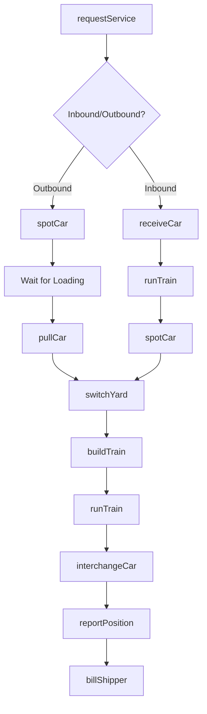
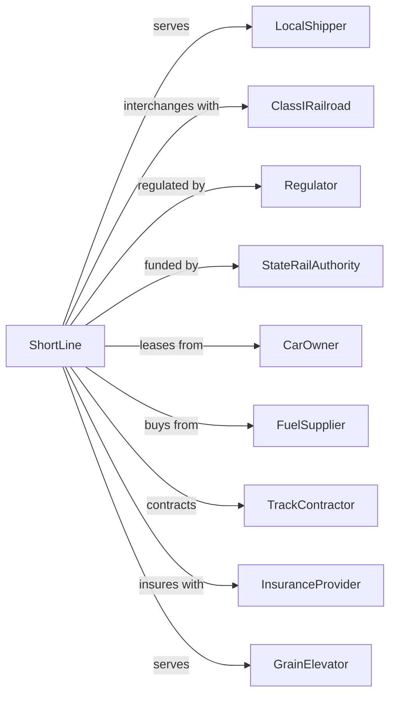

# Short Line Railroads

> Business-as-Code definition for short line and regional railroad operations. Models local rail freight service from shipper facilities to Class I interchange.

## Overview

Short line railroads provide first-mile and last-mile rail service, connecting local shippers to the national rail network through interchange with Class I carriers. This definition exposes actions for managing local switching, car supply, interchange coordination, and customer service for agricultural, industrial, and manufacturing shippers.

## Actors

| Actor | Description |
|-------|-------------|
| LocalShipper | Factory, grain elevator, or industrial customer |
| ClassIRailroad | Major railroad for interchange traffic |
| Regulator | STB and FRA oversight |
| StateRailAuthority | State agency for rail assistance programs |
| CarOwner | Provides private or leased railcars |
| FuelSupplier | Supplies diesel for locomotives |
| TrackContractor | Maintains rail and ties |
| InsuranceProvider | Covers liability and equipment |
| GrainElevator | Agricultural facility served by rail |

## Roles

| Role | Description |
|------|-------------|
| Engineer | Operates locomotive for switching |
| Conductor | Manages switching crew and car handling |
| TrackForeman | Oversees maintenance of way |
| Dispatcher | Coordinates train movements |
| CarClerk | Manages car accounting and billing |
| GeneralManager | Oversees railroad operations |
| CustomerRep | Handles shipper relationships |
| SafetyOfficer | Ensures FRA compliance |

## Entities

| Entity | Description |
|--------|-------------|
| LocalTrain | Switching consist for customer service |
| Locomotive | Power unit for local operations |
| Railcar | Freight car for shipper service |
| Siding | Track at customer facility |
| Interchange | Junction with Class I railroad |
| Waybill | Shipping document for car movement |
| SwitchList | Daily car placement instructions |
| Track | Railroad owned infrastructure |
| Customer | Shipper served by short line |
| Rate | Local and proportional pricing |

## Actions

| Action | Description |
|--------|-------------|
| requestService | Receive shipper car order |
| pullCar | Retrieve loaded car from customer |
| spotCar | Place empty car at customer siding |
| switchYard | Rearrange cars in local yard |
| buildTrain | Assemble cars for interchange |
| runTrain | Operate local freight service |
| interchangeCar | Deliver car to Class I connection |
| receiveCar | Accept car from Class I interchange |
| inspectCar | Check mechanical condition |
| reportPosition | Update car location to Class I |
| billShipper | Invoice for local service |
| maintainTrack | Perform rail and tie work |
| serveCustomer | Provide scheduled switching |
| marketService | Attract new rail shippers |

## Events

| Event | Description |
|-------|-------------|
| serviceRequested | Customer car order received |
| carPulled | Loaded car picked up from siding |
| carSpotted | Empty placed at customer |
| yardSwitched | Cars rearranged locally |
| trainBuilt | Interchange consist assembled |
| trainDeparted | Local service left yard |
| carInterchanged | Car delivered to Class I |
| carReceived | Car accepted from Class I |
| carInspected | Mechanical check completed |
| positionReported | Car location sent to network |
| shipperBilled | Invoice sent to customer |
| trackMaintained | Rail work completed |
| customerServed | Switching completed |
| newBusinessSecured | Shipper signed service contract |

## Searches

| Search | Description |
|--------|-------------|
| getCustomerCars | List cars at shipper siding |
| getYardInventory | List cars in local yard |
| getInterchangeStatus | Check cars at junction |
| findEmptyCars | List available empties by type |
| getServiceSchedule | View switching days and times |
| getWaybill | Retrieve shipping documentation |
| getTrackCondition | Check rail maintenance status |
| getCustomerHistory | Review shipper volume and trends |

## Workflow



## Actor Relationships



## Usage

### Calling Actions

```typescript
import { railShortLine } from '@headlessly/rail-short-line'

const shortline = railShortLine()

// Find empty cars available for loading
const empties = await shortline.findEmptyCars({ type: 'covered-hopper', location: 'main-yard' })

// Check yard inventory
const yardCars = await shortline.getYardInventory({ yard: 'junction-yard', status: 'ready' })

// Request switching service
const request = await shortline.requestService({
  customerId: 'acme-manufacturing',
  carType: 'boxcar',
  quantity: 3,
  movement: 'outbound',
  readyDate: '2024-06-12'
})

// Pull loaded cars from customer
await shortline.pullCar({
  customerId: 'acme-manufacturing',
  cars: ['BNSF-123456', 'UP-789012', 'NS-345678'],
  destination: 'chicago-interchange'
})

// Run local train to interchange
await shortline.runTrain({
  trainId: 'LOCAL-01',
  origin: 'mill-yard',
  destination: 'junction',
  cars: 12
})
```

### Event-Driven Automation

```typescript
// Auto-schedule switching based on car volume
shortline.carReceived(async ({ customerId, carCount }) => {
  const customer = await shortline.getCustomerHistory({ customerId })

  if (carCount >= customer.minimumSwitch) {
    await shortline.serveCustomer({
      customerId,
      serviceDate: nextBusinessDay(),
      priority: 'normal'
    })
  }
})

// Auto-report positions to Class I
shortline.carInterchanged(async ({ carId, interchangePoint, classIRoad }) => {
  await shortline.reportPosition({
    carId,
    location: interchangePoint,
    status: 'delivered',
    railroad: classIRoad,
    timestamp: new Date()
  })
})
```
