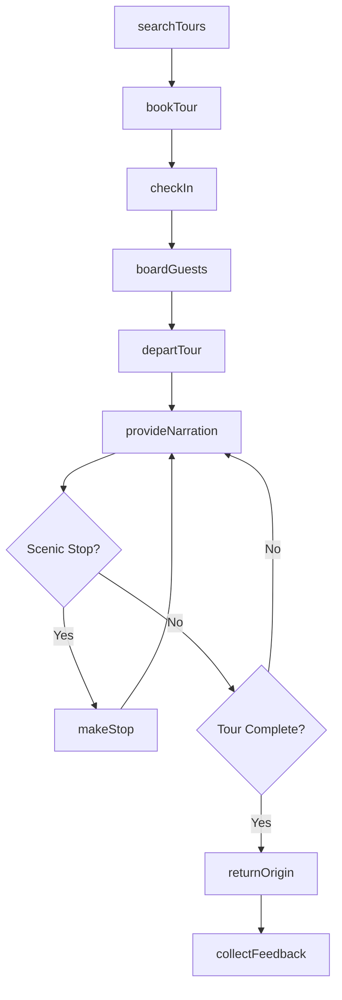
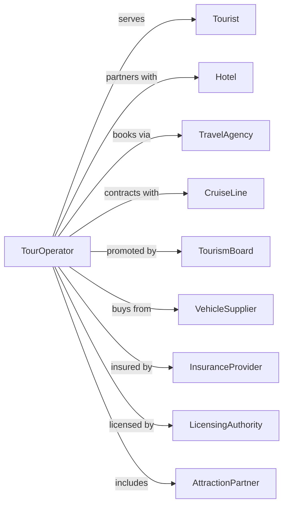

# Scenic and Sightseeing Transportation, Land

> Business-as-Code definition for land-based scenic and sightseeing transportation operations. Models the complete tour lifecycle from booking through vehicle operations, narrated tours, and guest services for sightseeing buses, trolleys, train excursions, and horse-drawn rides.

## Overview

Scenic and sightseeing transportation on land involves providing local sightseeing services using buses, trolleys, steam trains, and horse-drawn vehicles. Services typically involve same-day tours returning to the point of origin. This definition exposes actions for managing tour bookings, vehicle dispatch, guided narration, and guest experiences for land-based sightseeing operations.

## Actors

| Actor | Description |
|-------|-------------|
| Tourist | Visitor booking sightseeing tour |
| Hotel | Partner referring guests for tours |
| TravelAgency | Books tours for traveling groups |
| CruiseLine | Coordinates shore excursions |
| TourismBoard | Destination marketing organization |
| VehicleSupplier | Provides buses, trolleys, or carriages |
| InsuranceProvider | Covers passenger liability |
| LicensingAuthority | Issues tour operator permits |
| AttractionPartner | Destination included in tour |

## Roles

| Role | Description |
|------|-------------|
| TourGuide | Provides narration and guest assistance |
| Driver | Operates tour vehicle |
| ReservationAgent | Books tours and manages guests |
| Dispatcher | Coordinates vehicle schedules |
| FleetManager | Maintains vehicles and equipment |
| MarketingCoordinator | Promotes tours to visitors |
| GuestServiceRep | Handles inquiries and feedback |
| SafetyOfficer | Ensures passenger safety compliance |

## Entities

| Entity | Description |
|--------|-------------|
| TourBus | Sightseeing bus or motorcoach |
| Trolley | Open-air or replica trolley vehicle |
| SteamTrain | Historic or excursion rail equipment |
| Carriage | Horse-drawn sightseeing vehicle |
| Tour | Scheduled sightseeing excursion |
| Route | Planned path with points of interest |
| Booking | Guest reservation for tour |
| Stop | Designated viewing or photo stop |
| Narration | Audio or guide commentary |
| Ticket | Proof of tour purchase |

## Actions

| Action | Description |
|--------|-------------|
| searchTours | Find available sightseeing options |
| bookTour | Reserve seats on scheduled tour |
| checkIn | Process guest arrival for tour |
| boardGuests | Load passengers onto vehicle |
| departTour | Begin scheduled tour departure |
| provideNarration | Deliver commentary at points of interest |
| makeStop | Pause at scenic or photo location |
| returnOrigin | Complete tour at starting point |
| collectFeedback | Request guest review |
| processRefund | Handle cancellation request |
| dispatchVehicle | Assign vehicle and crew to tour |
| trackTour | Monitor tour progress and location |

## Events

| Event | Description |
|-------|-------------|
| toursSearched | Available options displayed |
| tourBooked | Reservation confirmed |
| guestCheckedIn | Arrival processed |
| guestsBoarded | Passengers loaded |
| tourDeparted | Tour started |
| narrationProvided | Commentary delivered |
| stopMade | Photo or viewing stop completed |
| tourReturned | Back at origin |
| feedbackCollected | Review received |
| refundProcessed | Cancellation handled |
| vehicleDispatched | Crew and vehicle assigned |
| tourTracked | Progress monitored |
| guestCheckedIn | Guest arrived and checked in for tour |

## Searches

| Search | Description |
|--------|-------------|
| findTours | List available tours by date and type |
| checkAvailability | Get seat availability for tour |
| getTourDetails | Retrieve route and points of interest |
| getSchedule | List departure times |
| getBookings | Review reservations by date |
| getVehicleStatus | Check fleet availability |
| getReviews | Retrieve guest feedback |
| getAttractions | List points of interest on route |

## Workflow



## Actor Relationships



## Usage

### Calling Actions

```typescript
import { tourScenicSightseeing } from '@headlessly/tour-scenic-sightseeing'

const tours = tourScenicSightseeing()

// Search for tours
const available = await tours.findTours({
  destination: 'San Francisco',
  date: '2024-04-15',
  type: 'trolley'
})

// Book a tour
const booking = await tours.bookTour({
  tourId: available[0].id,
  departureTime: '10:00',
  guests: [
    { name: 'John Smith', type: 'adult' },
    { name: 'Jane Smith', type: 'adult' }
  ],
  pickupLocation: 'Fishermans Wharf'
})

// Get tour details
const details = await tours.getTourDetails({
  tourId: booking.tourId
})
```

### Event-Driven Automation

```typescript
// Auto-confirm bookings
tours.tourBooked(async ({ bookingId, guests, tourDate }) => {
  const booking = await tours.getBooking({ bookingId })

  await sendConfirmation({
    to: booking.email,
    subject: 'Tour Confirmation',
    template: 'booking-confirmation',
    data: { booking, tourDetails: await tours.getTourDetails({ tourId: booking.tourId }) }
  })
})

// Auto-send reminder before tour
tours.guestCheckedIn(async ({ bookingId, checkInTime }) => {
  const booking = await tours.getBooking({ bookingId })

  // Schedule reminder 24 hours before
  await scheduleReminder({
    to: booking.email,
    sendAt: subtractHours(booking.departureTime, 24),
    subject: 'Tour Tomorrow',
    body: `Your tour departs at ${booking.departureTime}. Please arrive 15 minutes early.`
  })
})

// Auto-request reviews after tour
tours.tourReturned(async ({ tourId, date }) => {
  const bookings = await tours.getBookings({ tourId, date })

  for (const booking of bookings) {
    await scheduleTask({
      delay: '2h',
      action: async () => {
        await sendEmail({
          to: booking.email,
          subject: 'How was your tour?',
          template: 'review-request'
        })
      }
    })
  }
})
```
